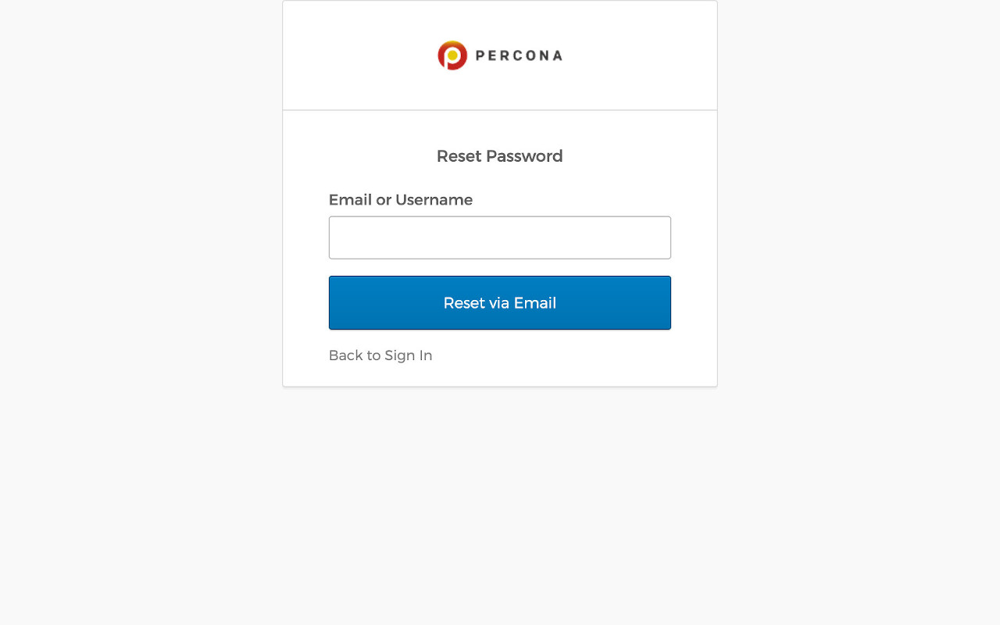
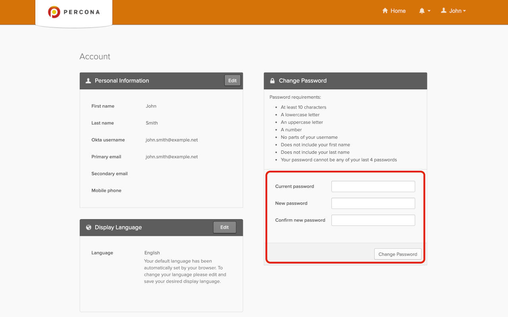

# SSH Key

This section lets you upload your public SSH key to access the PMM Server via SSH (for example, when accessing PMM Server as a [virtual appliance](../setting-up/server/virtual-appliance.md)).

Enter your **public key** in the *SSH Key* field and click *Apply SSH Key*.

## Alertmanager integration

Alertmanager manages alerts, de-duplicating, grouping, and routing them to the appropriate receiver or display component.

This section lets you configure integration of VictoriaMetrics with an external Alertmanager.

!!! hint alert alert-success "Tip"
    If possible, use [Integrated Alerting](../get-started/alerting.md) instead of Alertmanager.

- The *Alertmanager URL* field should contain the URL of the Alertmanager which would serve your PMM alerts.
- The *Prometheus Alerting rules* field is used to specify alerting rules in the YAML configuration format.

Fill both fields and click the *Apply Alertmanager settings* button to proceed.

## Percona Platform

This panel is where you connect your PMM server to your Percona Platform Account.

!!! note alert alert-primary ""
    Your Percona Platform Account is separate from your PMM User account.

### Connect PMM to Percona Platform

To learn how to connect your PMM servers to Percona Platform and leverage Platform services that boost the monitoring capabilities of your PMM installations, see [Integrate PMM with Percona Platform](integrate-platform.md).

### Password Reset

#### Password Forgotten

In case you forgot your password, click on the *Forgot password* link on the login page.

You will be redirected to a password reset page. Enter the email you are registered with in the field and click on *Reset via Email*.

An email with a link to reset your password will be sent to you.

#### Change Password after Login

If you did not forget your password but you still want to change it, go to <https://okta.percona.com/enduser/settings> (make sure you are logged in).

Insert you current password and the new password in the form to the bottom right of the page. If you cannot see the form, you will need to click on the *Edit Profile* green button (you will be prompted for you password).

Click on *Change Password*. If everything goes well, you will see a confirmation message.