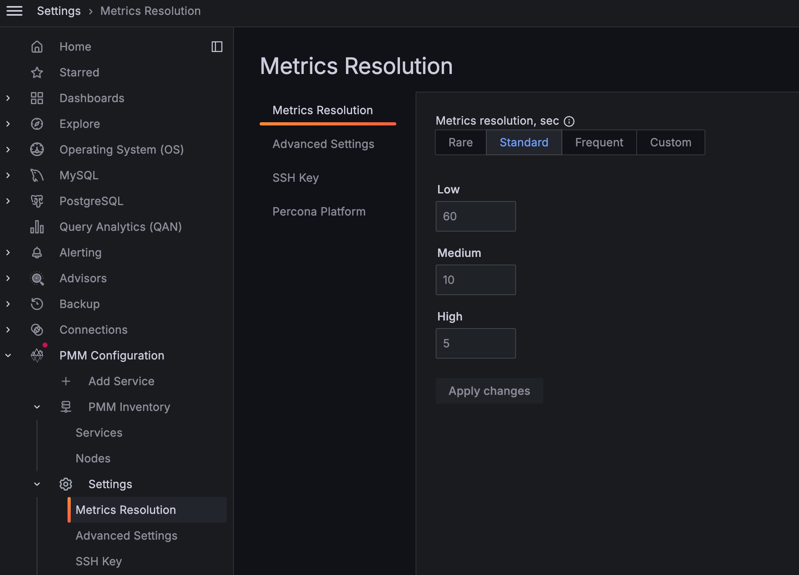

# About PMM configuration

The *Settings* page is where you configure PMM.

Open the *Settings* page from the [main menu](../details/interface.md#main-menu) with <i class="uil uil-cog"></i> *Configuration* → <i class="uil uil-setting"></i> *Settings*. The page opens with the *Metrics Resolution* settings tab selected.

On the left are the selector tabs:

- [Configure](#configure)
  - [Metrics resolution](#metrics-resolution)
  - [Advanced Settings](#advanced-settings)
    - [Data Retention](#data-retention)
    - [Telemetry](#telemetry)
    - [Check for updates](#check-for-updates)
    - [Advisors](#advisors)
  - [Public address](#public-address)
    - [DBaaS](#dbaas)
    - [Alerting](#alerting)
    - [Microsoft Azure Monitoring](#microsoft-azure-monitoring)
    - [Public Address {: #public-address-1 }](#public-address--public-address-1-)
  - [SSH Key](#ssh-key)
  - [Alertmanager integration](#alertmanager-integration)
  - [Percona Platform](#percona-platform)
    - [Connect PMM to Percona Platform](#connect-pmm-to-percona-platform)
    - [Password Reset](#password-reset)
      - [Password Forgotten](#password-forgotten)
      - [Change Password after Login](#change-password-after-login)

!!! hint alert alert-success "Tip"
    Click *Apply changes* to save any changes made here.
