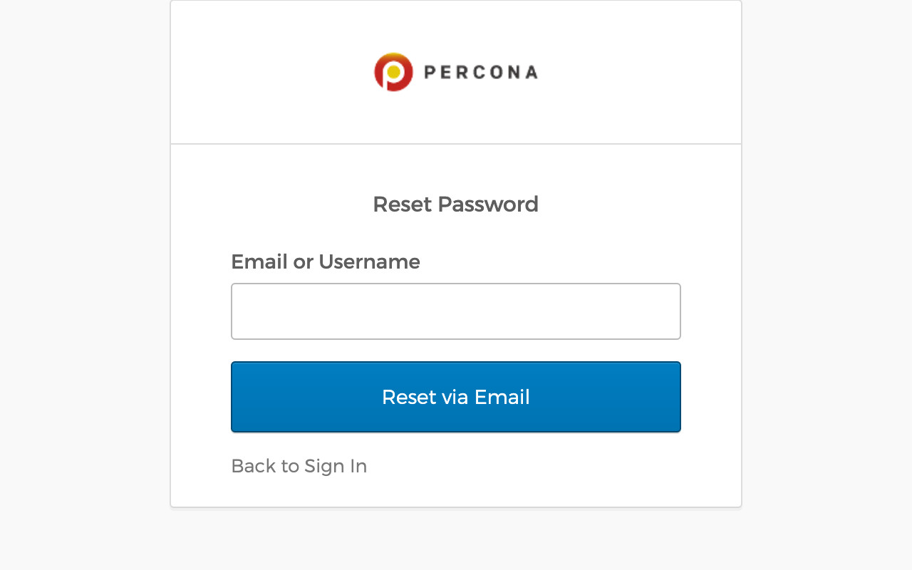
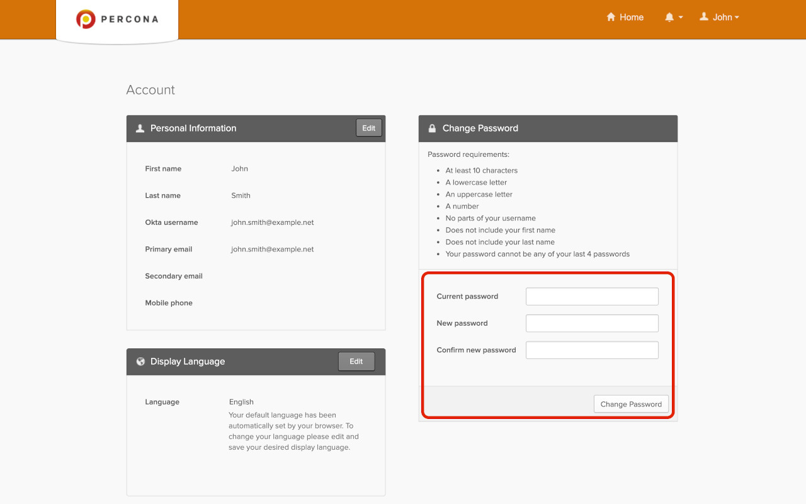

# Percona Platform

This panel is where you connect your PMM server to your Percona Platform Account.

!!! note alert alert-primary ""
    Your Percona Platform Account is separate from your PMM User account.

### Connect PMM to Percona Platform

To learn how to connect your PMM servers to Percona Platform and leverage Platform services that boost the monitoring capabilities of your PMM installations, see [Integrate PMM with Percona Platform](integrate-platform.md).

### Password Reset

#### Password Forgotten

In case you forgot your password, click on the *Forgot password* link on the login page.

You will be redirected to a password reset page. Enter the email you are registered with in the field and click on *Reset via Email*.

An email with a link to reset your password will be sent to you.

#### Change Password after Login

If you did not forget your password but you still want to change it, go to <https://okta.percona.com/enduser/settings> (make sure you are logged in).

Insert you current password and the new password in the form to the bottom right of the page. If you cannot see the form, you will need to click on the *Edit Profile* green button (you will be prompted for you password).

Click on *Change Password*. If everything goes well, you will see a confirmation message.