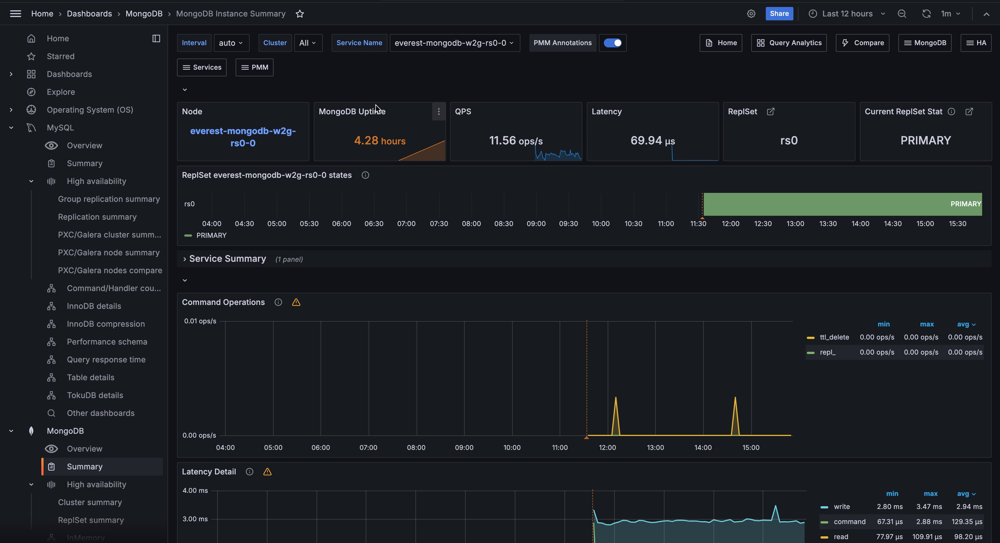

# MongoDB Instance Summary

## Command Operations

Ops or Replicated Ops/sec classified by legacy wire protocol type (query, insert, update, delete, getmore). And (from the internal TTL threads) the docs deletes/sec by TTL indexes.

## Latency Detail

Average latency of operations (classified by read, write, or (other) command)

## Connections

TCP connections (Incoming)

## Cursors

Open cursors. Includes idle cursors.

## Document Operations

Docs per second inserted, updated, deleted or returned. (N.b. not 1-to-1 with operation counts.)

## Queued Operations

Operations queued due to a lock.

## Query Efficiency

Ratio of Documents returned or Index entries scanned / full documents scanned

## Scanned and Moved Objects

This panel shows the number of objects (both data (scanned_objects) and index (scanned)) as well as the number of documents that were moved to a new location due to the size of the document growing. Moved documents only apply to the MMAPv1 storage engine.

## getLastError Write Time

Legacy driver operation: Number of, and Sum of time spent, per second executing getLastError commands to confirm write concern.

## getLastError Write Operations

Legacy driver operation: Number of getLastError commands that timed out trying to confirm write concern.

## Assert Events

This panel shows the number of assert events per second on average over the given time period. In most cases assertions are trivial, but you would want to check your log files if this counter spikes or is consistently high.

## Page Faults

Unix or Window memory page faults. Not necessarily from mongodb.

