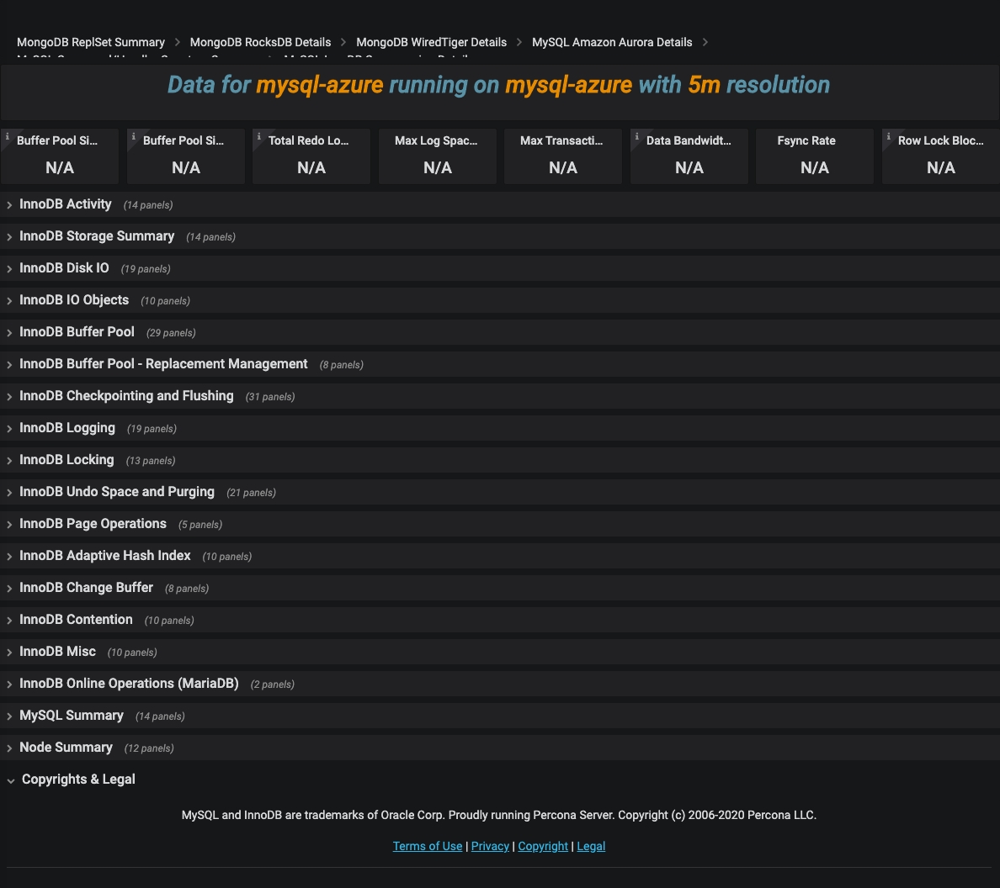

# MySQL InnoDB Details

This dashboard contains metrics that help analyze how the InnoDB engine performs.

## InnoDB Checkpoint Age

The maximum checkpoint age is determined by the total length of all transaction log files (`innodb_log_file_size`).

When the checkpoint age reaches the maximum checkpoint age, blocks are flushed syncronously. The rules of the thumb is to keep one hour of traffic in those logs and let the checkpointing perform its work as smooth as possible. If you don’t do this, InnoDB will do synchronous flushing at the worst possible time, i.e. when you are busiest.

## InnoDB Transactions

InnoDB is an MVCC storage engine, which means you can start a transaction and continue to see a consistent snapshot even as the data changes. This is implemented by keeping old versions of rows as they are modified.

The *InnoDB History List* is the undo logs which are used to store these modifications. They are a fundamental part of the InnoDB transactional architecture.

If the history length is rising regularly, do not let open connections linger for a long period as this can affect the performance of InnoDB considerably. It is also a good idea to look for long running queries in QAN.

## InnoDB Row Operations

This metric allows you to see which operations occur and the number of rows affected per operation. A metric like *Queries Per Second* will give you an idea of queries, but one query could effect millions of rows.

## InnoDB Row Lock Time

When data is locked, then that means that another session cannot update that data until the lock is released (which unlocks the data and allows other users to update that data. Locks are usually released by either a `ROLLBACK` or `COMMIT` SQL statement.

InnoDB implements standard row-level locking where there are two types of locks, shared (S) locks and exclusive (X) locks.

A shared (S) lock permits the transaction that holds the lock to read a row.  An exclusive (X) lock permits the transaction that holds the lock to update or delete a row.  *Average Row Lock Wait Time* is the row lock wait time divided by the number of row locks.

*Row Lock Waits* indicates how many times a transaction waited on a row lock per second.

*Row Lock Wait Load* is a rolling *5* minute average of *Row Lock Waits*.

## InnoDB I/O

This metric has the following series:

* *Data Writes* is the total number of InnoDB data writes.
* *Data Reads* is the total number of InnoDB data reads (OS file reads).
* *Log Writes* is the number of physical writes to the InnoDB redo log file.
* *Data Fsyncs* is the number of fsync() operations. The frequency of fsync() calls is influenced by the setting of the innodb_flush_method configuration option.

## InnoDB Log File Usage Hourly

Along with the buffer pool size, innodb_log_file_size is the most important setting when we are working with InnoDB. This graph shows how much data was written to InnoDB’s redo logs over each hour. When the InnoDB log files are full, InnoDB needs to flush the modified pages from memory to disk.

The rules of the thumb is to keep one hour of traffic in those logs and let the checkpointing perform its work as smooth as possible. If you don’t do this, InnoDB will do synchronous flushing at the worst possible time, ie when you are busiest.

This graph can help guide you in setting the correct `innodb_log_file_size`.

## InnoDB Deadlocks

A deadlock in MySQL happens when two or more transactions mutually hold and request for locks, creating a cycle of dependencies. In a transaction system, deadlocks are a fact of life and not completely avoidable. InnoDB automatically detects transaction deadlocks, rollbacks a transaction immediately and returns an error.

## InnoDB Condition Pushdown

Index Condition Pushdown (ICP) is an optimization for the case where MySQL retrieves rows from a table using an index.

Without ICP, the storage engine traverses the index to locate rows in the base table and returns them to the MySQL server which evaluates the `WHERE` condition for the rows. With ICP enabled, and if parts of the `WHERE` condition can be evaluated by using only columns from the index, the MySQL server pushes this part of the `WHERE` condition down to the storage engine. The storage engine then evaluates the pushed index condition by using the index entry and only if this is satisfied is the row read from the table.

ICP can reduce the number of times the storage engine must access the base table and the number of times the MySQL server must access the storage engine.

## Other Metrics

* InnoDB Logging Performance
* InnoDB Buffer Pool Content
* InnoDB Buffer Pool Pages
* InnoDB Buffer Pool I/O
* InnoDB Buffer Pool Requests
* InnoDB Buffer Read-Ahead
* InnoDB Change Buffer
* InnoDB Change Buffer Activity

!!! seealso "See also"

    * [Percona Database Performance Blog: How to Deal with MySQL deadlocks](https://www.percona.com/blog/2014/10/28/how-to-deal-with-mysql-deadlocks/)
    * [Percona Database Performance Blog: ICP counters and how to interpret them](https://www.percona.com/blog/2017/05/09/mariadb-handler_icp_-counters-what-they-are-and-how-to-use-them/)
    * [Percona Database Performance Blog: How to calculate a good InnoDB log file size](https://www.percona.com/blog/2008/11/21/how-to-calculate-a-good-innodb-log-file-size/)
    * [Percona Server Documentation: Improved InnoDB I/O scalability](http://www.percona.com/doc/percona-server/5.5/scalability/innodb_io_55.html)
    * [MySQL Server 5.7 Documentation: Shared lock](https://dev.mysql.com/doc/refman/5.7/en/glossary.html#glos_shared_lock)
    * [MySQL Server 5.7 Documentation: Exclusive lock](https://dev.mysql.com/doc/refman/5.7/en/glossary.html#glos_exclusive_lock)
    * [MySQL Server 5.7 Documentation: InnoDB locking](https://dev.mysql.com/doc/refman/5.7/en/innodb-locking.html)
    * [MySQL Server Documentation: Index Condition Pushdown optimisation](https://dev.mysql.com/doc/refman/5.7/en/index-condition-pushdown-optimization.html)
