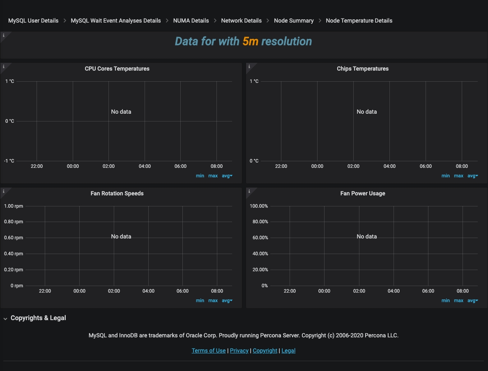

# Node Temperature Details

The Node Temperature Details dashboard exposes hardware monitoring and sensor data obtained through the `sysfs` virtual filesystem of the node.

Hardware monitoring devices attached to the CPU and/or other chips on the motherboard let you monitor the hardware health of a system. Most modern systems include several of such devices. The actual list can include temperature sensors, voltage sensors, fan speed sensors, and various additional features, such as the ability to control the rotation speed of the fans.

## CPU Cores Temperatures

Presents data taken from the temperature sensors of the CPU

## Chips Temperatures

Presents data taken from the temperature sensors connected to other system controllers

## Fan Rotation Speeds

Fan rotation speeds reported in RPM (rotations per minute).

## Fan Power Usage

Describes the pulse width modulation of the PWN-equipped fans. PWM operates like a switch that constantly cycles on and off, thereby regulating the amount of power the fan gains: 100% makes it rotate at full speed, while lower percentage slows rotation down proportionally.
