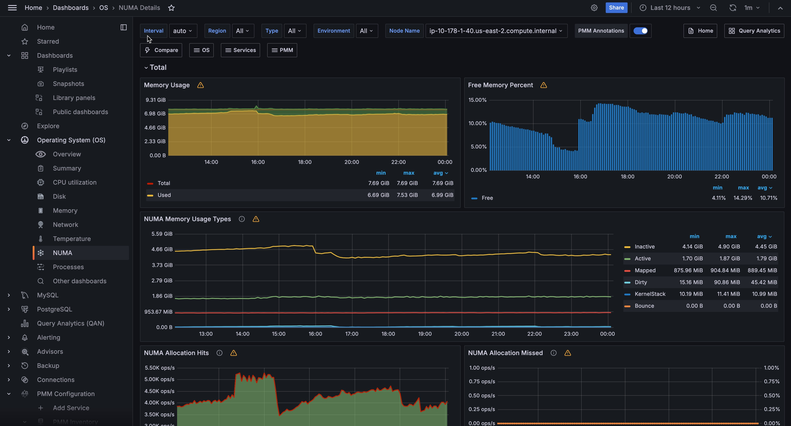

# NUMA Details

For each node, this dashboard shows metrics related to Non-uniform memory
access (NUMA).

## Memory Usage

Remotes over time the total, used, and free memory.

## Free Memory Percent

Shows the free memory as the ratio to the total available memory.

## NUMA Memory Usage Types

Dirty
: Memory waiting to be written back to disk

Bounce
: Memory used for block device bounce buffers

Mapped
: Files which have been mmaped, such as libraries

KernelStack The memory the kernel stack uses. This is not reclaimable.

## NUMA Allocation Hits

Memory successfully allocated on this node as intended.

## NUMA Allocation Missed

Memory missed is allocated on a node despite the process preferring some different node.

Memory foreign is intended for a node, but actually allocated on some different node.

## Anonymous Memory

Active
: Anonymous memory that has been used more recently and usually not swapped out.

Inactive
: Anonymous memory that has not been used recently and can be swapped out.

## NUMA File (PageCache)

Active(file) Pagecache memory that has been used more recently and usually not reclaimed until needed.

Inactive(file) Pagecache memory that can be reclaimed without huge performance impact.

## Shared Memory

Shmem Total used shared memory (shared between several processes, thus including RAM disks, SYS-V-IPC and BSD like SHMEM).

## HugePages Statistics

Total
:   Number of hugepages being allocated by the kernel (Defined with `vm.nr_hugepages`).

Free
:   The number of hugepages not being allocated by a process

Surp
:   The number of hugepages in the pool above the value in `vm.nr_hugepages`. The maximum number of surplus hugepages is controlled by `vm.nr_overcommit_hugepages`.

## Local Processes

Memory allocated on a node while a process was running on it.

## Remote Processes

Memory allocated on a node while a process was running on some other node.

## Slab Memory

Slab
: Allocation is a memory management mechanism intended for the efficient memory allocation of kernel objects.

SReclaimable
: The part of the Slab that might be reclaimed (such as caches).

SUnreclaim
: The part of the Slab that can’t be reclaimed under memory pressure
