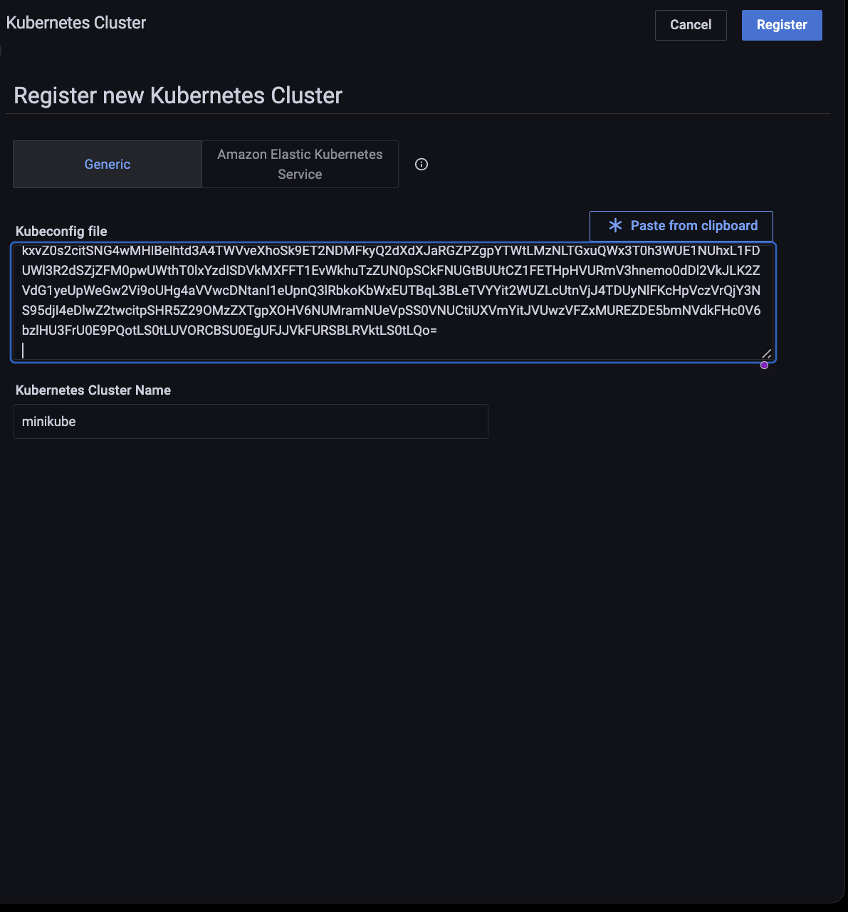
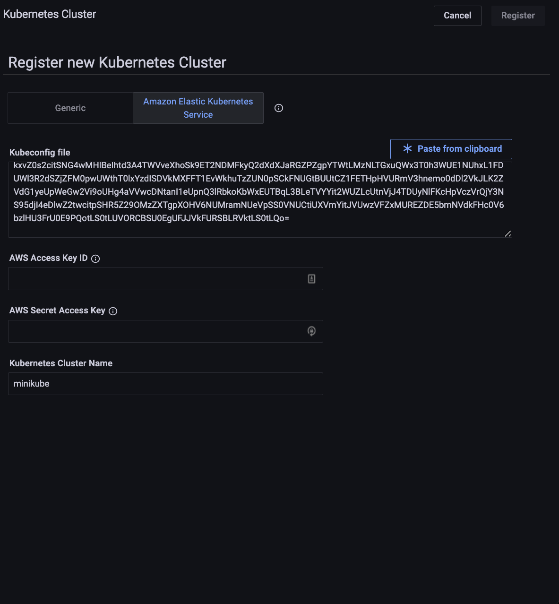
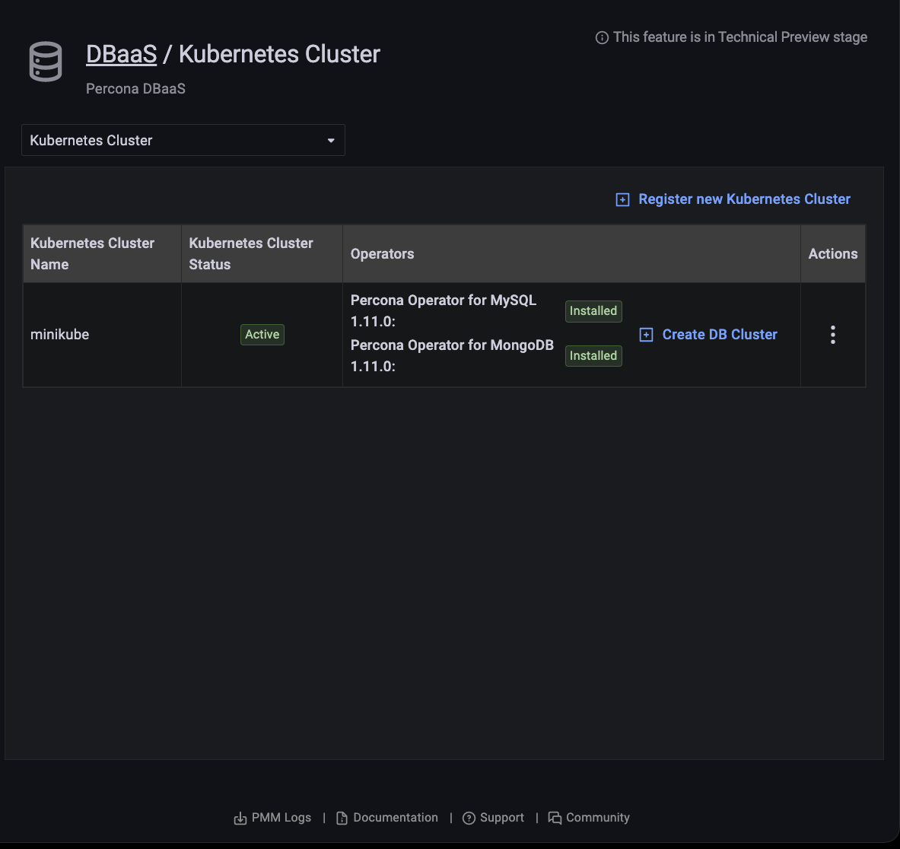
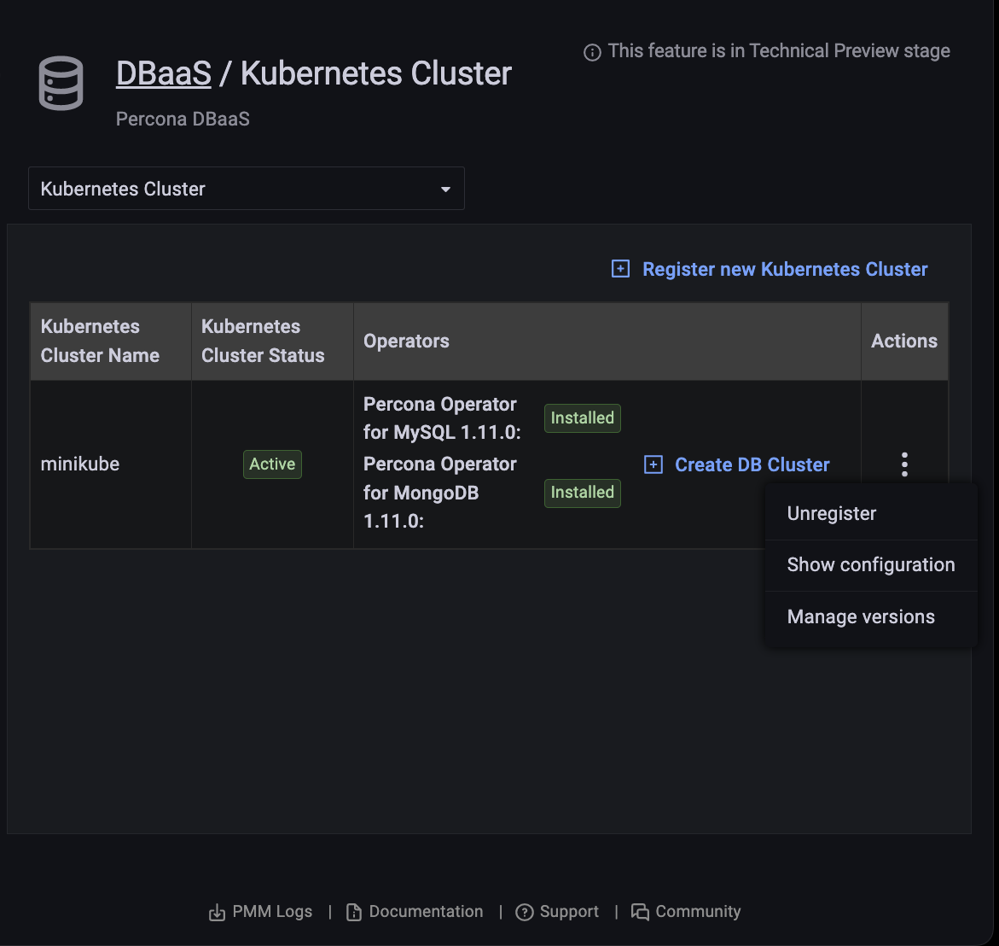
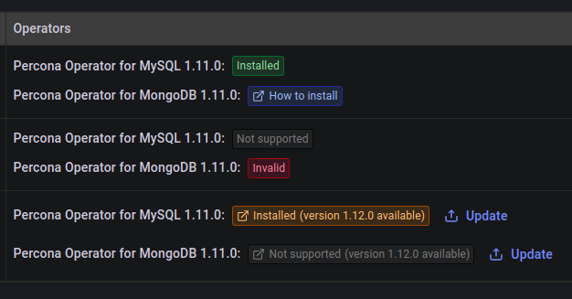
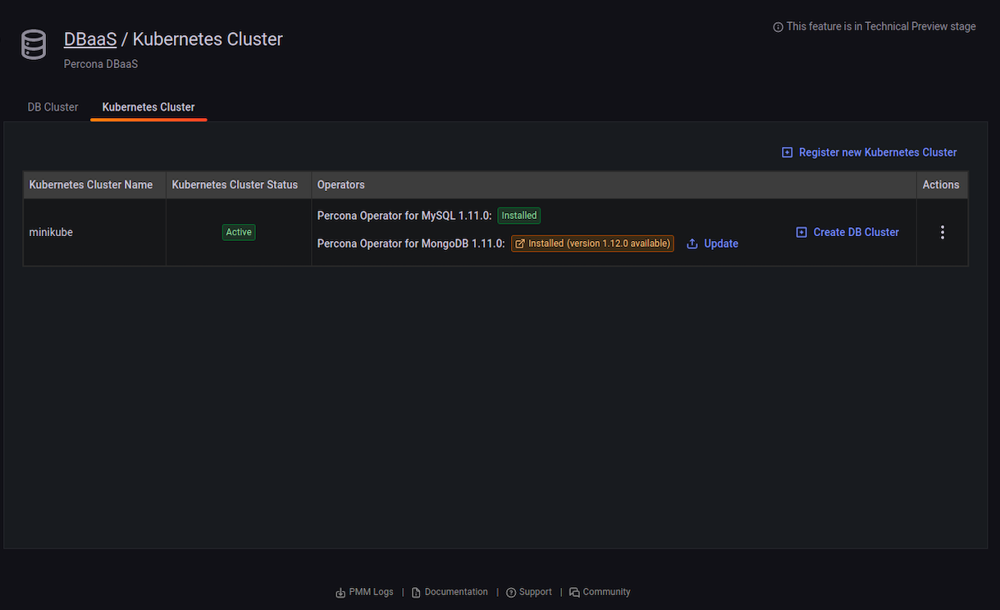
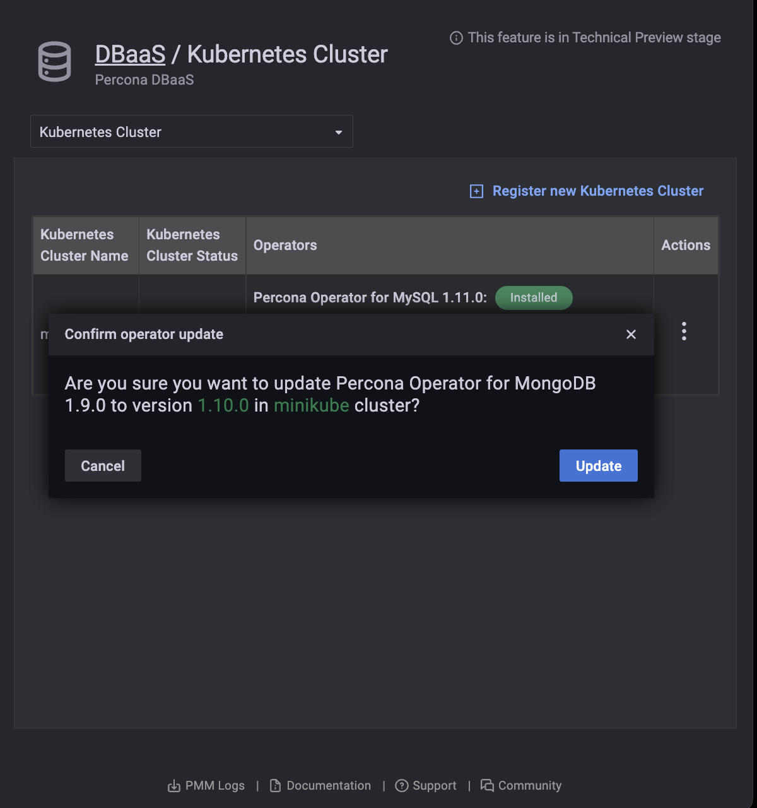

# Kubernetes clusters

 ## Add a Kubernetes cluster

!!! caution alert alert-warning "Caution"
    Ensure that you set PMM *Public Address* under <i class="uil uil-cog"></i> *Configuration* → <i class="uil uil-setting"></i> *Settings* → *Advanced Settings* before creating a Kubernetes cluster. Otherwise, PMM would **not** monitor the Kubernetes cluster along with the associated database clusters.

!!! note alert alert-primary ""
    [Percona Operator for MySQL](https://docs.percona.com/percona-operator-for-mysql/pxc/index.html) and [Percona Operator for MongoDB](https://docs.percona.com/percona-operator-for-mongodb/index.html are installed as part of the Kubernetes cluster registration process. It enables you to deploy database clusters into the Kubernetes cluster.

    If a public address is set the [VictoriaMetrics Operator](https://docs.victoriametrics.com/operator/) is also installed as part of the Kubernetes cluster registration process. It lets you monitor a kubernetes cluster via PMM.

1. Click *Register new Kubernetes Cluster*.

2. Copy the value of *Kubeconfig file* and click *Paste from clipboard* to copy the content of the kubeconfig file in the corresponding field. The value of *Kubernetes Cluster Name* gets auto-populated from the contents of the *kubeconfig file*.

!!! note alert alert-primary "Availability"
    This feature is available starting with PMM 2.30.0.

!!! note alert alert-primary ""
    This feature is available only in [secure contexts](https://developer.mozilla.org/en-US/docs/Web/Security/Secure_Contexts) (HTTPS) and some [supporting browsers](https://developer.mozilla.org/en-US/docs/Web/API/Clipboard#browser_compatibility).

!!! note alert alert-info ""
    For a Kubernetes cluster, when using Amazon Elastic Kubernetes Service (EKS) and the *kubeconfig file* does not contain the AWS
    access key ID and AWS secret access key. Select the *Using Amazon Elastic Kubernetes Service (EKS)*
    checkbox and enter the access key ID and secret access key in the respective fields.
    Please refer to the [AWS documentation](https://docs.aws.amazon.com/) for instructions on how to get these.

3. Click *Register*.

4. A message will momentarily display telling you whether the registration was successful or not.

    

## Unregister a Kubernetes cluster

!!! caution alert alert-warning "Important"
    You can't unregister a Kubernetes cluster if there DB clusters associated with it.

1. Click *Unregister*.

2. Confirm the action by clicking *Proceed*, or abandon by clicking *Cancel*.

## View a Kubernetes cluster's configuration

1. Find the row with the Kubernetes cluster you want to see.

2. In the *Actions* column, open the <i class="uil uil-ellipsis-v"></i> menu and click *Show configuration*.

## Manage allowed component versions

Administrators can select allowed and default versions of components for each cluster.

1. Find the row with the Kubernetes cluster you want to manage.

2. In the *Actions* column, open the <i class="uil uil-ellipsis-v"></i> menu and click *Manage versions*.

    

3. Select an *Operator* and *Component* from the drop-down menus.

    

4. Activate or deactivate allowed versions, and select a default in the *Default* menu.

5. Click *Save*.

## Kubernetes operator status

The Kubernetes Cluster tab shows the status of operators.

## Kubernetes operator update

When a new version of the operator is available the *Operators* column shows a message with this information. Click the message to go to the operator release notes to find out more about the update.

To update the cluster:

1. Find the row with the operator you want to update.

2. Click the *Update* button in front of the operator.

3. Confirm the action by clicking *Update*, or abandon by clicking *Cancel*.

    