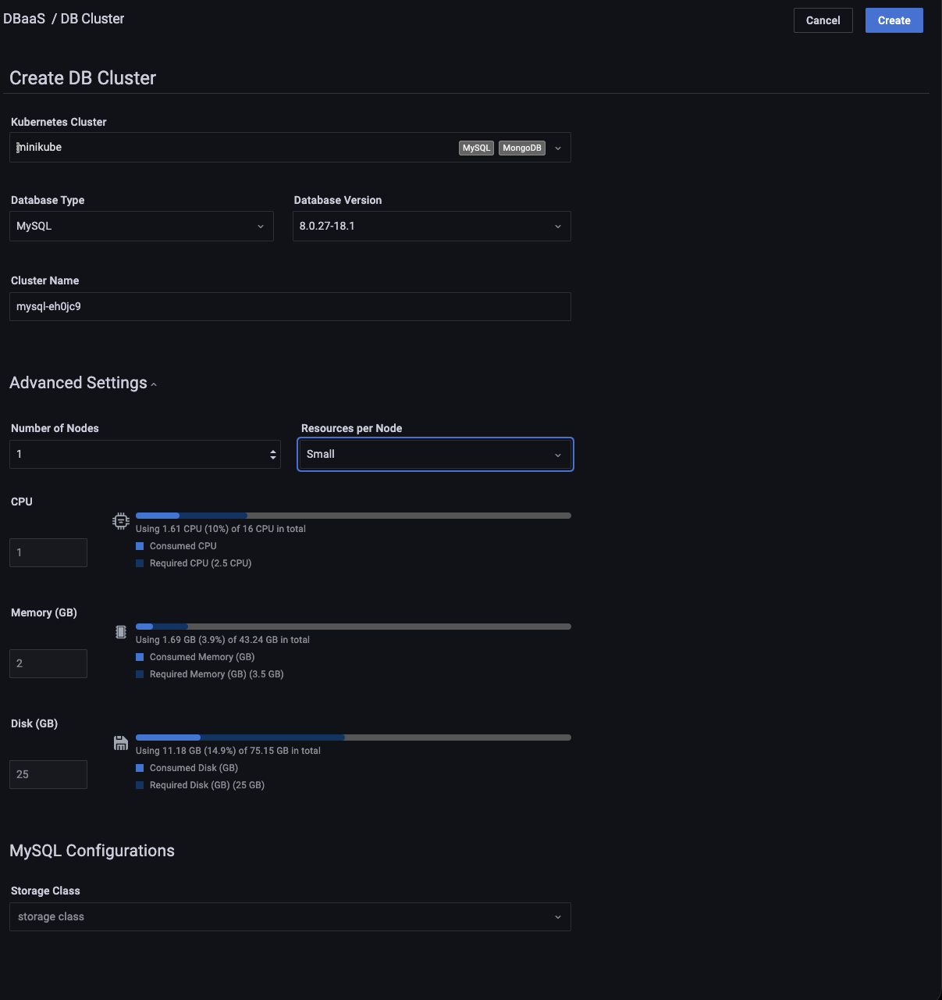
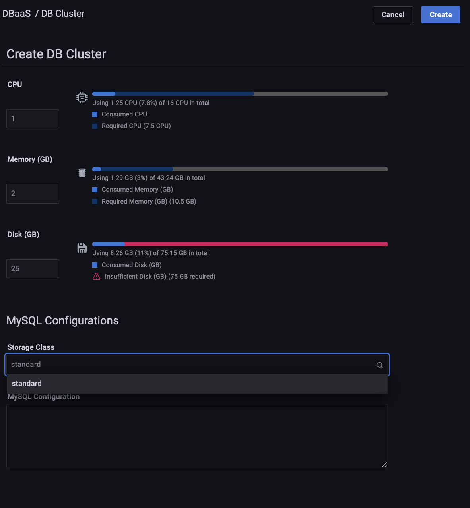
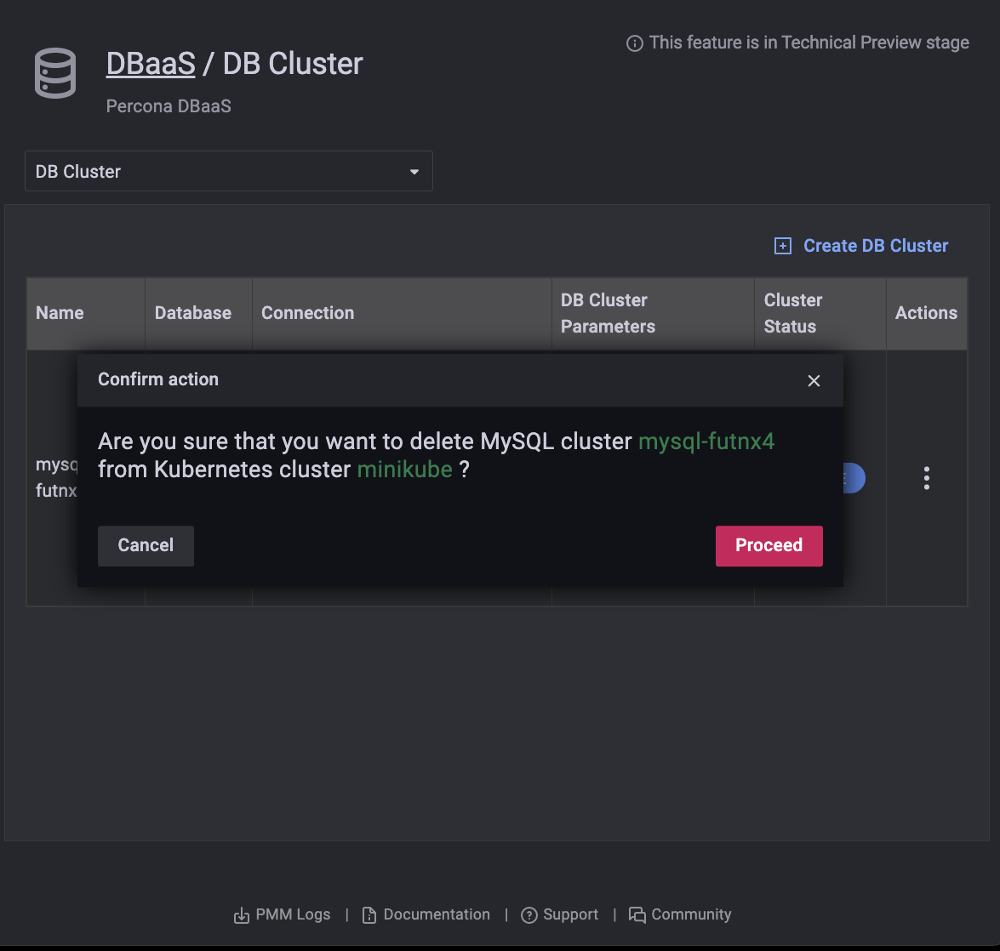
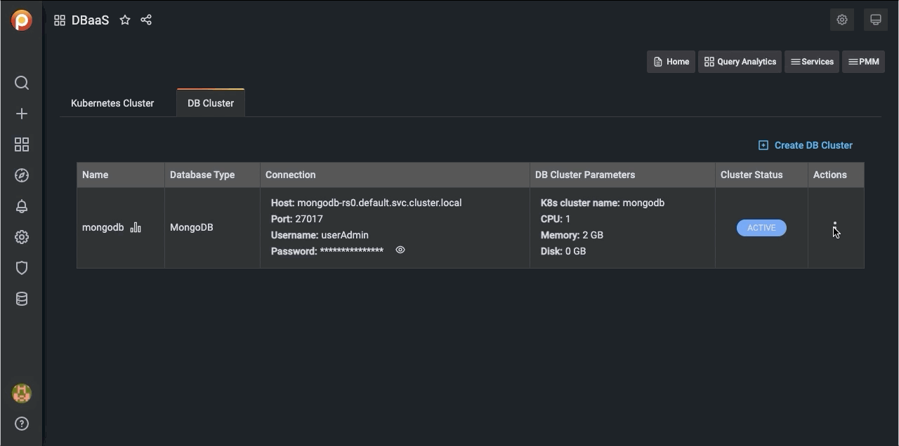
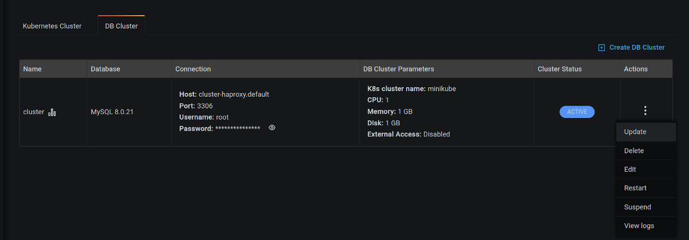

## DB clusters

### Add a DB Cluster

You must create at least one Kubernetes cluster to create a DB cluster.

To monitor a DB cluster, set up a [public address](../how-to/configure.md#public-address) for PMM Server first.

You can create a DB cluster with the click of a button! We have populated all needed fields with suitable defaults but you can customize many aspects of your DB cluster's configuration.  

To create a DB cluster, do the following:

1. Select the *DB Cluster* tab.

2. Click *Create DB Cluster*.

3. From the drop-down menu, select the values for the following:
    - *Kubernetes Cluster*
    - *Database Type*
    - *Database Version*

4. Optionally expand *Advanced Settings* panel for further customization.

    1. Select the number of nodes. (1 is the minimum)

    2. Select a preset *Resources per Node*.

        *Small*, *Medium* and *Large* are fixed preset values for *Memory*, *CPU*, and *Disk*.

        Values for the *Custom* preset can be edited.

        Beside each resource type is an estimate of the required and available resources represented numerically in absolute and percentage values, and graphically as a colored, segmented bar showing the projected ratio of used to available resources. A red warning triangle <i style="color: red" class="uil uil-exclamation-triangle"></i> is shown if the requested resources exceed those available.

        

    3. Enter the following on the *Database Configurations* panel:

    - *Storage Class* - Select the storage class from the drop-down. Storage classes allow dynamic provisioning of persistent storage for PMM. Using storage classes, you can create and attach volumes on-demand without manually managing the underlying storage infrastructure.
    - *Database configuration*- Enter the config string into the Configuration text box to configure the database engine.

        

    4. Enter the following on the *Network and Security* panel:

    - *Expose* - Select this checkbox to make this DB cluster available outside of the kubernetes cluster.
    - *Internet Facing* - Select this checkbox if you want the cluster to be accessible on the Internet.
    - *Source Range* - For security, you can control the exposure level by providing the IP address in the *Source Range* field. This allows you to choose the IP addresses that can access your DB cluster. To add more than one source range, click *Add New*.

5. Click *Create Cluster* to create your cluster.

6. A row appears with information on your cluster:

    

    - *Name*: The cluster name.
    - *Database*: The cluster database type and version.
    - *Connection*:
        - *Host*: The hostname.
        - *Port*: The port number.
        - *Username*: The connection username.
        - *Password*: The connection password (click the eye icon <i class="uil uil-eye"></i> to reveal).
    - *DB Cluster Parameters*:
        - *K8s cluster name*: The Kubernetes cluster name.
        - *CPU*: The number of CPUs allocated to the cluster.
        - *Memory*: The amount of memory allocated to the cluster.
        - *Disk*: The amount of disk space allocated to the cluster.
    - *Cluster Status*:
        - *PENDING*: The cluster is being created.
        - *ACTIVE*: The cluster is active.
        - *FAILED*: The cluster could not be created.
        - *DELETING*: The cluster is being deleted.
        - *UPDATING*: The cluster is being updated.

### Delete a DB Cluster

1. Find the row with the database cluster you want to delete.

2. In the *Actions* column, open the <i class="uil uil-ellipsis-v"></i> menu and click *Delete*.

3. Confirm the action by clicking *Proceed*, or abandon by clicking *Cancel*.

    

!!! danger alert alert-danger "Danger"
    Deleting a cluster also deletes any attached volumes.  Please proceed with caution. 

### Edit a DB Cluster

1. Select the *DB Cluster* tab.

2. Find the row with the database cluster you want to change.

3. In the *Actions* column, open the <i class="uil uil-ellipsis-v"></i> menu and click *Edit*.

A paused cluster can't be edited.

### Restart a DB Cluster

1. Select the *DB Cluster* tab.

2. Identify the database cluster to be changed.

3. In the *Actions* column, open the <i class="uil uil-ellipsis-v"></i> menu and click *Restart*.

### Suspend or resume a DB Cluster

1. Select the *DB Cluster* tab.

2. Identify the DB cluster to suspend or resume.

3. In the *Actions* column, open the <i class="uil uil-ellipsis-v"></i> menu and click the required action:

    - For active clusters, click *Suspend*.

        

    - For paused clusters, click *Resume*.

        

### Update a DB Cluster

1. Select the *DB Cluster* tab.

2. Identify the DB cluster to update.

3. In the *Actions* column, open the <i class="uil uil-ellipsis-v"></i> menu and click *Update*:

    

4. Confirm the update by clicking on *Update*, or abandon by clicking *Cancel*.

    

!!! seealso alert alert-info "See also"
    [Setting up a development environment for DBaaS](../dbaas/setting-up.md)

[ALPHA]: https://en.wikipedia.org/wiki/Software_release_life_cycle#Alpha
[Amazon Elastic Kubernetes Service (EKS)]: https://aws.amazon.com/eks/
[AWS documentation]: https://docs.aws.amazon.com/general/latest/gr/aws-sec-cred-types.html
