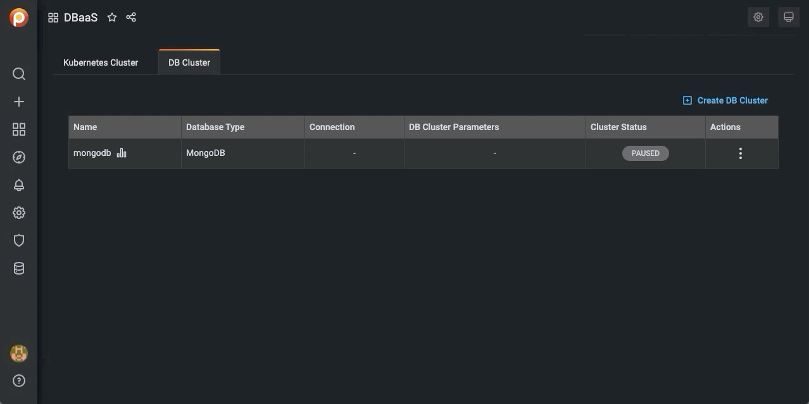

# Suspend or resume a DB Cluster

1. Select the *DB Cluster* tab.

2. Identify the DB cluster to suspend or resume.

3. In the *Actions* column, open the <i class="uil uil-ellipsis-v"></i> menu and click the required action:

    - For active clusters, click *Suspend*.

        

    - For paused clusters, click *Resume*.

        