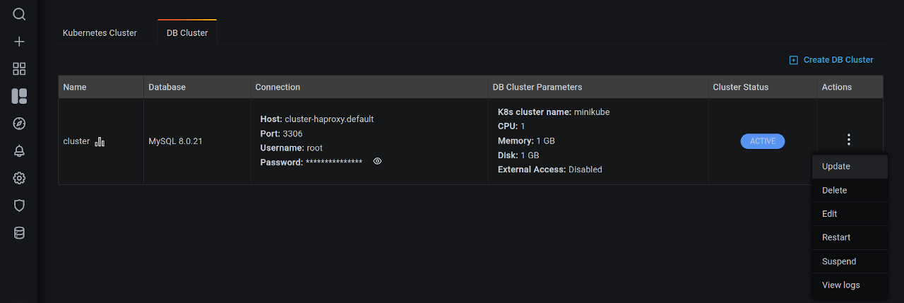
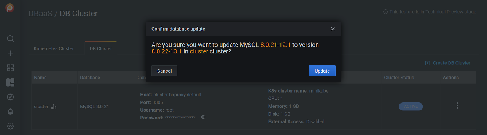

# Update a DB Cluster

1. Select the *DB Cluster* tab.

2. Identify the DB cluster to update.

3. In the *Actions* column, open the <i class="uil uil-ellipsis-v"></i> menu and click *Update*:

    

4. Confirm the update by clicking on *Update*, or abandon by clicking *Cancel*.

    

!!! seealso alert alert-info "See also"
    [Setting up a development environment for DBaaS](../dbaas/setting-up.md)

[ALPHA]: https://en.wikipedia.org/wiki/Software_release_life_cycle#Alpha
[Amazon Elastic Kubernetes Service (EKS)]: https://aws.amazon.com/eks/
[AWS documentation]: https://docs.aws.amazon.com/general/latest/gr/aws-sec-cred-types.html