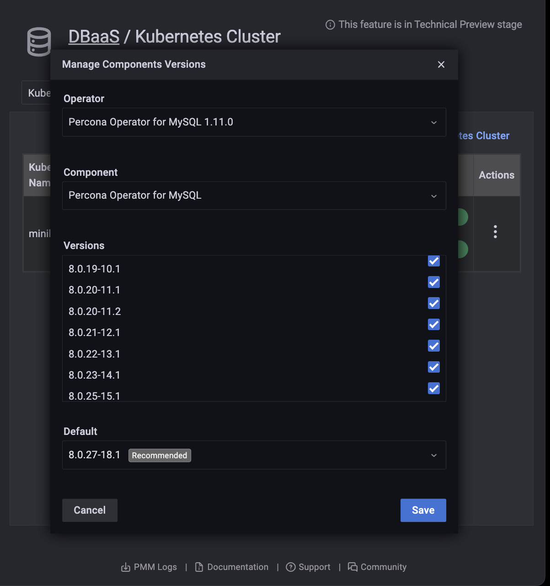

# Manage allowed component versions

Administrators can select allowed and default versions of components for each cluster.

1. Find the row with the Kubernetes cluster you want to manage.

2. In the *Actions* column, open the <i class="uil uil-ellipsis-v"></i> menu and click *Manage versions*.

    

3. Select an *Operator* and *Component* from the drop-down menus.

    

4. Activate or deactivate allowed versions, and select a default in the *Default* menu.

5. Click *Save*.

## Kubernetes operator status

The Kubernetes Cluster tab shows the status of operators.

