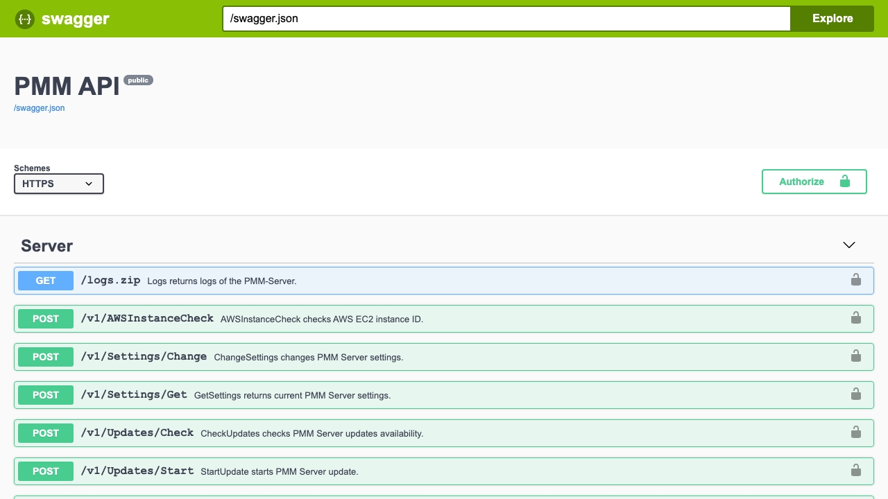

# API

PMM Server lets you visually interact with API resources representing all objects within PMM. You can browse the API using the [Swagger](https://swagger.io/tools/swagger-ui/) UI, accessible at the `/swagger/` endpoint URL:

Clicking an object lets you examine objects and execute requests on them:

The objects visible are nodes, services, and agents:

- A **Node** represents a bare metal server, a virtual machine, a Docker container, or a more specific type such as an Amazon RDS Node. A node runs zero or more Services and Agents, and has zero or more Agents providing insights for it.
- A **Service** represents something useful running on the Node: Amazon Aurora MySQL, MySQL, MongoDB, etc. It runs on zero (Amazon Aurora Serverless), single (MySQL), or several (Percona XtraDB Cluster) Nodes. It also has zero or more Agents providing insights for it.
- An **Agent** represents something that runs on the Node which is not useful in itself but instead provides insights (metrics, query performance data, etc) about Nodes and/or Services. An agent always runs on the single Node (except External Exporters), and provides insights for zero or more Services and Nodes.

Nodes, Services, and Agents have **Types** which define specific their properties, and the specific logic they implement.

Nodes and Services are external by nature – we do not manage them (create, destroy), but merely maintain a list of them (add to inventory, remove from inventory) in `pmm-managed`. Most Agents, however, are started and stopped by `pmm-agent`. The only exception is the External Exporter Type which is started externally.
