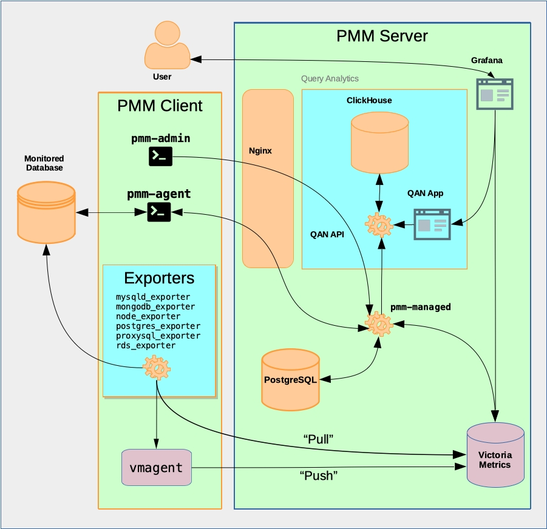
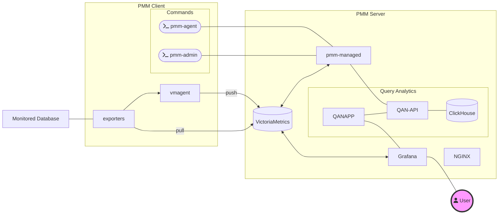
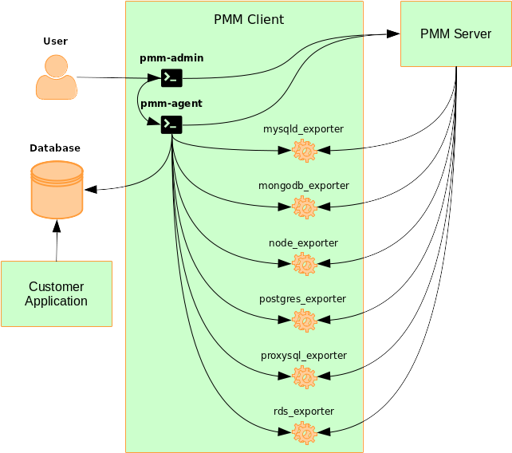

# Architecture

## PMM Server





```plantuml
@startuml "pmm-context1"
!includeurl https://raw.githubusercontent.com/stawirej/C4-PlantUML/master/C4_Component.puml

!define DEVICONS https://raw.githubusercontent.com/tupadr3/plantuml-icon-font-sprites/master/devicons
!define FONTAWESOME https://raw.githubusercontent.com/tupadr3/plantuml-icon-font-sprites/master/font-awesome-5
!include DEVICONS/angular.puml
!include DEVICONS/java.puml
!include DEVICONS/msql_server.puml
!include FONTAWESOME/users.puml

LAYOUT_LEFT_RIGHT()
LAYOUT_WITH_LEGEND()

ComponentDb_Ext(database, "Monitored Database", "")

System_Boundary(pmm_server, "PMM Server") {
    Component(pmm_managed, "pmm-managed", " ")
    ComponentDb(victoriametrics, "VictoriaMetrics", " ")
}

System_Boundary(pmm_client, "PMM Client") {
    Component(pmm_admin, "pmm-admin", "golang")
    Component(pmm_agent, "pmm-agent", "golang")
    Component(vmagent, "vmagent", " ")
    Boundary(exporters, "exporters"){
    }
}

Rel_D(database, exporters, " ")
Rel_D(vmagent, victoriametrics, "Push")
Rel_D(exporters, vmagent, " ")
Rel_D(exporters, victoriametrics, "Pull")
Rel_D(pmm_admin, pmm_managed, " ")
Rel_D(pmm_agent, pmm_managed, " ")
' Rel(database, pmm_agent, " ")
Rel_L(victoriametrics, pmm_managed, "")
@enduml
```


PMM Server includes the following tools:

- Query Analytics (QAN) enables you to analyze MySQL query performance over periods of time. In addition to the client-side QAN agent, it includes the following:

    - QAN API is the backend for storing and accessing query data collected by the QAN agent running on a PMM Client.

    - QAN Web App is a web application for visualizing collected Query Analytics data.

- Metrics Monitor provides a historical view of metrics that are critical to a MySQL or MongoDB server instance. It includes the following:

    - [VictoriaMetrics](https://github.com/VictoriaMetrics/VictoriaMetrics), a scalable time-series database. (Replaces [Prometheus](https://prometheus.io).)

    - [ClickHouse](https://clickhouse.tech/) is a third-party column-oriented database that facilitates the Query Analytics functionality.

    - [Grafana](http://docs.grafana.org/) is a third-party dashboard and graph builder for visualizing data aggregated (by VictoriaMetrics or Prometheus) in an intuitive web interface.

    - Percona Dashboards is a set of dashboards for Grafana developed by Percona.

### PMM Client



The PMM Client package consist of the following:

* `pmm-admin` is a command-line tool for managing PMM Client, for example, adding and removing database instances that you want to monitor. ([Read more.](../details/commands/pmm-admin.md)).

* `pmm-agent` is a client-side component a minimal command-line interface, which is a central entry point in charge for bringing the client functionality: it carries on client’s authentication, gets the client configuration stored on the PMM Server, manages exporters and other agents.

* `node_exporter` is an exporter that collects general system metrics.

* `mysqld_exporter` is an exporter that collects MySQL server metrics.

* `mongodb_exporter` is an exporter that collects MongoDB server metrics.

* `postgres_exporter` is an exporter that collects PostgreSQL performance metrics.

* `proxysql_exporter` is an exporter that collects ProxySQL performance metrics.

To make data transfer from PMM Client to PMM Server secure, all exporters are able to use SSL/TLS encrypted connections, and their communication with the PMM server is protected by the HTTP basic authentication.
