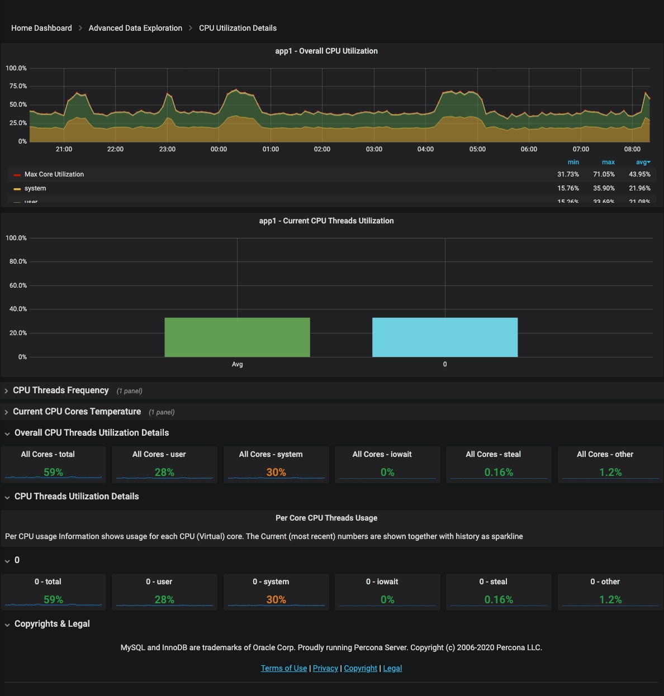

# CPU Utilization Details

## Overall CPU Utilization

The Overall CPU Utilization metric shows how much of the overall CPU time is used by the server. It has these components:

Max Core Utilization
: No description

System
: This component the proportion of time the CPUs spent inside the Linux kernel for operations like context switching, memory allocation and queue handling.

User
: This component is the time spent in the user space.  Normally, most of the MySQL CPU time is in user space. A high value of user time indicates a CPU bound workload.

Softirq
: This component is the portion of time the CPU spent servicing software interrupts generated by the device drivers.  A high value of softirq may indicates a poorly configured device.  The network devices are generally the main source of high softirq values.

Steal
: When multiple virtual machines share the same physical host, some virtual machines may be allowed to use more of their share of CPU and that CPU time is accounted as Steal by the virtual machine from which the time is taken.

Iowait
: This component is the time the CPU spent waiting for disk IO requests to complete.  A high value of iowait indicates a disk bound load.

Nice
: No description

In addition, sampling of the Max utilization of a single core is shown.

!!! note

    This metric presents global values: while there may be a lot of unused CPU, a single core may be saturated.  Look at the Max Core Utilization to see if any core is reaching close to 100%.

## Current CPU Threads Utilization

This shows the total utilization of each CPU core along with the average utilization of all CPU cores.  Watch for any core close to 100% utilization and investigate the root cause.

## CPU Threads Frequency

No description

## Current CPU Cores Temperature

No description

## Overall CPU Threads Utilization Details

No description
