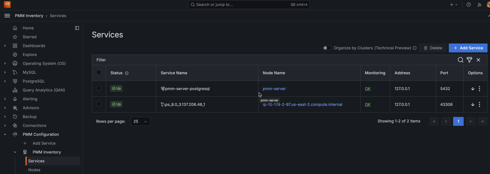
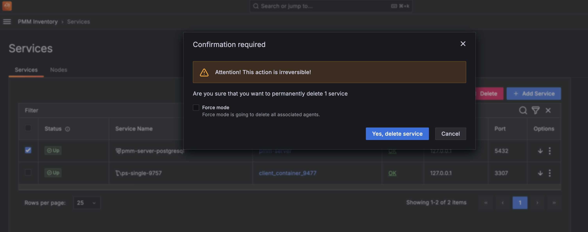

# PMM Inventory

The **Inventory** dashboard is a high-level overview of all objects  registered in PMM.

To check your inventory list, go to <i class="uil uil-cog"></i> **Configuration** > **Inventory**.

Inventory objects form a hierarchy with Node at the top, then Service and Agents assigned to a Node.

This information is detailed in the two tabs available on this page:

### **Services** tab

Shows individual services, the nodes on which they run, and the Agents against which they are assigned.
The **Status** column shows the status of your databases based on metrics coming directly from the database. 
The **Monitoring** column summarizes the status of all the Agents assigned to the service.

You can check Query Analytics information and the Service Overview Dashboard for each service by clicking on the  in the **Options** column.
From here you can also check additional information about the service, by clicking the . This expands the service entry to show reference information like service labels and IDs.

Each instance of a service gets a `service_id` value that is related to a `node_id`. Examples are MySQL, Amazon Aurora MySQL. This feature also allows to support multiple mysqld instances on a single node, with different service names, e.g. `mysql1-3306`, and `mysql1-3307`.

Each binary (exporter, agent) running on a client will get an `agent_type` value. Examples:

- `pmm-agent` is at the top of the tree, assigned to PMM Agent itself
- `node_exporter` is assigned to an agent that extracts the node metrics
- `mysqld_exporter` and `qan-mysql-perfschema-agent` are assigned to agents that extract metrics from mysql and its performance schema respectively.

### **Nodes** tab

Shows where the service and agents run. 

Each `node_id` is associated with a `machine_id` (from `/etc/machine-id`). Some examples are bare metal, virtualized, container.

By expanding the entry from the options column, you can check the node labels and attributes. 

## Removing items from the inventory
To remove items from the inventory:

1. Go to <i class="uil uil-cog"></i> **Configuration** > → {{icon.inventory}} **Inventory**.

2. In the first column, select the items to be removed.

    

3. Click **Delete** and confirm the removal.