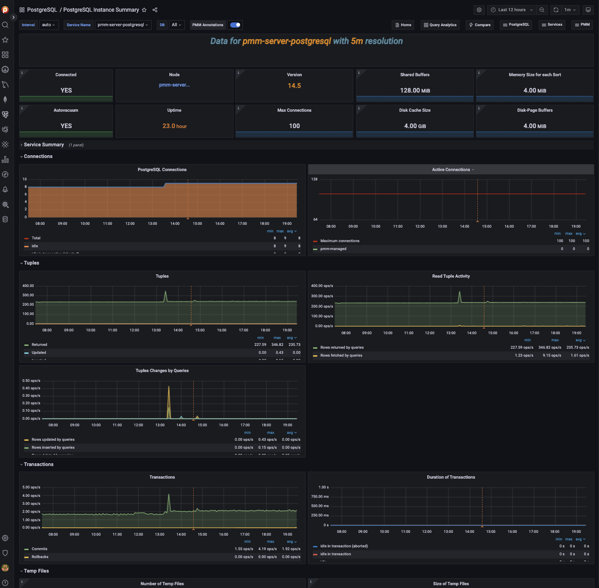
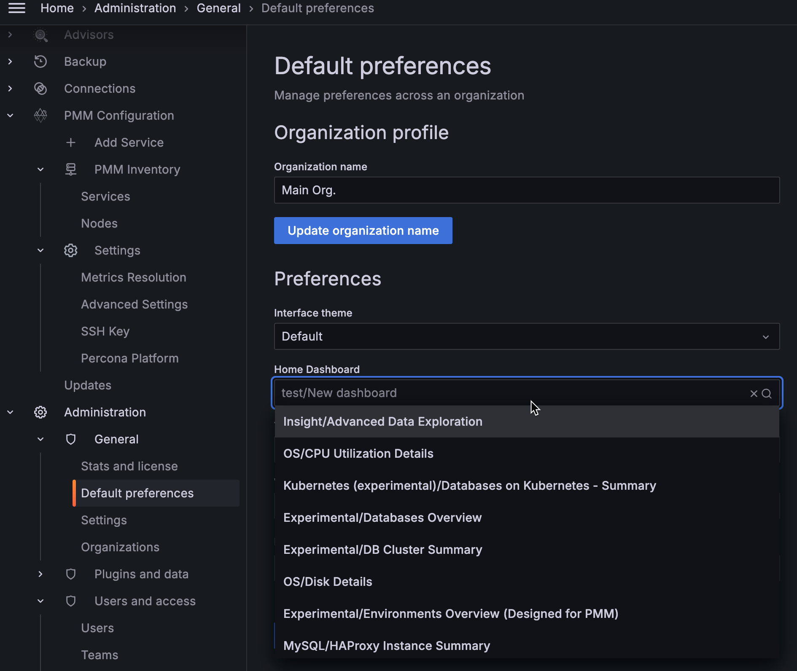

# Manage dashboards

This section describes how to manage your PMM dashboards and the widgets on those dashboards, including:

- Creating dashboard folders

- Managing dashboard folders

- Setting custom Home dashboard

## Create dashboard folders

Folders help you organize and group PMM dashboards, which is crucial when you have multiple dashboards or teams using the same PMM instance.

!!! note alert alert-primary "Note"
    To create a dashboard folder, you must have PMM's `Admin` privileges.

To create a dashboard folder:

1. On the PMM dashboards page, from the side menu, go to <i class="uil uil-plus"></i> `Dashboards > New folder`.

2. Enter a unique name for your folder and click `Create`.

## Managing dashboard folders

This section describes how to delete multiple dashboards, move dashboards from one folder to another and navigate to a folder page where you can assign folder and dashboard permissions.

### Delete multiple dashboards

To delete multiple dashboards at once:

1. From the side menu, go to <i class="uil uil-apps"></i> `Dashboards > Browse` and check the dashboards that you want to delete, and click `Delete'.

2. On the `Delete` window, click `Delete`.

### Move dashboards from one folder to another

To move dashboards from one folder to another:

1. From the side menu, go to <i class="uil uil-apps"></i> `Dashboards > Browse` and check the dashboards that you want to move. Click `Move`.

2. On the `Choose Dashboard Folder` dialog box select the dashboard that you want to move from the drop-down. Click `Move'.

### Navigate to a dashboard folder page to assign permissions

1. From the side menu, go to <i class="uil uil-apps"></i> `Dashboards > Browse` and hover over the dashboard folder whose permissions you want to set. Click `Go to Folder`.

2. Go to the `Permissions` tab and select the requisite permission from the drop-down for the various roles.

## Setting custom Home Dashboard

To set up your custom Home Dashboard:

1. From the side menu, go to <i class="uil uil-apps"></i> `Dashboards > Browse` and select the dashboard you want to set as your home dashboard.

2. Click the star next to the dashboard title to mark it as a favorite.

3. From the side menu go to <i class="uil uil-cog"></i> `Configuration > Preferences`. In the `Home Dashboard` field, select the dashboard that you want to set as your home dashboard. 

