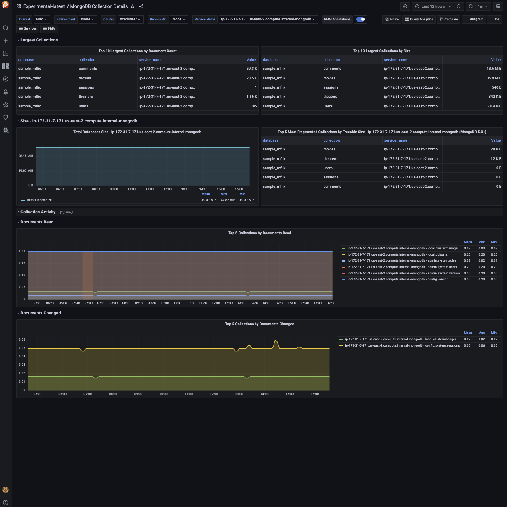

# Experimental MongoDB Collection Details

!!! caution alert alert-warning "Disclaimer"
    This is an Experimental Dashboard that is not part of the official Percona Monitoring and Management (PMM) deployment and might be updated. We ship this Dashboard to obtain feedback from our users.

!!! note alert alert-primary "Availability"
    This experimental dashboard is available starting with PMM 2.30.0.

The experimental MongoDB MongoDB Collection Details dashboard provides information about the top collections by document count, size, and document read  for MongoDB databases.

