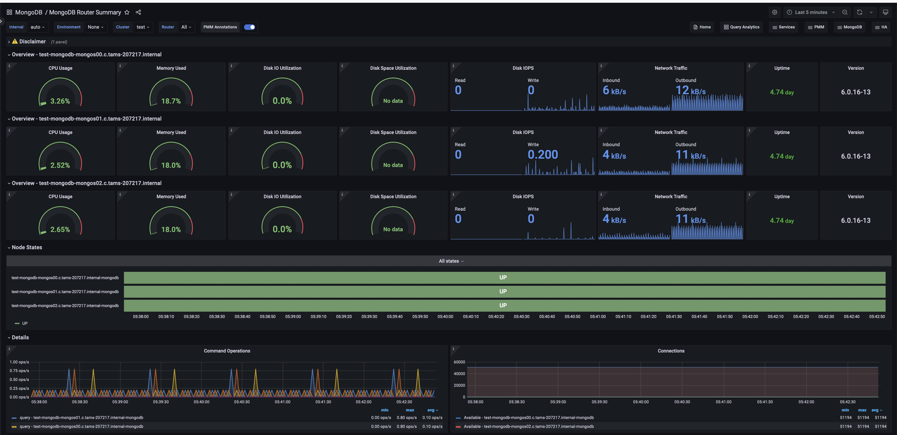

# Experimental MongoDB Router Summary

This dashboard is available starting from PMM 2.43 and is specifically designed for monitoring MongoS (router) nodes in sharded MongoDB clusters.

## Overview

For each MongoS in the cluster, this section includes main monitoring metrics like CPU, memory and disk usage. Uptime and MongoS version are reported as well.

## Node States

This section allows to easily see the state (UP or DOWN) for all MongoS that are part of the selected sharded cluster.

## Details

This section includes additional information like "Command Operations", "Connections", "Query execution times" and "Query efficiency".

### Command Operations
Shows MongoDB command operations over time, displaying rates for inserts, updates, deletes, queries, and TTL deletions per second. 

Use this to monitor overall database workload, compare operation types, spot peak usage and unusual patterns, assess replication activity, and track automatic data cleanup. 

### Connections
Displays MongoDB connection metrics over time, showing both current and available connections. Use this to monitor connection usage trends, identify periods of high demand, and ensure the database isn't reaching its connection limits. 

By comparing current to available connections, it's easy to spot potential bottlenecks or capacity issues before they impact performance. 

### Query execution times
Shows the average execution times for MongoDB queries over time, categorized into read, write, and other command operations. 

Use this to identify slow queries, performance bottlenecks, and unusual spikes in execution times. Comparing latencies across operation types can also guide decisions on indexing strategies and query optimizations.

### Query Efficiency
Visualizes MongoDB query efficiency over time, displaying the ratio of scanned documents or index entries to returned documents, along with operation latencies.

A ratio near 1 indicates highly efficient queries, while higher values (e.g., 100) suggest inefficiency. 

Compare document scans, index scans, and operation latencies to quickly identify poorly performing queries, and ensure that queries execute as efficiently as possible.
