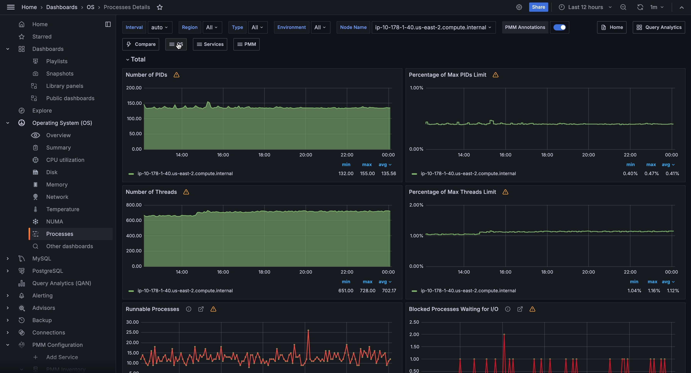

# Processes Details

The Processes Details dashboard displays Linux process information - PIDs, Threads, and Processes.  The dashboard shows how many processes/threads are either in the kernel run queue (runnable state) or in the blocked queue (waiting for I/O). When the number of process in the runnable state is constantly higher than the number of CPU cores available, the load is CPU bound. When the number of process blocked waiting for I/O is large, the load is disk bound. The running average of the sum of these two quantities is the basis of the `loadavg` metric.

The dashboard consists of two parts: the first section describes metrics for all hosts, and the second part provides charts for each host.

Charts for all hosts, available in the first section, are the following ones:

* States of Processes
* Number of PIDs
* Percentage of Max PIDs Limit
* Number of Threads
* Percentage of Max Threads Limit
* Runnable Processes
* Blocked Processes Waiting for I/O
* Sleeping Processes
* Running Processes
* Disk Sleep Processes
* Stopped Processes
* Zombie Processes
* Dead Processes

The following charts are present in the second part, available for each host:

* Processes
* States of Processes
* Number of PIDs
* Percentage of Max PIDs Limit
* Number of Threads
* Percentage of Max Threads Limit

## Number of PIDs

No description

## Percentage of Max PIDs Limit

No description

## Number of Threads

No description

## Percentage of Max Threads Limit

No description

## Runnable Processes

**Processes**

The Processes graph shows how many processes/threads are either in the kernel run queue (runnable state) or in the blocked queue (waiting for I/O).  When the number of process in the runnable state is constantly higher than the number of CPU cores available, the load is CPU bound.  When the number of process blocked waiting for I/O is large, the load is disk bound.  The running average of the sum of these two quantities is the basis of the `loadavg` metric.

## Blocked Processes Waiting for I/O

**Processes**

The Processes graph shows how many processes/threads are either in the kernel run queue (runnable state) or in the blocked queue (waiting for I/O).  When the number of process in the runnable state is constantly higher than the number of CPU cores available, the load is CPU bound.  When the number of process blocked waiting for I/O is large, the load is disk bound.  The running average of the sum of these two quantities is the basis of the `loadavg` metric.

## Sleeping Processes

No description

## Running Processes

No description

## Disk Sleep Processes

No description

## Stopped Processes

No description

## Zombie Processes

No description

## Dead Processes

No description
