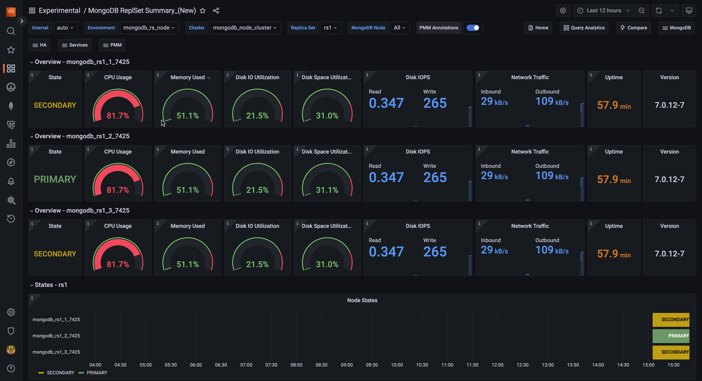

# MongoDB ReplSet Summary (NEW)

The MongoDB ReplSet Summary dashboard offers a comprehensive view of your MongoDB replica set's health and performance. It provides clear insights for both simple and complex, multi-environment setups. 

The dashboard displays key metrics for individual nodes and the entire replica set, allowing you to quickly spot issues and maintain optimal database performance. With focused information and effective visualizations, it helps you identify and resolve potential problems efficiently, making it easier to manage MongoDB deployments of any size.

## Overview

The overview section displays essential data for individual nodes, such as their role, CPU usage, memory consumption, disk space, network traffic, uptime, and the current MongoDB version.

### CPU Usage

This section shows the CPU usage over time, highlighting the percentage of CPU capacity utilized by each node in the replica set.

### Memory Used

Indicates how much memory can be used without causing swapping, ensuring efficient memory management.

### Disk I/O Utilization

Displays disk utilization as a percentage, showing how often there was at least one I/O request in flight. This metric helps determine if disk load was evenly distributed or if I/O was bottlenecked, potentially leading to queuing and latency.

### Disk Space Utilization

Provides detailed information about disk space usage on the specified mount point, including used space, free space, and total disk space. Low free space can lead to *Disk full* errors, which may cause system crashes or service interruptions.

### Disk IOPS

Tracks the number of physical I/O operations (reads and writes) served by different devices. Spikes in IOPS can indicate performance issues related to I/O subsystem overload.

### Network Traffic

Monitors the volume of data moving across the network at any given time, helping identify potential network bottlenecks.

### Uptime

Shows how long each node in the replica set has been running without a shutdown or restart.

### Version

Displays the current MongoDB version for each node in the replica set.

## States

Tracks the replica set state over a specified time period. For more details on replica set states, see to the [MongoDB documentation](https://www.mongodb.com/docs/manual/reference/replica-states/).

## Details

### Command Operations

Shows the number of operations per second, classified by legacy wire protocol type (e.g., query, insert, update, delete). It also includes documents deleted per second by TTL indexes.

### Top Hottest Collections by Read

Lists the five collections with the most read operations.

### Query Execution Times

Displays the average latency of operations, categorized by read, write, or command.

### Top Hottest Collections by Write

Lists the five collections with the most write operations.

### Query Efficiency

Measures the ratio of documents (or index entries) scanned to documents returned. A ratio of 1 indicates that all returned documents perfectly match the query criteria.

### Queued Operations

Shows operations that are queued due to lock contention.

### Reads & Writes

Tracks read and write operations over time, with reads representing data queries and writes representing data modifications.

### Connections

Displays the total available and currently active database connections over time.

## Collection Details

MongoDB organizes data in collections, which are similar to tables in relational databases.

## Replication

### Replication Lag

Monitors replication lag, which occurs when a secondary node cannot replicate data as fast as it is written to the primary node. Causes of lag can include network latency, packet loss, or routing issues.

### OpLog Recovery Window

Indicates the timespan (window) between the newest and oldest operations in the Oplog collection.

## Performance

### Flow Control

Displays the average latency of operations, categorized by read, write, or command.

### WiredTiger Concurrency Tickets Available

Shows the number of available WiredTiger concurrency tickets, which control the number of operations that can run simultaneously in the storage engine.

## Nodes Summary

Provides a quick overview of the health and resource utilization of your nodes, making it easy to spot any potential issues or resource constraints.

## CPU Usage

Measures CPU time as a percentage of the CPU's total capacity, providing insights into CPU utilization.

## CPU Saturation

Indicates when a system is running at maximum CPU capacity, leading to increased data queuing and potential performance degradation.

## Disk I/O and Swap Activity

Tracks disk I/O operations and swap activity, which involve transferring data between the hard disk drive and RAM.

## Network Traffic

Monitors network traffic, showing the amount of data moving across the network at any given time.

## Operations - by Service Name

Classifies operations by legacy wire protocol type (insert, update, and delete only).

## Max Member Ping Time - by Service Name

Tracks the maximum ping time between replica set members, which can correlate with replication lag.

## Max Heartbeat Time

Measures the time elapsed since the last heartbeat from replica set members.

## Elections

Counts the number of elections, which typically occur when the primary role changes due to maintenance or issues.

## Oplog Recovery Window - by Service Name

Displays the timespan between the newest and oldest operations in the Oplog collection for each service name.
