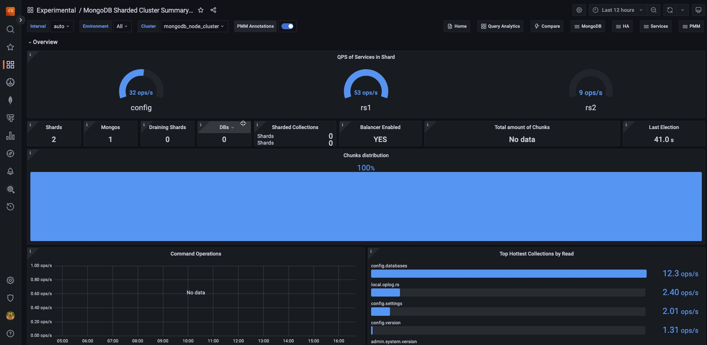

# Sharded Cluster Summary

## Overview

Queries per second of all shards + config server replica set.

### Shards

A shard contains a subset of sharded data for a sharded cluster. Together, the cluster’s shards hold the entire data set for the cluster.

### Mongos
Number of mongos routers registered as part of the cluster.

### Draining Shards
When you run removeShard, MongoDB drains the shard by using the balancer to move the shard’s chunks to other shards in the cluster. Once the shard is drained, MongoDB removes the shard from the cluster.

### DBs
When you run removeShard, MongoDB drains the shard by using the balancer to move the shard’s chunks to other shards in the cluster. Once the shard is drained, MongoDB removes the shard from the cluster.

### Sharded Collections

Provides a quick view of how many collections in your MongoDB cluster are sharded. This is an important metric for understanding the scale and distribution of your data across the sharded cluster. 

A higher number indicates more collections are distributed across multiple shards, which can improve performance for large datasets.
However, it also implies more complex data management. 

### Balancer Enabled
Background process that monitors the number of chunks on each shard and whether the MongoDB Balancer is currently enabled in your sharded cluster.

The balancer is crucial for maintaining an even distribution of chunks across shards, so knowing its status is important for cluster health and performance.

A **YES** indicates that the balancer is active and working to keep your data evenly distributed, while a **NO**" might indicate a manual override or a potential issue that needs investigation.

### Total amount of Chunks

Provides a quick view of the total number of chunks in your sharded MongoDB cluster to give you an idea of how your data is distributed across the cluster. 

A high number of chunks could indicate a well-distributed dataset, while a sudden increase might suggest increased data volume or changes in your sharding strategy.

### Last Election

Provides a quick view of how long it has been since the last election in your MongoDB replica set. 

Elections occur when a new primary node needs to be chosen, which can happen during normal operations (like planned maintenance) or due to issues (like a primary node failure). 

A very recent election might indicate a recent change or issue in your cluster that warrants investigation, while a long time since the last election suggests stability in the primary node assignment.

### Command Operations

Provides a comprehensive overview of MongoDB operation rates across your deployment. It displays the frequency of primary operations (query, insert, update, delete, and getmore), replicated operations on secondary nodes, and document deletions by Time-To-Live (TTL) indexes. 

By aggregating data from selected environments, clusters, and replica sets over customizable time intervals, the graph enables you to quickly identify workload patterns, potential replication lags, and the impact of automated data cleanup processes.

### Top Hottest Collections by Read

This panel displays the five MongoDB collections with the highest read rates. It shows the number of read operations per second for each collection, aggregated across your selected environment and cluster. 

The bar gauge visualization helps quickly identify which collections are experiencing the most read activity, useful for performance monitoring and resource planning. Data is updated regularly to reflect recent changes in read patterns.

### Query execution times

This graph shows the average time taken for MongoDB to execute read, write, and other operations. It displays latency in microseconds over time, helping you spot performance trends or issues across different operation types. 

Use this to quickly identify any unusual delays in database operations.

### Top Hottest Collections by Write

Displays the five MongoDB collections with the highest write activity. It shows the number of write operations (inserts, updates, and deletes) per second for each collection, aggregated across your selected environment and cluster. 

The bar gauge visualization helps quickly identify which collections are experiencing the most write activity, useful for performance monitoring and resource planning. Data is updated regularly to reflect recent changes in write patterns.

### Operations Per Shard

Shows the total number of operations per second for each shard in your MongoDB cluster. 

It combines all types of operations (queries, inserts, updates, deletes, and getmore) into a single metric for each shard. The stacked area chart allows you to see both individual shard activity and total cluster activity over time. 

This visualization helps you monitor the distribution of workload across shards and identify any imbalances or unusual patterns in operation rates.

### MongoDB Versions
Displays the current MongoDB version for each service in your cluster.

This information helps you quickly identify which version of MongoDB is running on each service, ensuring all parts of your cluster are using consistent and up-to-date software. 

Use this to track version differences across your MongoDB deployment and plan upgrades as needed."

## Node States

This panel shows the status of each node in your MongoDB replica set over time. It displays a timeline for each node, with colors representing different states such as Primary, Secondary, or Arbiter.

The visualization helps you track state changes, identify any instability in the replica set, and understand the roles of different nodes throughout the selected time range. Use this to monitor the health and stability of your MongoDB replica set at a glance.

## Collection Details

### Size of Collections in Shards

Displays the storage size of MongoDB collections across different shards in your cluster. 

The data is organized by database and collection, with separate columns for each shard.

This visualization helps you understand how your data is distributed across shards and identify which collections are using the most storage space. Use this information to optimize data distribution and storage usage in your MongoDB cluster.
