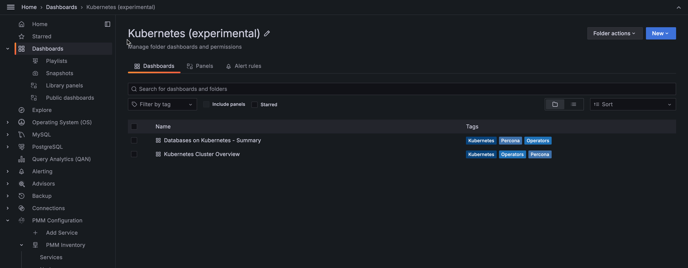

# Kubernetes monitoring for Percona Operator 

!!! caution alert alert-warning "Important"
    This feature is still in [Technical Preview](https://docs.percona.com/percona-monitoring-and-management/details/glossary.html#technical-preview) and is subject to change. We recommend that early adopters use this feature for testing purposes only.

Starting with PMM 2.37.0 we have introduced *Kubernetes Volumes* dashboard. This dashboard provides insights into your Kubernetes volumes, including capacity and usage, in real-time. 

With this dashboard, you can easily monitor the performance and usage of your volumes and take proactive measures to ensure their performance.

