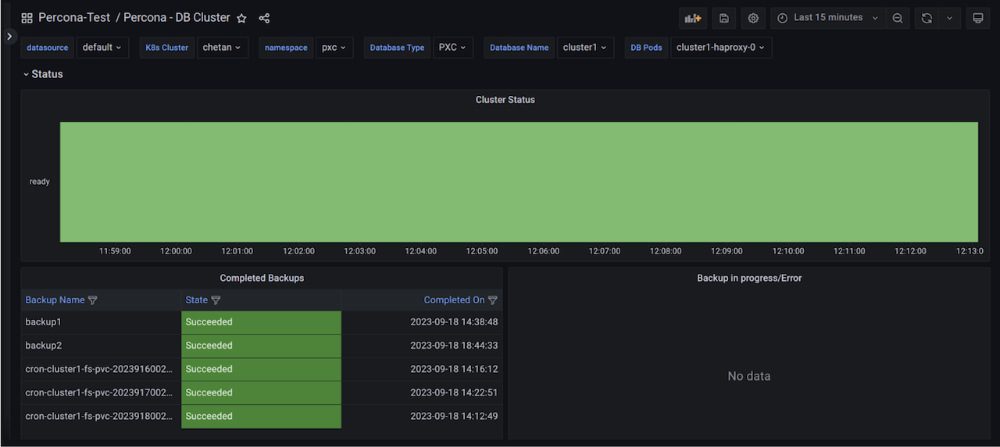

# Kubernetes monitoring for Percona operators 

!!! caution alert alert-warning "Important"
    This feature is still in [Technical Preview](https://docs.percona.com/percona-monitoring-and-management/details/glossary.html#technical-preview) and is subject to change. We recommend that early adopters use this feature for testing purposes only.

The following new dashboards have been added:

## Kubernetes overview

Kubernetes Cluster overview dashboard provides insights into k8s health and its objects, including Percona Custom Resources.

## Dashboard for DB clusters managed with Percona Kubernetes Operators

This dashboard presents the main parameters of the DB clusters created by Percona Operators for different databases and helps spot performance problems on them. 

