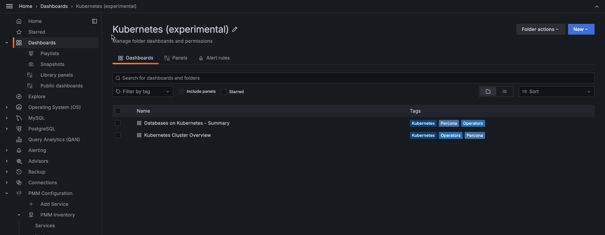

# Kubernetes Volumes

!!! caution alert alert-warning "Disclaimer"
    This is an Experimental Dashboard that is not part of the official Percona Monitoring and Management (PMM) deployment and might be updated. We ship this Dashboard to obtain feedback from our users.

!!! note alert alert-primary "Availability"
    This experimental dashboard is available starting with PMM 2.37.0.

*Kubernetes Volumes* dashboard  provides insights into your Kubernetes volumes, including capacity and usage, in real-time. 

With this dashboard, you can easily monitor the performance and usage of your volumes and take proactive measures to ensure their performance.

