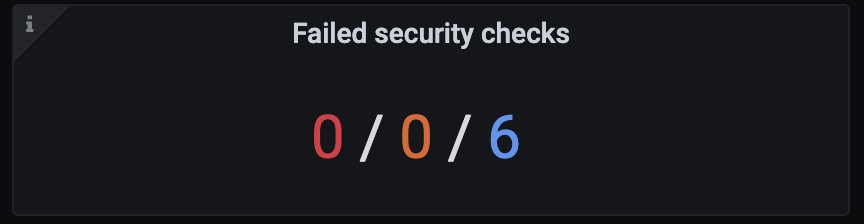
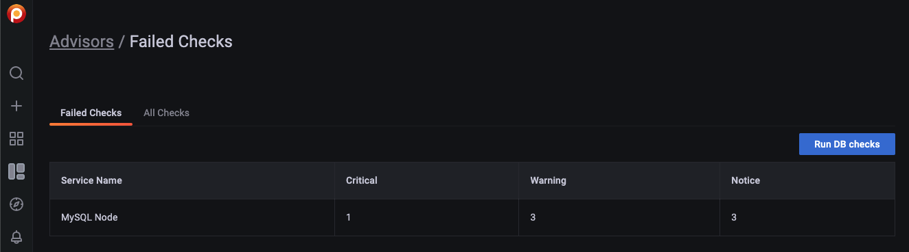

# Develop custom checks
 
PMM offers a set of checks that can detect common security threats, performance degradation, data loss and data corruption.
 
As a developer, you can create custom checks to cover additional use cases, relevant to your specific database infrastructure.
 
## Check components
 
A check is a combination of:
 
- SQL query or MongoDB query document for extracting data from the database.
- Python script for converting extracted data into check results. This is actually a [Starlark](https://github.com/google/starlark-go) script, which is a Python dialect that adds more imperative features than Python. The script's execution environment is sandboxed, and no I/O can be done from it.
 
All checks are self-contained in the first phase, as well as in most of the planned phases.
 
This means that extracted data is processed on the PMM side and not sent back to the SaaS.
  
## Backend
 

 
1. pmm-managed checks that the installation is opted-in for checks.
2. pmm-managed downloads checks file from SaaS.
3. pmm-managed verifies file signatures using a list of hard-coded public keys. At least one signature should be correct.
4. pmm-managed sends queries to pmm-agent and gathers results.
5. pmm-managed executes check scripts that produce alert information.
6. pmm-managed sends alerts to Alert Manager.
   - Due to Alertmanager design, pmm-managed has to send and re-send alerts to it much more often than the frequency with which checks are executed. This expected behaviour is not important for using checks but is important for understanding how checks work.
   - Currently, Prometheus is not involved.
 
## Frontend
 

 
Our UI in Grafana uses Alert Manager API v2 to get information about failed checks.
 
## Check fields
 
- **Version** (integer, required): defines what other properties are expected, what types are supported, what is expected from the script and what it can expect from the execution environment, etc.
- **Name** (string, required): defined machine-readable name (ID).
- **Summary** (string, required): defines short human-readable description.
- **Description** (string, required): defines long human-readable description.
- **Type** (string/enum, required): defines the query type and the PMM Service type for which the advisor runs. Check the list of available types in the table below.
- **Query** (string, optional): contains an SQL query as a string with proper quoting. The query for Security Checks (developed for PMM 2.26 and older) can also contain a MongoDB query document. Advisor checks for PMM 2.27 and later do not yet support a query parameter for MongoDB. 

    The query is executed on the PMM Client side and can be absent if the type defines the whole query by itself.  
or 
- **Script** (string, required): contains a small Python program that processes query results, and returns check results. It is executed on the PMM Server side.
 
## Checks script
 
The check script assumes that there is a function with a fixed name _check_ that accepts a _list_ of _docs_ containing returned rows for SQL databases and documents for MongoDB. It returns zero, one, or several check results that are then converted to alerts.
 
PMM 2.12.0 and earlier use **context**, while newer versions use **check_context**. Both have the same meaning.
  
## Check severity levels
PMM can display failed checks as Critical, Major or Trivial. These three severity levels can be linked to the following severity types in the check source:
 
 - Critical: emergency, alert, critical
 - Major: warning  
 - Trivial: notice, info, debug
 
## Check types
Use one of the following check types to define your query type and the PMM Service type for which the check will run:
 
| Check type  |  Description | "query" required (must be empty if no)   |  Availability in PMM | Documentation  |
|---|---|---|---|---|
| MYSQL_SHOW |     Executes 'SHOW …' clause against MySQL database.      |Yes | PMM 2.27 and older||
| MYSQL_SELECT    |     Executes 'SELECT …' clause against MySQL database.       |Yes|PMM 2.27 and older|   |
| POSTGRESQL_SHOW     |    Executes 'SHOW ALL' command against PosgreSQL database.        | No| PMM 2.27 and older ||
| POSTGRESQL_SELECT      | Executes 'SELECT …' clause against PosgreSQL database.    | Yes|  PMM 2.27 and older||
| MONGODB_GETPARAMETER     | Executes db.adminCommand( { getParameter: "*" } ) against MongoDB's "admin" database.    | No | PMM 2.27 and older| [getParameter](https://docs.mongodb.com/manual/reference/command/getParameter/)|
| MONGODB_BUILDINFO    | Executes db.adminCommand( { buildInfo:  1 } ) against MongoDB's "admin" database.    | No | PMM 2.27 and older| [buildInfo](https://docs.mongodb.com/manual/reference/command/buildInfo/) |
| MONGODB_GETCMDLINEOPTS          |    Executes db.adminCommand( { getCmdLineOpts: 1 } ) against MongoDB's "admin" database.      | No | PMM 2.27 and older| [getCmdLineOpts](https://docs.mongodb.com/manual/reference/command/getCmdLineOpts/) |
| MONGODB_REPLSETGETSTATUS     |   Executes db.adminCommand( { replSetGetStatus: 1 } ) against MongoDB's "admin" database.       | No |PMM 2.27 and newer |  [replSetGetStatus](https://docs.mongodb.com/manual/reference/command/replSetGetStatus/) |
| MONGODB_GETDIAGNOSTICDATA |Executes db.adminCommand( { getDiagnosticData: 1 } ) against MongoDB's "admin" database.   | No | PMM 2.27 and newer| [MongoDB Performance](https://docs.mongodb.com/manual/administration/analyzing-mongodb-performance/#full-time-diagnostic-data-capture)| 
 
## Develop custom checks
 
1.  Download the latest PMM Server and PMM Client builds:
 
    - PMM Server: [percona/pmm-server:2](https://www.percona.com/software/pmm/quickstart#)
    - PMM Client: _pmm2-client-2.9.1.tar.gz_
 
2.  Run PMM Server with special environment variables:
 
    - _PMM_DEBUG=1_ to enable debug output that would be useful later;
    - _PERCONA_TEST_CHECKS_FILE=/srv/custom-checks.yml_ to use checks from the local files instead of downloading them from the SaaS.
    - _PERCONA_TEST_CHECKS_DISABLE_START_DELAY=true_ to disable the default check execution start delay. This is currently set to one minute, so that checks run upon system start.
    - _PERCONA_TEST_CHECKS_RESEND_INTERVAL=2s_ to define the frequency for sending the SA-based alerts to Alertmanager.
 
    ```
    docker run -p 80:80 -p 443:443 --name pmm-server \
 
    -e PMM_DEBUG=1 \
    -e PERCONA_TEST_CHECKS_FILE=/srv/custom-checks.yml \
    -e PERCONA_TEST_CHECKS_DISABLE_START_DELAY=true
    -e PERCONA_TEST_CHECKS_RESEND_INTERVAL=2s \
    perconalab/pmm-server:dev-latest
    ```
 
3.  Log in to Grafana with credentials **admin/admin**.
 
4. Go to **Configuration > Settings > Advanced Settings** and enable **Advisors**. For PMM 2.26 and older this option is called **Security Threat Tool**.
 
4.  Create _/srv/custom-checks.yml_ inside a Docker container with the content of your check.
 
5.  The checks will run according to the time interval defined on the UI. You can see the result of running the check on the home dashboard:
 
    
 
6.  Click on the number of failed checks to open the Failed Checks dashboard:
 
    
 
7.  Go into Docker container to output the logs of pmm-managed and read check logs:
 
```
# get inside the container
docker exec -it pmm-server bash
# print and watch the logs
supervisorctl tail -f pmm-managed
 
```
## Advisor checks particularities (for PMM 2.27 and newer)
PMM 2.26 and older included a set of security checks grouped under the **Security Threat Tool** option.
 
Starting with the 2.27 release, checks are grouped into a set of Advisors, according to the functionality and recommendations they provide.
 
To reflect these changes, the old **Security Threat Tool** option has been renamed to **Advisors** and the checks use a slightly different format.
 
### Check format
Advisors checks use a slightly different format than security checks developed for PMM 2.26 and later. 

To create advisor checks for PMM 2.27 and later, use the following format:
 
```yaml
---
checks:
  - version: 2             <------ version increment
    name: exampleV2
    summary: Check format V2
    description: Checks something important
    tiers: [ anonymous, registered ]
    interval: standard
    family: MYSQL          <------- family
    queries:               <-------- queries
      - type: MYSQL_SELECT
        query: some query
 
      - type: MYSQL_SHOW
        query: some query
 
    script: |
      def check_context(docs, context):
          firstQueryResults = docs[0]
          secondQueryResults = docs[1]
          // Process query results
          return results          }
          }]
```
  
### Function signature
 
The function signature for PMM 2.27 and later can be **check_context** (docs, context), where docs are lists of docs (one list of dicts for each query). 

### No query parameter for MongoDB
 The query for Security Checks (developed for PMM 2.26 and older) can also contain a MongoDB query document.
 Advisor checks for PMM 2.27 and later do not yet support a query parameter for MongoDB.
 
 
## Particularities of security checks for PMM 2.26 and older) 
 
### Format
 
The example below shows the format for a single check that returns the static result:
 
```yaml
---
checks:
  - version: 1
    name: example
    summary: Example check
    description: This check is just an example.
    tiers: [anonymous, registered]
    type: MONGODB_BUILDINFO
    script: |
      def check(docs):
          # for compatibility with PMM Server < 2.12
          context = {
              "format_version_num": format_version_num,
              "parse_version": parse_version,
          }
          return check_context(docs, context)
 
 
      def check_context(docs, context):
          # `docs` is a frozen (deeply immutable) list of dicts where each dict represents a single document in result set.
          # `context` is a dict with additional functions.
          #
          # Global `print` and `fail` functions are available.
          #
          # `check_context` function is expected to return a list of dicts that are then converted to alerts;
          # in particular, that list can be empty.
          # Any other value (for example, string) is treated as script execution failure
          # (Starlark does not support Python exceptions);
          # it is recommended to use global function `fail` for that instead.
 
          format_version_num = context.get("format_version_num", fail)
          parse_version = context.get("parse_version", fail)
 
          print("first doc =", repr(docs[0]))
 
          return [{
              "summary": "Example summary",
              "description": "Example description",
              "severity": "warning",
              "labels": {
                  "version": format_version_num(10203),
              }
          }]
```
 
Here is a much more realistic example:
 
```yaml
---
checks:
  - version: 1
    name: mongodb_version
    summary: MongoDB Version
    description: This advisor returns warnings if MongoDB/PSMDB version is not the latest one.
    tiers: [anonymous, registered]
    type: MONGODB_BUILDINFO
    script: |
      LATEST_VERSIONS = {
          "mongodb": {
              "3.6": 30620,  # https://docs.mongodb.com/manual/release-notes/3.6/
              "4.0": 40020,  # https://docs.mongodb.com/manual/release-notes/4.0/
              "4.2": 40210,  # https://docs.mongodb.com/manual/release-notes/4.2/
              "4.4": 40401,  # https://docs.mongodb.com/manual/release-notes/4.4/
          },
          "percona": {
              "3.6": 30620,  # https://www.percona.com/downloads/percona-server-mongodb-3.6/
              "4.0": 40020,  # https://www.percona.com/downloads/percona-server-mongodb-4.0/
              "4.2": 40209,  # https://www.percona.com/downloads/percona-server-mongodb-4.2/
              "4.4": 40401,  # https://www.percona.com/downloads/percona-server-mongodb-4.4/
          },
      }
 
 
      def check(docs):
          # for compatibility with PMM Server < 2.12
          context = {
              "format_version_num": format_version_num,
              "parse_version": parse_version,
          }
          return check_context(docs, context)
 
 
      def check_context(docs, context):
          # `docs` is a frozen (deeply immutable) list of dicts where each dict represents a single document in result set.
          # `context` is a dict with additional functions.
          #
          # Global `print` and `fail` functions are available.
          #
          # `check_context` function is expected to return a list of dicts that are then converted to alerts;
          # in particular, that list can be empty.
          # Any other value (for example, string) is treated as script execution failure
          # (Starlark does not support Python exceptions);
          # it is recommended to use global function `fail` for that instead.
 
          """
          This advisor returns warnings if MongoDB/PSMDB version is not the latest one.
          """
 
          format_version_num = context.get("format_version_num", fail)
          parse_version = context.get("parse_version", fail)
 
          if len(docs) != 1:
              return "Unexpected number of documents"
 
          info = docs[0]
 
          # extract information
          is_percona = 'psmdbVersion' in info
 
          # parse_version returns a dict with keys: major, minor, patch, rest, num
          version = parse_version(info["version"])
          print("version =", repr(version))
          num = version["num"]
          mm = "{}.{}".format(version["major"], version["minor"])
 
          results = []
 
          if is_percona:
              latest = LATEST_VERSIONS["percona"][mm]
              if latest > num:
                  results.append({
                      "summary": "Newer version of Percona Server for MongoDB is available",
                      "description": "Current version is {}, latest available version is {}.".format(format_version_num(num), format_version_num(latest)),
                      "severity": "warning",
                      "labels": {
                          "current": format_version_num(num),
                          "latest":  format_version_num(latest),
                      },
                  })
 
              return results
 
          if True:  # MongoDB
              latest = LATEST_VERSIONS["mongodb"][mm]
              if latest > num:
                  results.append({
                      "summary": "Newer version of MongoDB is available",
                      "description": "Current version is {}, latest available version is {}.".format(format_version_num(num), format_version_num(latest)),
                      "severity": "warning",
                      "labels": {
                          "current": format_version_num(num),
                          "latest":  format_version_num(latest),
                      },
                  })
 
              return results
```
 
### Function signature
 
The function signature can be **def check(docs)**  or **def check_context** (docs, context), where **docs** is a list of dicts.
  
 
## Check examples
You can find working examples of the build-in checks on [Percona Github](https://github.com/percona-platform/checked/tree/main/data/checks).
 
## Submit feedback
 We welcome your feedback on the current process for developing and debugging checks. Send us your comments over [Slack](https://percona.slack.com) or post a question on the [Percona Forums](https://forums.percona.com/).