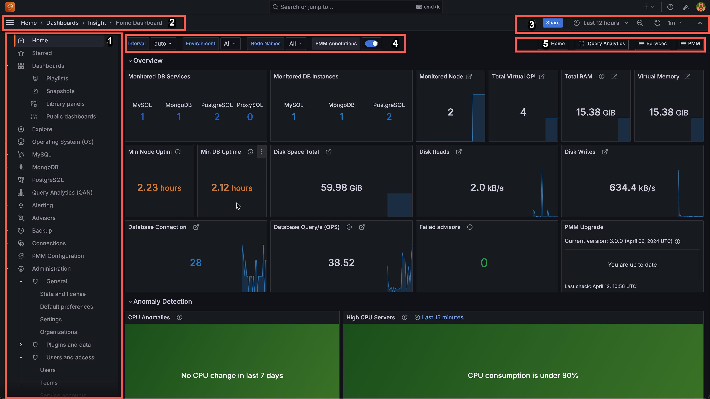

# User Interface

How to log in, how the user interface is laid out, and what the controls do.

PMM's user interface is a browser application based on [Grafana].

## Logging in

1. Start a web browser and in the address bar enter the server name or IP address of the PMM server host.

2. The page loads showing the PMM login screen.

    

3. Enter the username and password given to you by your system administrator. The defaults are:

   - Username: `admin`

   - Password: `admin`

4. Click _Log in_.

5. If this is your first time logging in, you'll be asked to set a new password. (We recommend you do.)

   - Either enter a new password in both fields and click _Submit_, or,

   - click _Skip_ to use the default password.

6. The PMM Home dashboard loads.

   

## Dashboards

The interface is a collection of web pages called _dashboards_.

Dashboards are grouped into _folders_. You can customize these, by renaming them or creating new ones.

The area inside dashboards is populated by _panels_. Some are in collapsible panel groups. A panel can show a value, a graph, a chart, or a visual representation of a set.

## Controls

These menus and controls appear on all dashboards:

1. Main menu (also _Grafana menu_, _side menu_).

2. Navigation bar.

3. View controls.

4. View selectors (with dynamic contents).

5. Shortcut menu (with dynamic contents).

(For details see [UI Components](../details/interface.md).)

## Navigation

### Search for a dashboard by name

There are two ways to open the dashboard search page. (Each takes you to the same search screen.)

- Click the <i class="uil uil-search"></i> icon in the main menu.

- Click the dashboard name in the navigation bar (top row, to the right of the <i class="uil uil-apps"></i> icon). (To search within the current folder, click the folder name instead of the dashboard name.)

1. Click _Search dashboards by name_ and begin typing any part of the dashboard name (in this example, "_Instances_").

   

2. Click one of the search results to go to that dashboard. Change the search text to refine the list.

3. To abandon the search, click the <i class="uil uil-times"></i> icon at the end of the search bar.

### Open a dashboard with the menu

In the [main menu](../details/interface.md#main-menu), the {{icon.dashboards}} _PMM Dashboards_ icon reveals a submenu containing links to all PMM dashboards grouped by service type. (This menu will replace the [shortcut menu](../details/interface.md#shortcut-menu) which has links to commonly-used dashboards.)

## Panels

Charts, graphs and set-based panels reveal extra information when the mouse is moved over them.

Some panels have an information icon <i class="fa fa-info"></i> in the top left corner. Mouse over this to reveal panel information.

### Panel menu

At the top of each panel and to the right of the panel name is the _panel menu_.

!!! hint alert alert-success "Tip"
      The menu is hidden until you mouse over it. Look for the <i class="uil uil-angle-down"></i> symbol in the title bar of a panel.

| Item                                      | Description                                                                   |
| ----------------------------------------- | ----------------------------------------------------------------------------- |
| <i class="uil uil-eye"></i> View          | Open the panel in full window mode.                                           |
| <i class="uil uil-share-alt"></i> Share   | [Share the panel's link or image](../how-to/share-dashboard.md). |
| <i class="uil uil-compass"></i> Explore   | Run [PromQL] queries.                                                         |
| <i class="fa fa-info-circle"></i> Inspect | See the panel's data or definition.                                           |
| <i class="uil uil-cube"></i> More         | (Only charts and graphs) Additional options.                                  |

### View

The _View_ menu items opens panels in full-window mode. This is useful for graphs with several metrics.

Exit a panel's full window mode by pressing _Escape_ or clicking the left arrow <i class="uil uil-arrow-left"></i> next to the dashboard name.

!!! info alert alert-info "See also"
- [How to render dashboard images](../how-to/render-dashboard-images.md)
- [How to annotate special events](../how-to/annotate.md)

[grafana]: https://grafana.com/docs/grafana/latest/
[promql]: https://prometheus.io/docs/prometheus/latest/querying/basics/

## Timezones

By default Grafana uses the timezone from your web browser. However, you can change this setting.

### Set user timezone

1. On the left menu, hover your cursor over your avatar and then click _Preferences_.
2. Click to select an option in the _Timezone list_.
3. Click _Save_.

# UI components

!!! note alert alert-light "Key"
    1. [Main menu](#main-menu) (also *Grafana menu*, *side menu*)
    2. [Navigation bar](#navigation-bar)
    3. [View controls](#view-controls)
    4. [View selectors](#view-selectors) (dynamic contents)
    5. [Shortcut menu](#shortcut-menu) (dynamic contents)

## Main menu

The main menu is part of the Grafana framework and is visible on every page.

| Item (Top)                         | Name                 | Description
|:----------------------------------:|----------------------|-------------------------------
| {{icon.percona}}                   | Home                 | Link to home dashboard.
| <i class="uil uil-search"></i>     | Search               | Search dashboards by name.
| <i class="uil uil-star"></i>       | Starred              | Mark your favorite dashboards.
| <i class="uil uil-apps"></i>       | Dashboards           | Create dashboards or [folders][Folders], manage dashboards, import dashboards, create playlists, manage snapshots.
|       | Operating System (OS)    | Operating System dashboard
|     | MySQL      | MySQL dashboard
|     | MongoDB      | MongoDB dashboard
|     | PostgreSQL     | PostgreSQL dashboard
|     | ProxySQL     | ProxySQL dashboard
|     | HAproxy     | HAproxy dashboard
| | Query Analytics (QAN) | Query Analytics
| <i class="uil uil-compass"></i>    | Explore              | Run queries with [PromQL].
| <i class="uil uil-bell"></i>       | Percona Alerting             | [Alerting](../get-started/alerting.md), Create new alerts and manage your alert rules and alert templates.
| <i class="uil uil-cog"></i>        | Configuration        |
|        | Entitlements        |This tab is displayed after connecting PMM to Percona Portal, and shows all your Percona Platform account information. 
|        | Support Tickets        | Shows the list of tickets opened across your organization. This tab is only available after you connect PMM to Percona Platform.
|        | Environment Overview        | This tab is displayed after connecting PMM to Percona Portal. Shows the name and email of the Customer Success Manager assigned to your organization, who can help with any PMM queries. This tab will soon be populated with more useful information about your PMM environment. 
| <i class="uil uil-shield"></i>     | Server Admin         |
| <i class="uil uil-history"></i>    | Backup Management    | [Backup management and storage location configuration][BACKUP].
| {{icon.checks}}                    | PMM Advisor Checks  | Run health assessment checks against your connected databases and check any failed checks. 
| <i class="uil uil-database"></i>   | DBaaS                |

!!! hint alert alert-success "Tip"
    The DBaaS icon appears only if a server feature flag has been set.

    The Backup Management icon appears when *Backup Management* is activated in <i class="uil uil-cog"></i> *Configuration* → <i class="uil uil-setting"></i> *Settings* → *Advanced Settings*.

| Icon (Bottom)                            | Description |
|:----------------------------------------:|-------------|
| (Profile icon)                           | User menu   |
| <i class="uil uil-question-circle"></i>  | Help        |

## Navigation bar

| Item (left)                       | Description
|-----------------------------------|-------------------------
| <i class="uil uil-apps"></i>      | (Display only.)
| (Name) /                          | (Optional) Folder name.
| (Name)                            | Dashboard name.
| <i class="uil uil-star"></i>      | Mark as favorite.
| <i class="uil uil-share-alt"></i> | Share dashboard.

## View controls

| Item (right)                                    | Description
|-------------------------------------------------| --------------------
| <i class="uil uil-cog"></i>                     | Dashboard settings.
| <i class="uil uil-monitor"></i>                 | Cycle view mode.
| <i class="uil uil-clock-nine"></i> (time range) | Time range selector.
| <i class="uil uil-search-minus"></i>            | Time range zoom out.
| <i class="uil uil-sync"></i>                    | Refresh dashboard.
| (Time interval)                                 | Refresh period.

## View selectors

This menu bar is context-sensitive; it changes according to the page you are on. (With wide menus on small screens, items may wrap to the next row.)

| Item                          | Description
|-------------------------------|-------------------------------------------
| Interval                      | Data interval.
| Region                        | Filter by region.
| Environment                   | Filter by environment.
| Cluster                       | Filter by cluster.
| Replication Set               | Filter by replication set.
| Node Name                     | Filter by node name.
| Service Name                  | Filter by service name.
| PMM Annotations               | View [annotations](../how-to/annotate.md).

## Shortcut menu

This menu contains shortcuts to other dashboards. The list changes according to the page you're on.

!!! note alert alert-primary ""
    This menu will be removed in future releases. Its function will be replaced by the {{icon.dashboards}} *PMM Dashboards* main menu entry.

| Item                                         | Description
|----------------------------------------------| ------------------------------
| <i class="uil uil-file-alt"></i> Home        | Home dashboard.
| <i class="uil uil-apps"></i> Query Analytics | Query Analytics.
| <i class="uil uil-bolt"></i> Compare         | Nodes compare.
| (Service Type)                               | Service type menu (see [Services menu](#services-menu)).
| <i class="uil uil-bars"></i> HA              | HA dashboards.
| <i class="uil uil-bars"></i> Services        | Services menu.
| <i class="uil uil-bars"></i> PMM             | PMM menu.

!!! hint alert alert-success "Tip"
    The *Compare* menu links to the Instances Overview dashboard for the current service type.

### Services menu

The *Services* menu choice determines the Service Type menu.

| Menu      | Item                           | Service type menu                       | Description
|-----------|--------------------------------|-----------------------------------------|-----------------------
| Services  |                                |                                         |
|           | MongoDB Instances Overview     | <i class="uil uil-bars"></i> MongoDB    | MongoDB dashboards.
|           | MySQL Instances Overview       | <i class="uil uil-bars"></i> MySQL      | MySQL dashboards.
|           | Nodes Overview                 | <i class="uil uil-bars"></i> OS         | OS dashboards.
|           | PostgreSQL Instances Overview  | <i class="uil uil-bars"></i> PostgreSQL | PostgreSQL dashboards.

!!! hint alert alert-success "Note"
    - You can easily access all dashboards for monitored services from the *Main menu* via *Other Dashboards* in the *Services* sub menu.
    - Only the services being monitored by PMM will appear on the main menu.

### PMM menu

This item lists shortcuts to utility pages.

| Menu | Item
|------|---------------------
| PMM  |
|      | PMM Add Instance
|      | PMM Advisor Checks
|      | PMM Inventory
|      | PMM Settings

[Folders]: https://grafana.com/docs/grafana/latest/dashboards/dashboard_folders/
[PromQL]: https://grafana.com/blog/2020/02/04/introduction-to-promql-the-prometheus-query-language/

[BACKUP]: ../get-started/backup/index.md

