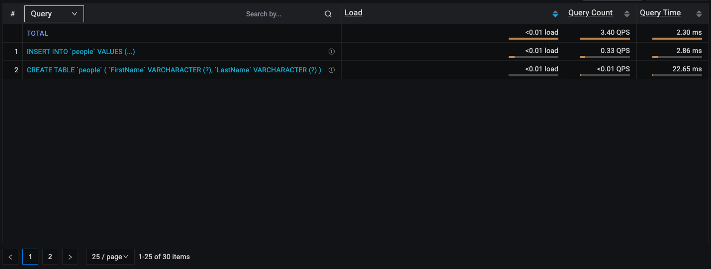
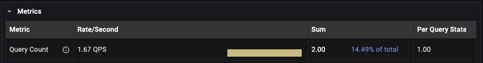

# Query Analytics under the hood

## Components
QAN consists of three main components:
1. [Filters Panel](../get-started/./query-analytics.md#filters-panel)
2. [Overview Panel](../get-started./query-analytics.md#overview-panel)
3. [Details Panel](../get-started./query-analytics.md#details-panel)

## How QAN collects data?
- QAN collects data every minute, on the minute (e.g., 8:15:00 and next at 8:16:00, etc.).

- The collected data is represented by "buckets."

## Understanding buckets
- A bucket contains all the data captured during a one-minute interval.

-  Once a bucket is created, it is sent to the PMM Server, where it is parsed and saved in the ClickHouse database. All QAN-related data is stored in ClickHouse, which can be either part of the PMM Server or an external instance.

- queries in buckets are aggregated by query ID, which means that all queries with the same query ID are represented by a single row in the Overview panel.
- Query IDs are calculated differently depending on the database technology and query source.
**MySQL**   
For MySQL, the query ID is based on the DIGEST value (for Performance Schema) or the MD5 checksum of the fingerprint (for slow log).

DIGEST (Perfschema) and fingerprint (Slowlog) are same. It is query without sensitive data. In case below both queries will have **same query ID**. The DIGEST value is generated from the query text without sensitive data.
    ```sh
    INSERT INTO people VALUES ('Joe', 'Doe'); 
    INSERT INTO people VALUES ('John', 'Smith'); 
    ``` 
    - **Perfschema** 
        - The query ID is based on the DIGEST (fingerprint) value from the `events_statements_summary_by_digest` table in the mysql database.

        - DIGEST for same query could be different in different versions of MySQL 
        - The DIGEST is generated from the query text without sensitive data (DIGEST_TEXT).

        - In MySQL 8.0 and higher, you can use the STATEMENT_DIGEST("your query") function to obtain the DIGEST (query ID) for a given query. See the [MySQL official documentation](https://dev.mysql.com/doc/refman/8.0/en/encryption-functions.html#function_statement-digest) for more details.
    - **Slowlog** 
        - The query ID is the MD5 checksum of the query fingerprint.

## Sources for data
- MySQL Perfschema: tables `events_statements_summary_by_digest` and `events_statements_history` in MySQL database called `mysql`
- MySQL Slowlog: file on path provided during configuring your MySQL
- PostgreSQL pg_stat_statements (PGSS): view `pg_stat_statements` in required database
- PostgreSQL pg_stat_statmonitor (PGSM): view `pg_stat_monitor` in required database

## Examples
### 1. MySQL, query source perfschema/slowlog
**Timeline**   
**8:05:05:** You started pmm-agent.

**8:05:20:** You executed queries:
```sh 
CREATE TABLE people (FirstName varchar(255), LastName varchar(255));
INSERT INTO people VALUES ('Joe', 'Doe');
INSERT INTO people VALUES ('John', 'Smith');
```
**8:05:25:** Queries finished.

**8:06:00:** Buckets are collected and sent to PMM Server. Now go to QAN.

**8:06:10:** You should see two rows in QAN list overview (depends on settings of filter and time range):
 
Lets answer some questions about the image above.   
**Question:** Why is the query a little bit different in the list overview?   
**Answer:** The query is the same, but sensitive data (Joe, John etc) are replaced by "?", "?+" or "..." in list overview  
**Question:** We triggered two INSERT queries, but there is only one row in the list overview. Why?   
**Answer:** for executed queries: 
```sh 
INSERT INTO people VALUES ('Joe', 'Doe');
INSERT INTO people VALUES ('John', 'Smith');
``` 
query ID will be the same and that is why it is aggregated as one row in the list overview. On the other hand in detail you still should see a real count of how many times the query was executed. As you can see in the image below. In detail the count for the INSERT query is 2. Since we executed the INSERT query 2 times it is correct and expected. 


### 2. MySQL, query source perfschema/slowlog, queries execution splitted over two buckets
**Timeline**   
**8:05:55:** You started pmm-agent. 

**8:05:59:** You executed queries: 
```sh
CREATE TABLE people (FirstName varchar(255), LastName varchar(255));
INSERT INTO people VALUES ('Joe', 'Doe');
INSERT INTO people VALUES ('John', 'Smith'); 
``` 
**8:06:00:** Buckets are collected and sent to PMM Server. Already executed queries are included too in the bucket. Could be found in QAN already in range 8:05:00 - 8:06:00 or any other timestamp, which includes this minute.

**8:06:01:** Queries finished.

**8:07:00:** Buckets are collected and sent to PMM Server. Rest of executed queries are included there and since now visible/increased in QAN.

**8:07:10:** You should see two rows in the QAN Overview Panel (depending on the filter settings and time range):
Now let's take a look at results with different time range filters.
1. QAN with default time range filter (Last 12 hours) - two rows in overview (one for CREATE query, another for INSERT). In the Details panel, the count for the INSERT query is 2.
2. Range 8:05:00 - 8:06:00 - one row in the Overview list for the CREATE query, because none of the INSERT queries were executed by that time
3. Range 8:06:00 - 8:07:00 - One row in the Overview panel for the INSERT query because the CREATE query was sent in the previous bucket.
In the Details Panel, the count for the INSERT query is 2 since both queries were executed in this range.

Remember that it may take up to 2 minutes for all the data to be visible in QAN after the queries have finished executing.

In the future, we will include examples covering more technologies (e.g., PostgreSQL, MongoDB) in this topic.