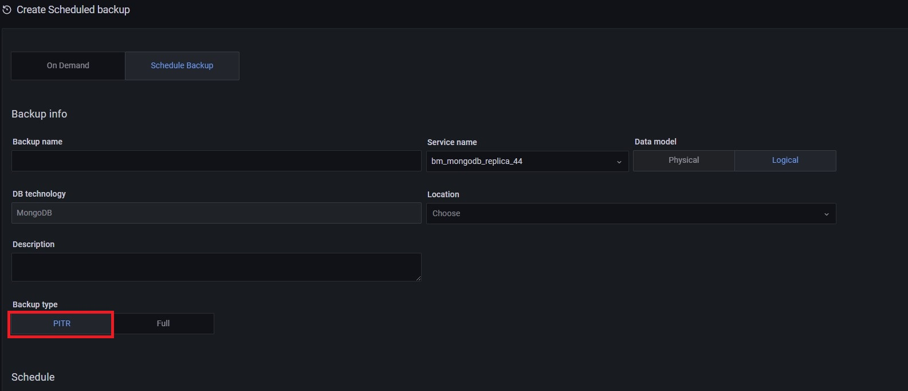

# Create MongoDB PITR backups

Point-in-Time Recovery (PITR) restores databases up to a specific moment. PITR includes restoring the data from a backup snapshot and replaying all events that occurred to this data up to a specified moment from [oplog slices].

Point-in-Time Recovery helps you prevent data loss during a disaster such as crashed database, accidental data deletion or drop of tables, or unwanted update of multiple fields instead of a single one.

### Compatibility with Percona Backup for MongoDB
PMM introduced the option to create PITR Backups for MongoDB in version 2.23, as part of the larger Backup Management feature. This implementation in PMM uses Percona Backup for MongoDB (pbm) behind the scenes.

Percona Backup for MongoDB is a distributed, low-impact solution for achieving consistent backups of MongoDB sharded clusters and replica sets.
Starting with PMM 2.32, restoring PITR backups is available for backups based on pbm ≤ 2.0.1. To  restore PITR backups, make sure you have pbm ≥ 2.0.1 installed.

 Percona Backup for MongoDB supports [Percona Server for MongoDB](https://www.percona.com/software/mongodb/percona-server-for-mongodb) and MongoDB Community ≤ 3.6, with [MongoDB Replication](https://docs.mongodb.com/manual/replication/) enabled. For more information, see the [Percona Backup for MongoDB documentation](https://docs.percona.com/percona-backup-mongodb/installation.html).

### How does it work?

To create a PITR backup, select the **PITR** backup type option when creating a scheduled backup for MongoDB. See the [Make a backup](#make-a-backup) section above.

#### PITR artifacts

The PITR oplog is available a few minutes (10 by default) after your PITR job has run for the first time. To see the corresponding PITR artifact, check out the list under **Backup > All Backups**.

#### PITR and other scheduled backups

Make sure to disable any other scheduled backup jobs before creating a PITR backup. PMM displays an error message if you try to enable PITR while other scheduled backup jobs are active:

This constraint applies at the service level. You can still have PITR enabled for one service while having regular scheduled backup jobs for other services.