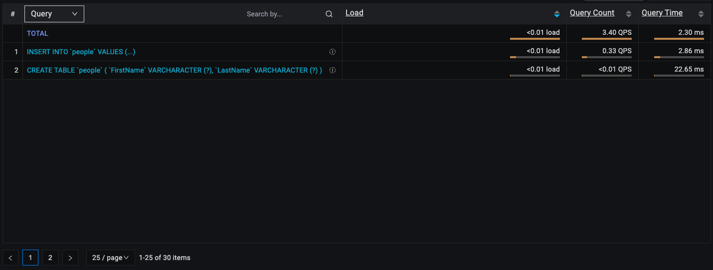

# Query analytics (QAN)

## Components
1. the [Filters Panel](./query-analytics.md#filters-panel)
2. the [Overview Panel](./query-analytics.md#overview-panel)
3. the [Details Panel](./query-analytics.md#details-panel)

**How QAN collecting data?**
- data are collected every minute (at 0 seconds, like 8:15:00, next in 8:16:00 etc)
- collected data are represented by buckets

**Sources for data**
- MySQL Perfschema: tables events_statements_summary_by_digest and events_statements_history in mysql database
- MySQL Slowlog: file on path provided during configuring your MySQL
- PostgreSQL pg_stat_statements (PGSS): view pg_stat_statements in required database
- PostgreSQL pg_stat_statmonitor (PGSM): view pg_stat_monitor in required database

**What is bucket/How is created?**
- buckets contains all data captured during one minute interval
- once bucket is created it is send to PMM Server where is it parsed and saved in clickhouse database, which is used for QAN data
- queries in buckets are aggregated by query ID
- query IDs are calculated different depends on technology and query source

**Examples:**

1. MySQL, query source perfschema/slowlog.

Timeline:  
8:05:05: You started pmm-agent.  
8:05:20: You triggered queries:  
>`CREATE TABLE people (FirstName varchar(255), LastName varchar(255));`  
`INSERT INTO people VALUES ('Joe', 'Doe');`  
`INSERT INTO people VALUES ('John', 'Smith');`  

8:05:25: Queries finished.   
8:06:00: Buckets are collected and sent to PMM Server. Now go to QAN.  
8:06:10: You should see those two rows in QAN list (depends on settings of filter and time range):
 
Lets answer some questions about image above.  
1. Why query is little bit different in list?
- query is same, but sensitive data (Joe, John etc) are replaced by "?", "?+" or "..." in list overview
2. We trigerred two INSERT queries, but there is only one in list. Why?
- queries are aggregated by query ID.  
**Slowlog**  
- case sensitive  
`insert into people values ('Joe', 'Doe');`   
`INSERT INTO people VALUES ('Joe', 'Doe');`  
Both queries above will have **different query ID**. 
- query ID is the right-most 16 characters of the MD5 checksum of fingerprint.  
**Perfschema**  
- not case sensitive  
`insert into people values ('Joe', 'Doe');`   
`INSERT INTO people VALUES ('Joe', 'Doe');`  
Both queries above will have **same query ID**. 
- query ID is based on DIGEST from MySQL
- with MySQL 8.0 and higher you can use function STATEMENT_DIGEST("your query") to get DIGEST (query ID). See more details on MySQL oficial website: https://dev.mysql.com/doc/refman/8.0/en/encryption-functions.html#function_statement-digest
- DIGEST is generated from query without sensitive data (DIGEST_TEXT), so for MySQL both queries will DIGEST_TEXT looks like same:  
`INSERT INTO people VALUES ('?', '?');`  
`INSERT INTO people VALUES ('?', '?');`   
That is why they has same query ID (DIGEST) and in list they are shown as 1 line, not 2. On the another hand in details you still should see real count of how many times query were trigger. As you can see on image below count for INSERT query is 2. Since we triggered INSERT query 2 times it is correct.
 

2. TODO MySQL, query source perfschema/slowlog, queries split into two buckets

TODO improve wording, structure