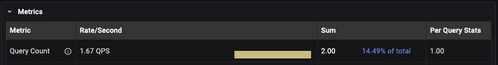

# Query analytics under the hood

## Components
1. [Filters Panel](./query-analytics.md#filters-panel)
2. [Overview Panel](./query-analytics.md#overview-panel)
3. [Details Panel](./query-analytics.md#details-panel)

## How QAN collecting data?
- data are collected every minute (at 0 seconds, like 8:15:00, next in 8:16:00 etc)
- collected data are represented by buckets

## What is bucket/How is created?
- buckets contains all data captured during one minute interval
- once bucket is created it is send to PMM Server where is it parsed and saved in clickhouse database. All QAN related data are stored there. Clickhouse is part of PMM Server, or you can use external one
- queries in buckets are aggregated by query ID. It means one row in list overview for all queries with same query ID
- query IDs are calculated different depends on technology and query source
    - **MySQL Perfschema**
        - query ID is based on DIGEST value from events_statements_summary_by_digest in mysql database
        - DIGEST for same query could be different in different versions of MySQL 
        - DIGEST is generated from query without sensitive data (DIGEST_TEXT), so both queries below will have same query ID.  
            ```sh
            INSERT INTO people VALUES ('Joe', 'Doe');  
            INSERT INTO people VALUES ('John', 'Smith');  
            ```
        - DIGEST is not case sensitive.   
            ```sh
            insert into people values ('Joe', 'Doe');   
            INSERT INTO people VALUES ('Joe', 'Doe'); 
            ``` 
            Both queries above will have **same query ID**. 
        - with MySQL 8.0 and higher you can use function STATEMENT_DIGEST("your query") to get DIGEST (query ID). See more details on MySQL official website: https://dev.mysql.com/doc/refman/8.0/en/encryption-functions.html#function_statement-digest
    - **MySQL Slowlog**
        - query ID is the right-most 16 characters of the MD5 checksum of fingerprint
        - fingerprint is query without sensitive data
        - MD5 checksum is case sensitive.
            ```sh
            insert into people values ('Joe', 'Doe');   
            INSERT INTO people VALUES ('Joe', 'Doe'); 
            ``` 
            Both queries above will have **different query ID**. 

## Sources for data
- MySQL Perfschema: tables `events_statements_summary_by_digest` and `events_statements_history` in MySQL database called `mysql`
- MySQL Slowlog: file on path provided during configuring your MySQL
- PostgreSQL pg_stat_statements (PGSS): view `pg_stat_statements` in required database
- PostgreSQL pg_stat_statmonitor (PGSM): view `pg_stat_monitor` in required database

## Examples
### 1. MySQL, query source perfschema/slowlog
**Timeline**   
8:05:05: You started pmm-agent.  
8:05:20: You executed queries:
```sh  
CREATE TABLE people (FirstName varchar(255), LastName varchar(255));
INSERT INTO people VALUES ('Joe', 'Doe');
INSERT INTO people VALUES ('John', 'Smith');
```
8:05:25: Queries finished.   
8:06:00: Buckets are collected and sent to PMM Server. Now go to QAN.  
8:06:10: You should see two rows in QAN list overview (depends on settings of filter and time range):
 
Lets answer some questions about image above.  
1. Why query is little bit different in list overview?
    - query is same, but sensitive data (Joe, John etc) are replaced by "?", "?+" or "..." in list overview
2. We trigerred two INSERT queries, but there is only one row in list overview. Why?
    - For executed queries:  
        ```sh
        INSERT INTO people VALUES ('Joe', 'Doe');   
        INSERT INTO people VALUES ('John', 'Smith');
        ```  
        query ID will be same and that is why it is aggregated as one row in list overview. On the another hand in details you still should see real count of how many times query were executed. As you can see on image below. In details count for INSERT query is 2. Since we executed INSERT query 2 times it is correct and expected.
         

### 2. MySQL, query source perfschema/slowlog, queries execution splitted over two buckets
**Timeline**  
8:05:55: You started pmm-agent.  
8:05:59: You executed queries:  
```sh
CREATE TABLE people (FirstName varchar(255), LastName varchar(255));
INSERT INTO people VALUES ('Joe', 'Doe'); 
INSERT INTO people VALUES ('John', 'Smith'); 
```  
8:06:00: Buckets are collected and sent to PMM Server. Already executed queries are included too in bucket. Could be find in QAN already in range 8:05:00 - 8:06:00 or any another timestamp, which includes this minute.  
8:06:01: Queries finished.    
8:07:00: Buckets are collected and sent to PMM Server. Rest of executed queries is included there and since now visible/increased in QAN.
8:07:10: You should see two rows in QAN list overview (depends on settings of filter and time range):

Now lets take a look on results with different time range filters.
1. QAN with default time range filter (Last 12 hours)
    - two rows in overview (one for CREATE query, another for INSERT)
    - in details for INSERT query count is 2
2. Range 8:05:00 - 8:06:00
    - one row in overview for CREATE query, because none of INSERT queries were executed by that time
3. Range 8:06:00 - 8:07:00
    - one row in overview for INSERT query, because CREATE query were send in previous bucket
    - in details for INSERT query count is 2. Both queries were executed in this range

Always rember that it could take up to 2 minutes until all data are visible in QAN since execution is done.

More technologies covered (PG, Mongo) with examples will be included in near future.