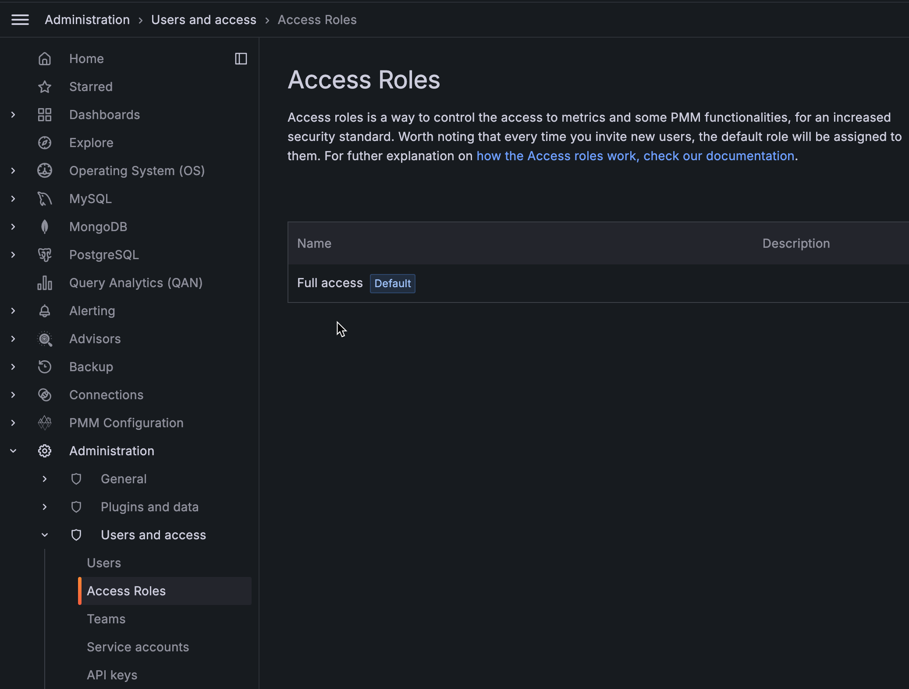
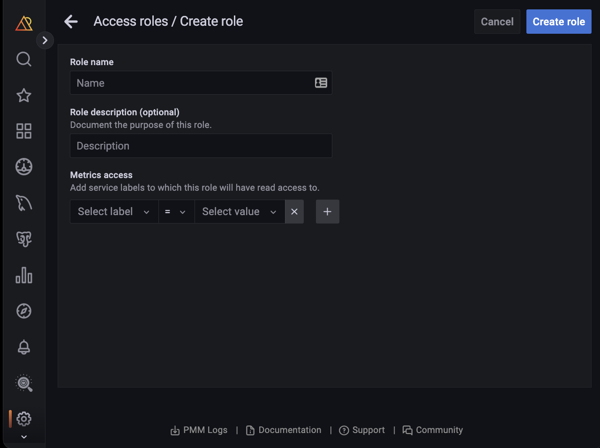
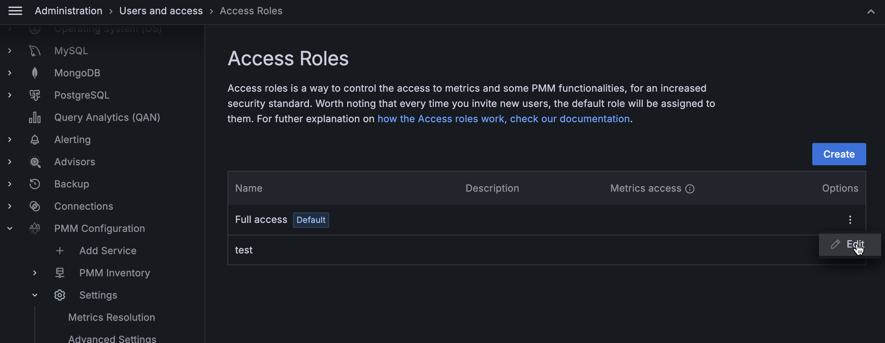
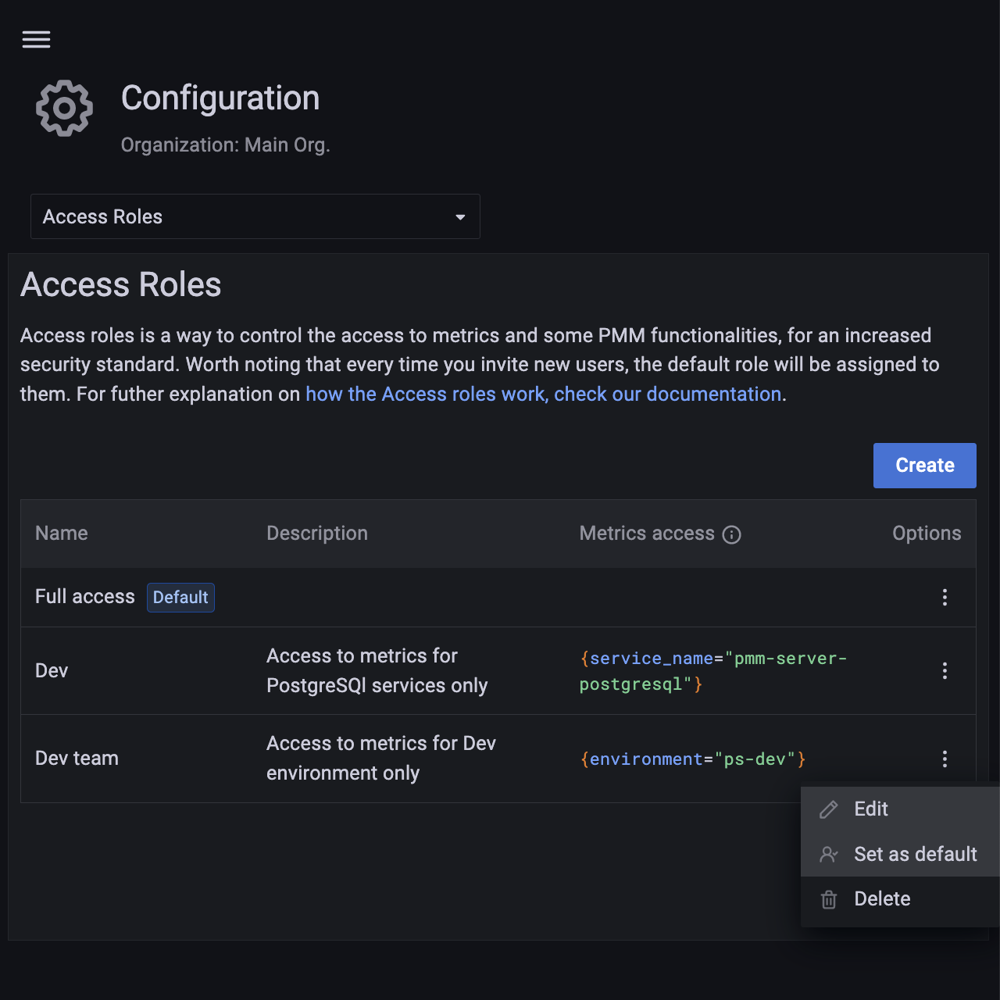
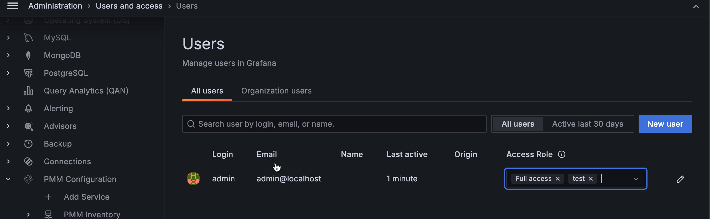
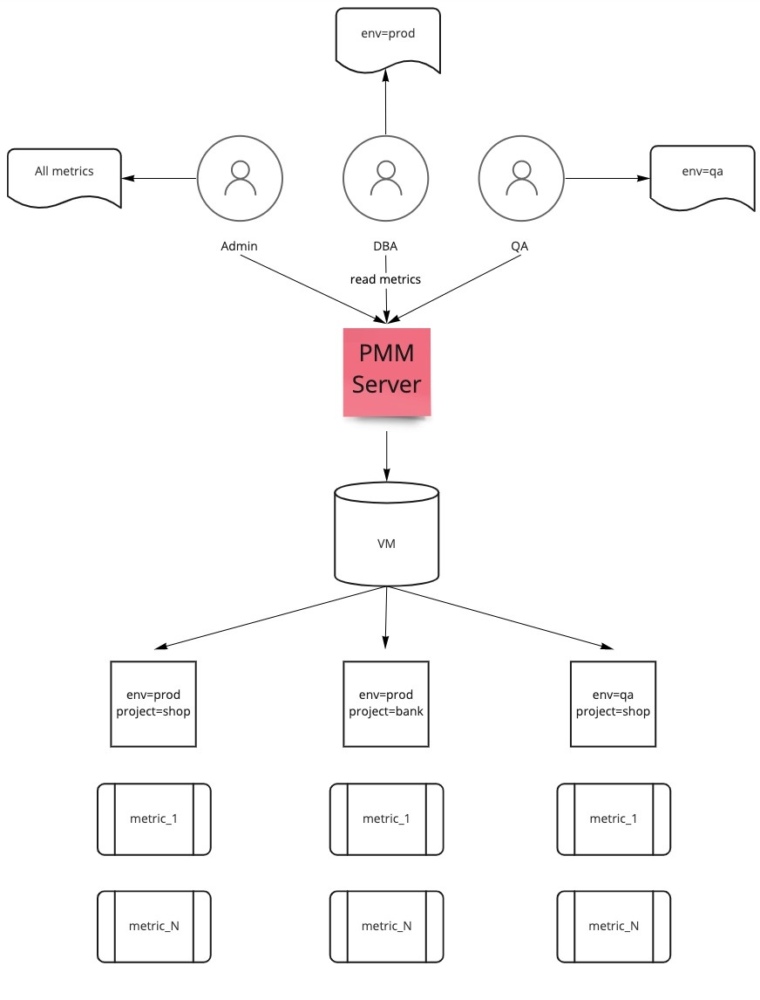

# Access roles in PMM

Roles are a vital part of Access control. Roles provide users with access to specific, role-based metrics.

## Enabling access roles in PMM

You can enable access roles in PMM as follows:

**Docker**

To enable access roles in a ``pmm-server`` docker container, pass an additional environment variable ``RBAC_ENABLE=1`` when starting the container.

```sh
docker run … RBAC_ENABLE=1
```

For compose add additional an variable:

```
services:
  pmm-server:
    …
    environment:
      …
      ENABLE_RBAC=1
```

## Creating access roles in PMM

To create access roles in PMM, do the following:

1. From the *Main* menu, navigate to *Configuration > Access Roles*. *Access Roles* tab
 opens.

   

2. Click *Create*. Create role page opens.


3. Enter the Role name and Role description.

   

4. Select the following from the dropdowns for metrics access:
    - Label
    - Operator
    - Value of the label.

 If you want to add more than one label for a role, click *+* and select the values from the dropdown.

 For information on how the Prometheus selectors work, see [Prometheus selectors](https://prometheus.io/docs/prometheus/latest/querying/basics/#time-series-selectors).

5. Click *Create* role.

!!! note alert alert-primary "Note"
    To create roles, you must have admin privileges. For more information, see [Manage users](../../how-to/manage-users.md).

## Managing access roles in PMM

You can manage roles in PMM by editing or deleting a role.

### Editing a role

To edit access roles, do the following:

1. From the *Main* menu, navigate to *Configuration > Access Roles*. The Access Roles tab opens.

2. On the role you want to edit, click the *ellipsis (three vertical dots) > edit role* in the *Options* column. The *Edit* role page opens.

  

3. Make the required changes to the role.

  


4. Click Save Changes.


### Setting a role as default

When a user signs in to PMM for the first time and the user has no role assigned, the user is automatically assigned the *Default* role. For administrators, the default role provides a convenient way to configure default permissions for new users.


To set a role as default, do the following:

1. From the *Main* menu, navigate to *Configuration > Access Roles*. The *Access Roles* tab opens.

2. On the role you want to set as default, click the *ellipsis (three vertical dots) > set as default* in the *Options* column.

 


### Removing a role

To remove access roles, do the following:

1. From the *Main* menu, navigate to *Configuration > Access Roles*. The *Access Roles* tab opens.

2. On the role you want to remove, click the *ellipsis (three vertical dots) > Delete* in the *Options* column. Delete role pop-up opens.

  


3. Click *Confirm* and delete the role.

## Assigning roles to users in PMM

To assign access roles to users, do the following:

1. From the *Main* menu, navigate to *Configuration > Users*. *Users* tab opens.

  


2. Select the *Access Role* you want to assign to a user from the dropdown. You can assign several roles to a user.

  


## Use Case

This use case demonstrates the following scenario:

The following labels are there as part of this use case:

-  Environments: **prod** and **qa**

-  Projects: **shop** and **bank**

The following roles are created as part of this use case:

- Roles: Admin, Dev and QA

An overview of the infrastructure can be seen in the diagram below. PMM monitors several services. The metrics that are stored in VictoriaMetrics have the appropriate labels.

  


 This diagram shows several roles within a company structure that have access to PMM, as well as the permissions they should be granted:

- Admin role - has access to all the metrics
- DBA role - has access to all metrics within **env=prod** only
- QA role - has access to all metrics within **env=qa** only

  


