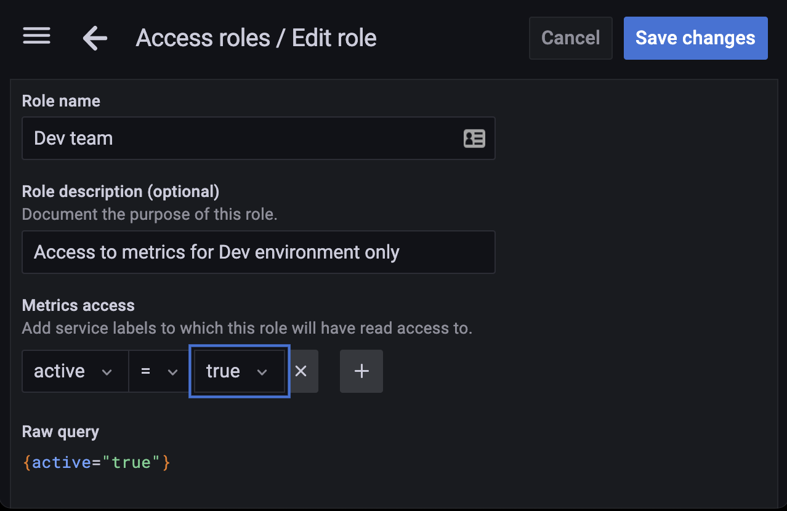
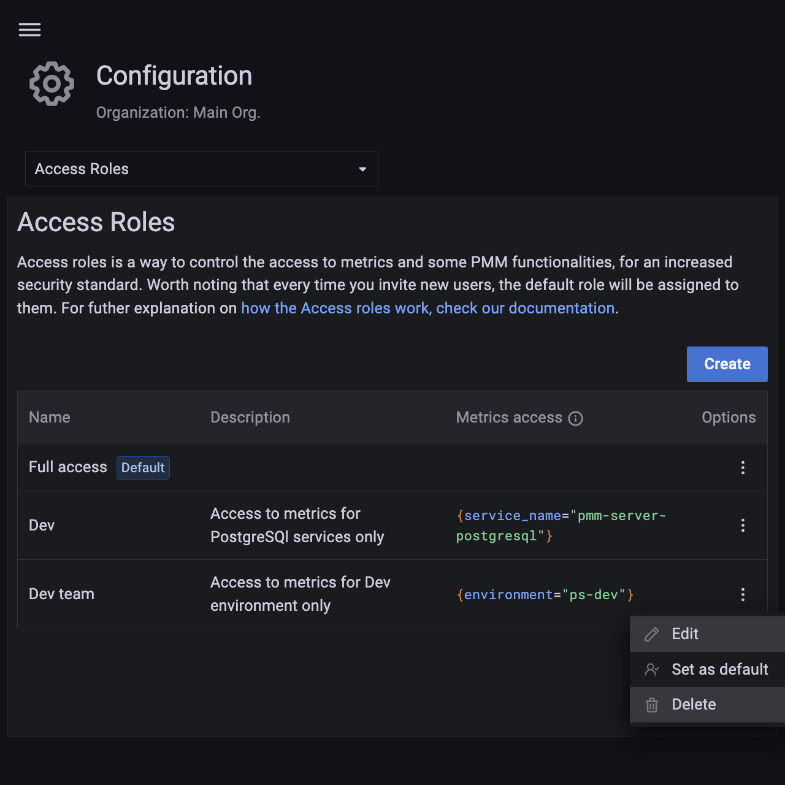

# Manage access roles

You can manage roles in PMM by editing or deleting a role.

## Edit roles

To edit access roles, do the following:

1. From the *Main* menu, navigate to <i class="uil uil-cog"></i> *Configuration → Access Roles*. The *Access Roles* tab opens.

2. On the role you want to edit, click the *ellipsis (three vertical dots) > edit role* in the *Options* column. The *Edit* role page opens.

    

3. Make the required changes to the role.

    

4. Click Save Changes.

## Set a role as default

When a user signs in to PMM for the first time and the user has no role assigned, the user is automatically assigned the *Default* role. For administrators, the default role provides a convenient way to configure default permissions for new users.

To set a role as default, do the following:

1. From the *Main* menu, navigate to <i class="uil uil-cog"></i> *Configuration → Access Roles*. The *Access Roles* tab opens.

2. On the role you want to set as default, click the *ellipsis (three vertical dots) → set as default* in the *Options* column.

 

## Remove roles

To remove access roles, do the following:

1. From the *Main* menu, navigate to <i class="uil uil-cog"></i> *Configuration → Access Roles*. The *Access Roles* tab opens.

2. On the role you want to remove, click the *ellipsis (three vertical dots) →  Delete* in the *Options* column. Delete role pop-up opens.

    

3. If the role that you want to delete is alreaqdy assigned to a user, you will see a dropdown with replacement roles. Select the replacemet role and the selected role will be assigned to the user.

4. Click *Confirm* and delete the role.

