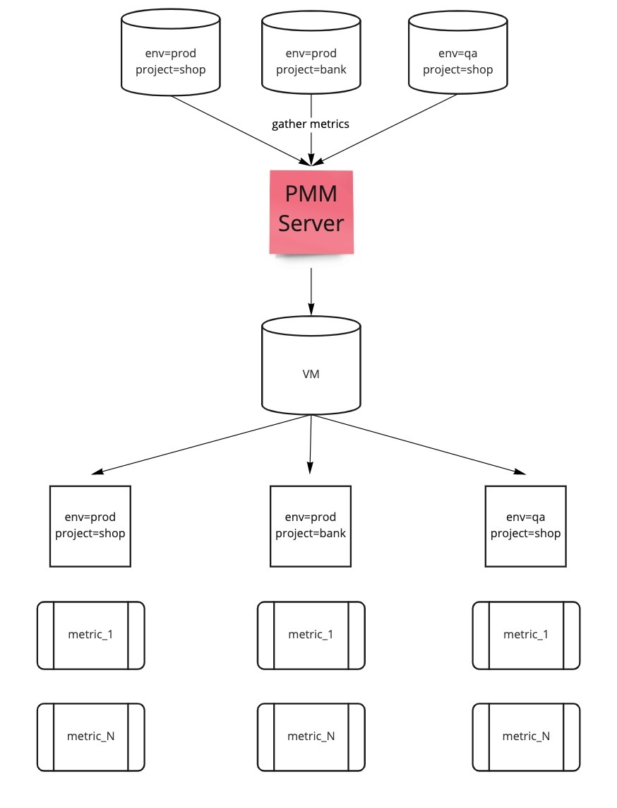
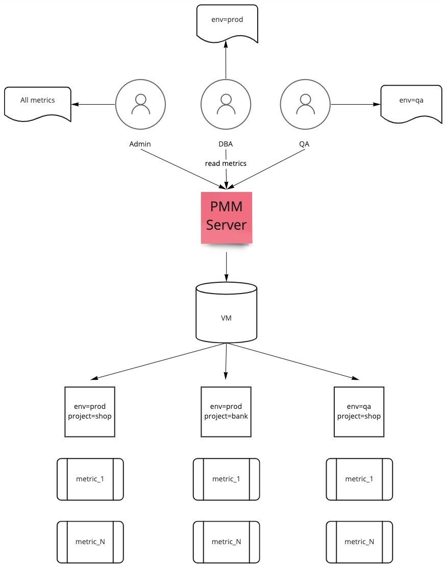

# Use Case

## Use case 1

This use case demonstrates the following scenario:

**Labels**

-  Environments: **prod** and **qa**

-  Projects: **shop** and **bank**

**Roles**

- Roles: Admin, Dev and QA

An overview of the infrastructure can be seen in the diagram below. PMM monitors several services. The metrics that are stored in VictoriaMetrics have the appropriate labels.

   

 This diagram shows several roles within a company structure that have access to PMM, as well as the permissions they should be granted:

- Admin role - has access to all the metrics
- DBA role - has access to all metrics within **env=prod** only
- QA role - has access to all metrics within **env=qa** only

    

## Use case 2

The use case demonstrates the following scenario:

**Labels**

- Environments: prod and dev

- Services: postgresql and mysql

**Roles**

- role_dev
- role_prod

| **Component**|**Role assigned**|**Labels applied to the role**|**Accessible Metrics**                                                                                                  |
|----------|--------|---------------------------------------------- |-------------------------------------------------------------------------------------------------------------|
| **User 1**  | `role_dev`    |`environment="dev", service="postgresql"`|The metrics for service postgresql on the dev environment will be accessible.|                                          
| **User 2**  | `role_prod`    |`environment="prod", service="mysql"`|The metrics for service mysql on the dev environment will be accessible.|                                          
| **User 3**  | `role_dev` and `role_prod`|`environment="dev", service="postgresql"` and   `environment="prod", service="mysql"` |The metrics for both the services mysql and postresql on the prod as well as dev environments will be accessible.|                                          

