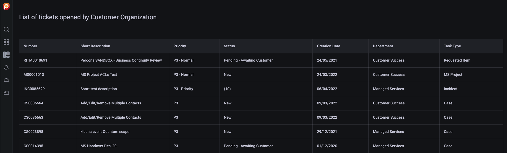
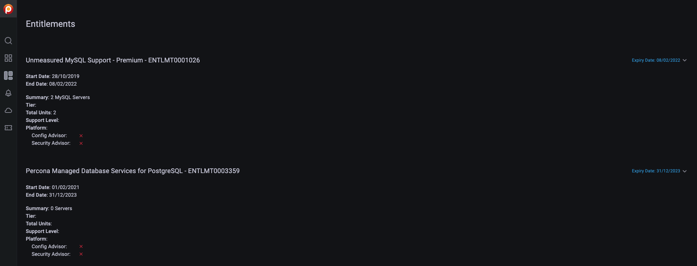

# Check Percona Portal account information

When you connect your PMM instances to Percona Platform, PMM has access to additional alert templates and Registered Advisors checks from Percona Platform.

If the Percona Account you used to connect PMM to Percona Platform is linked to a Percona Portal account, you also have access to Paid Advisor checks, which offer more advanced database health assessments. 

For such accounts PMM displays two new tabs on the main menu: **Entitlements**   and       **Support tickets**, where Percona customers can check all the information available for their accounts: 

