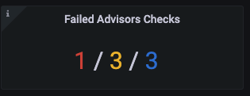
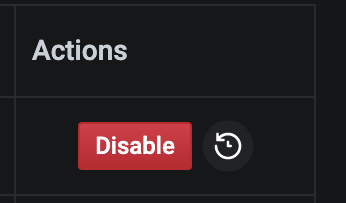

# Working with Advisor checks

Advisors are automated checks that you can run against connected databases to identify any potential security threats, configuration problems, performance concerns, policy non-compliance issues etc. 

Checks are grouped into advisors according to the functionality and recommendations they provide.

## Prerequisites for accessing Advisor checks
All checks are hosted on Percona Platform. PMM Server automatically downloads them from here when the **Advisors** and **Telemetry** options are enabled in PMM under **Configuration > Settings > Advanced Settings**. By default, the **Advisors** options is disabled.

### Advisor check tiers and Platform entitlements
Depending on the entitlements available for your Percona Account, the set of advisor checks that PMM can download from Percona Platform differ in terms of complexity and functionality. 

If your PMM instance is not connected to Percona Platform, PMM can only download the basic set of Anonymous advisor checks. 
As soon as you connect your PMM instance to Percona Platform, has access to additional checks, available only for Registered PMM instances. 

If you are a Percona customer with a Percona Customer Portal account, you also get access to Paid checks, which offer more advanced database health information.

​To see the complete list of available checks, see the [Advisor Checks for PMM](https://docs.percona.com/percona-platform/checks.html) topic in the Percona Platform documentation.  

## How to enable

By default, the **Advisors** option is disabled. To enable it, go to <i class="uil uil-cog"></i> **Configuration   <i class="uil uil-setting"></i> > Settings > Advanced Settings**. 

As soon as you enable Advisors, PMM Server starts downloading the checks available for your Percona Account and runs them automatically in the background. 

## Checks results
The results are sent to PMM Server where you can review any failed checks on the **Home Dashboard > Failed Advisors Checks** panel. The summary count of failed checks is classified as <b style="color:#e02f44;">Critical</b>, <b style="color:#e36526;">Major</b> and <b style="color:#5794f2;">Trivial</b>:

To see more details about the available checks and any checks that failed, click the *{{icon.checks}} Advisors* icon on the main menu. This icon is only available if you have enabled the Advisors options in the Advanced Settings.

**Check results data *always* remains on the PMM Server.** This is not related to anonymous data sent for Telemetry purposes.

## Change advisor's interval

Advisor checks can be executed manually or automatically. 
By default, automatic checks run every 24 hours. You can change this standard interval to a custom frequency for each individual advisor:

| Interval name                 | Value (hours)  |
|------------------------------ |:--------------:|
| *Rare interval*               | 78             |
| *Standard interval* (default) | 24             |
| *Frequent interval*           | 4              |

1. Click **{{icon.checks}} Advisors**.

2. Select the **All** tab.

3. In the **Actions** column for a chosen check, click the <i class="uil uil-history"></i> **Interval** icon.

1. Chose an interval and click **Save**.
    