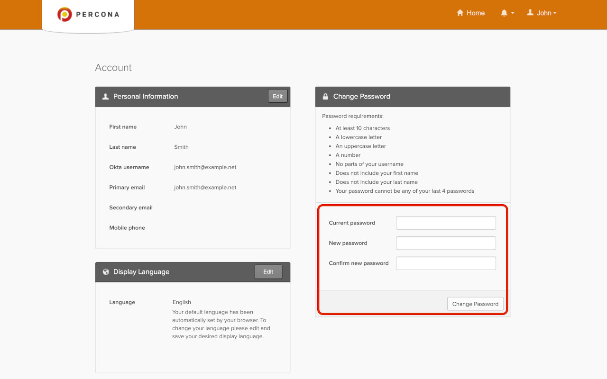
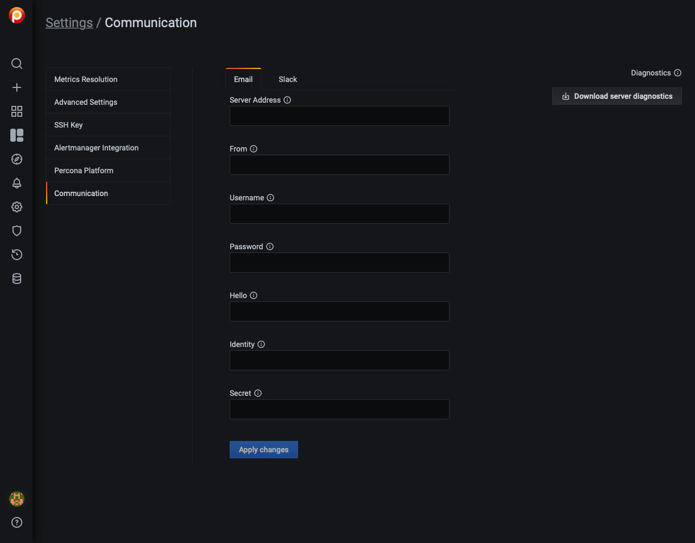
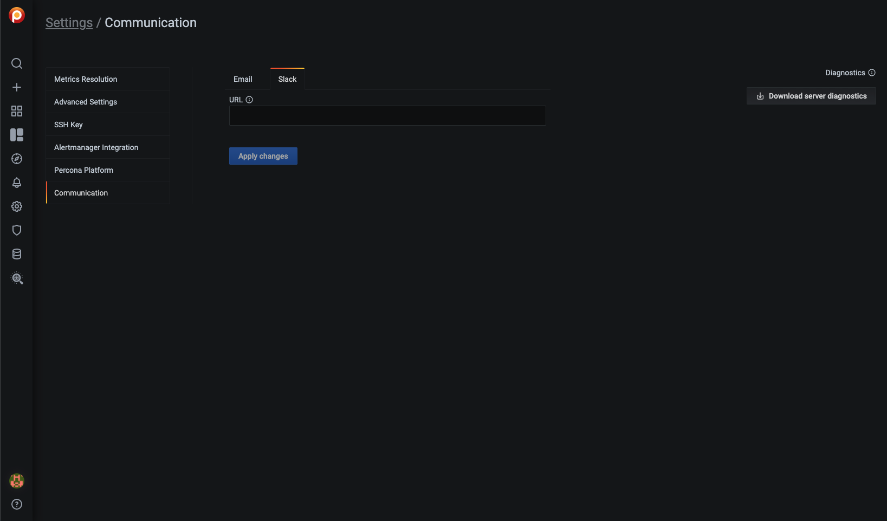

# Configure

The *Settings* page is where you configure PMM.

Open the *Settings* page from the [main menu](../details/interface.md#main-menu) with <i class="uil uil-cog"></i> *Configuration* → <i class="uil uil-setting"></i> *Settings*. The page opens with the *Metrics Resolution* settings tab selected.

On the left are the selector tabs:

- [Configure](#configure)
    - [Metrics resolution](#metrics-resolution)
    - [Advanced Settings](#advanced-settings)
        - [Data Retention](#data-retention)
        - [Telemetry](#telemetry)
        - [Check for updates](#check-for-updates)
        - [Security Threat Tool](#security-threat-tool)
    - [Public address](#public-address)
        - [DBaaS](#dbaas)
        - [Integrated Alerting](#integrated-alerting)
        - [Microsoft Azure Monitoring](#microsoft-azure-monitoring)
        - [Public Address](#public-address-1)
    - [SSH Key](#ssh-key)
    - [Alertmanager integration](#alertmanager-integration)
    - [Percona Platform](#percona-platform)
        - [Login](#login)
        - [Sign up](#sign-up)
        - [Password Reset](#password-reset)
            - [Password Forgotten](#password-forgotten)
            - [Change Password after Login](#change-password-after-login)
    - [Communication](#communication)
        - [Email](#email)
        - [Slack](#slack)

!!! hint alert alert-success "Tip"
    Click *Apply changes* to save any changes made here.

## Diagnostics

On all tabs is a *Diagnostics* section (top-right). Click *Download server diagnostics* to retrieve PMM diagnostics data which can be examined and/or shared with our support team should you need help.

## Metrics resolution

Metrics are collected at three intervals representing low, medium and high resolutions.

The *Metrics Resolution* settings tab contains a radio button with three fixed presets (*Rare*, *Standard* and *Frequent*) and one editable custom preset (*Custom*).

Each preset is a group of low, medium and high resolutions. The values are in seconds.

!!! note alert alert-primary "Time intervals and resolutions"
    Short time intervals are *high* resolution metrics. Longer time intervals are *low* resolution. So:

    - A low resolution interval *increases* the time between collection, resulting in low-resolution metrics and lower disk usage.
    - A high resolution interval *decreases* the time between collection, resulting in high-resolution metrics and higher disk usage.

The default values (in seconds) for the fixed presets and their resolution names are:

| Editable? | Preset            | Low  | Medium | High |
|-----------|-------------------|------|--------|------|
| No        | Rare              | 300  | 180    | 60   |
| No        | Standard          | 60   | 10     | 5    |
| No        | Frequent          | 30   | 5      | 1    |
| Yes       | Custom (defaults) | 60   | 10     | 5    |

Values for the *Custom* preset can be entered as values, or changed with the arrows.

!!! note alert alert-primary ""
    If there is poor network connectivity between PMM Server and PMM Client, or between PMM Client and the database server being monitored, scraping every second may not be possible when the network latency is greater than 1 second.

## Advanced Settings

### Data Retention

*Data retention* specifies how long data is stored by PMM Server. By default, time-series data is stored for 30 days. You can adjust the data retention time to balance your system's available disk space with your metrics history requirements.

### Telemetry

The *Telemetry* switch enables gathering and sending basic **anonymous** data to Percona, which helps us to determine where to focus the development and what is the uptake for each release of PMM. Specifically, gathering this information helps determine if we need to release patches to legacy versions beyond support, determining when supporting a particular version is no longer necessary, and even understanding how the frequency of release encourages or deters adoption.

The following information is gathered:

- PMM Version;
- Installation Method (Docker, AMI, OVF);
- the Server Uptime;
- Security Threat Tool Status (enabled or disabled);
- Integrated Alerting Status (enabled or disabled).

We do not gather anything that identify a system, but the following two points should be mentioned:

1. The Country Code is evaluated from the submitting IP address before being discarded.

2. We do create an "instance ID" - a random string generated using UUID v4.  This instance ID is generated to distinguish new instances from existing ones, for figuring out instance upgrades.

The first telemetry reporting of a new PMM Server instance is delayed by 24 hours to allow enough time to disable the service for those that do not wish to share any information.

The landing page for this service, [check.percona.com](https://check.percona.com), explains what this service is.

Grafana’s [anonymous usage statistics](https://grafana.com/docs/grafana/latest/administration/configuration/#reporting-enabled) is not managed by PMM. To activate it, you must change the PMM Server container configuration after each update.

As well as via the *PMM Settings* page, you can also disable telemetry with the `-e DISABLE_TELEMETRY=1` option in your docker run statement for the PMM Server.

!!! note alert alert-primary ""
    
    Telemetry is sent straight away; the 24 hour grace period is not honored.

### Check for updates

When active, PMM will automatically check for updates and put a notification in the home page *Updates* dashboard if any are available.

### Security Threat Tool

The [Security Threat Tool] performs a range of security-related checks on a registered instance and reports the findings. It is off by default.

!!! hint alert alert-success "Tip"
    To see the results of checks, select *{{icon.checks}} Security Checks* to open the *Security Checks/Failed Checks* dashboard, and select the *Failed Checks* tab.

Checks are re-fetched and re-run at intervals. There are three named intervals:

| Interval name                 | Value (hours)  |
|------------------------------ |:--------------:|
| *Rare interval*               | 78             |
| *Standard interval* (default) | 24             |
| *Frequent interval*           | 4              |

!!! note alert alert-primary ""
    The values for each named interval are fixed.

Checks use the *Standard* interval by default. To change a check's interval:

- Go to {{icon.checks}} *PMM Database Checks*.
- Select *All Checks*.
- In the *Actions* column, select the <i class="uil uil-history"></i> icon.

    

- Select an interval and click *Save*.

    

## Public address

The address or hostname PMM Server will be accessible at. Click *Get from browser* to have your browser detect and populate this field automatically.

### DBaaS

!!! caution alert alert-warning "Caution"
    DBaaS functionality is a technical preview that must be turned on with a server feature flag. See [DBaaS](../setting-up/server/dbaas.md).

Enables/disables [DBaaS features](../using/dbaas.md) on this server.

!!! caution alert alert-warning "Important"
    Deactivating DBaaS ***does not*** suspend or remove running DB clusters.

### Integrated Alerting

Enables [Integrated Alerting](../using/alerting.md) and reveals the [Communication](#communication) tab.

### Microsoft Azure Monitoring

!!! caution alert alert-warning "Caution"
    This is a technical preview feature.

Activates Microsoft Azure monitoring.

### Public Address {: #public-address-1 }

Public address for accessing DBaaS features on this server.

## SSH Key

This section lets you upload your public SSH key to access the PMM Server via SSH (for example, when accessing PMM Server as a [virtual appliance](../setting-up/server/virtual-appliance.md)).

Enter your **public key** in the *SSH Key* field and click *Apply SSH Key*.

## Alertmanager integration

Alertmanager manages alerts, de-duplicating, grouping, and routing them to the appropriate receiver or display component.

This section lets you configure integration of VictoriaMetrics with an external Alertmanager.

!!! hint alert alert-success "Tip"
    If possible, use [Integrated Alerting](../using/alerting.md) instead of Alertmanager.

- The *Alertmanager URL* field should contain the URL of the Alertmanager which would serve your PMM alerts.
- The *Prometheus Alerting rules* field is used to specify alerting rules in the YAML configuration format.

Fill both fields and click the *Apply Alertmanager settings* button to proceed.

## Percona Platform

This panel is where you connect your PMM server to your Percona Platform Account.

!!! note alert alert-primary ""
    Your Percona Platform Account is separate from your PMM User account.

### Connect PMM to Percona Platform
Connect your PMM servers to Percona Platform to leverage Platform services that boost the monitoring capabilities of your PMM installations.

To connect to Percona Platform, you need a Percona Account. With a Percona Account you also get access to various Percona services, including Percona Platform, Percona Customer Portal, and Community Forum.

If you don't have a Percona Account, you can create one on the [Percona Account Sign Up](https://id.percona.com/signin/register/) page.

#### Pre-requisites
To ensure that PMM can establish a connection to Percona Platform: 

### Check that you are a member of an existing Platform organization
1. Log in to [Percona Platform](https://portal.percona.com) using your Percona Account.
2. On the *Getting Started page*, check that the *Create organization* step shows an option to view your organization.

If you see an option to create a new organization instead, your Percona Account is not linked to any organization yet. If this is the case, contact your account administrator, or create a new organization for your Percona Account.

### Set the public address of your PMM server 
1. In PMM, go to *Settings > Advanced Settings*.
2. Enter your address/hostname or click *Get from browser* to enable your browser to automatically detect and populate this field.
3. Save the changes.

## Connect PMM to Percona Platform
To connect your PMM server to Percona Platform:

1. In PMM go to *Settings > Percona Platform* tab:
    
2. Fill in the *Connect PMM to Percona Portal* form with the name of your PMM instance and the credentials of your Percona Account:
3. Click *Connect*.

## Sign into PMM with your Percona Account
Once you've successfully connected your PMM instance to Percona Platform, you can also sign into PMM usig your Percona Account:

1. Log out of your existing PMM session.

2. On the PMM login screen, click the **Sign in with Percona Account**. 
 If you have an active Percona Account session on the same browser, PMM will log you in automatically. Otherwise, enter your Percona Account credentials to start a new session.

### Password Reset

#### Password Forgotten

In case you forgot your password, click on the *Forgot password* link on the login page.

You will be redirected to a password reset page. Enter the email you are registered with in the field and click on *Reset via Email*.

An email with a link to reset your password will be sent to you.

#### Change Password after Login

If you did not forget your password but you still want to change it, go to <https://okta.percona.com/enduser/settings> (make sure you are logged in).

Insert you current password and the new password in the form to the bottom right of the page. If you cannot see the form, you will need to click on the *Edit Profile* green button (you will be prompted for you password).

Click on *Change Password*. If everything goes well, you will see a confirmation message.

## Communication

Global communications settings for [Integrated Alerting](../using/alerting.md).

!!! hint alert alert-success "Tip"
    If there is no *Communication* tab, go to the *Advanced Settings* tab and activate *Integrated Alerting*.

(Integrated Alerting uses a separate instance of Alertmanager run by `pmm-managed`.)

### Email

Settings for the SMTP email server:

- *Server Address*: The default SMTP smarthost used for sending emails, including port number.
- *Hello*: The default hostname to identify to the SMTP server.
- *From*: The sender's email address.
- *Auth type*: Authentication type. Choose from:
    - *None*
    - *Plain*
    - *Login*
    - *CRAM-MD5*
- *Username*: SMTP Auth using CRAM-MD5, LOGIN and PLAIN.
- *Password*: SMTP Auth using CRAM-MD5, LOGIN and PLAIN.

### Slack

Settings for Slack notifications:

- *URL*: The Slack webhook URL to use for Slack notifications.

!!! seealso alert alert-info "See also"
    [Prometheus Alertmanager configuration](https://prometheus.io/docs/alerting/latest/configuration/)

[Security Threat Tool]: ../using/security-threat-tool.md