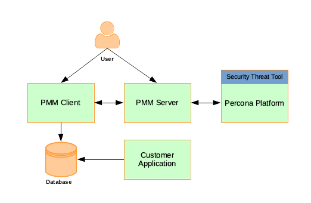

# Welcome

Percona Monitoring and Management (PMM) is a free, open-source database and system monitoring tool for MySQL, PostgreSQL, MongoDB, ProxySQL, and the servers they run on.

!!! alert alert-success "This documentation covers the latest release: [PMM {{release}}](release-notes/{{release}}.md)"

## What is *Percona Monitoring and Management*?

PMM is software that helps you improve the performance of database instances, simplify their management, and strengthen their security. With it, you can:

- Visualize a wide range of detailed out-of-the-box database metrics across large, mixed and complex multi-vendor system topologies.

- Drill-down, dissect and discover the cause of inefficiencies, bottlenecks, latencies, and security issues before they can cause problems (or if they already have).

PMM is efficient, quick to set up and easy to use. It runs in cloud, on-prem, or hybrid platforms. It is supported by [Percona's legendary expertise](https://www.percona.com/services) in open source databases, and by a [vibrant developer and user community](https://www.percona.com/forums/questions-discussions/percona-monitoring-and-management).

!!! alert alert-info "See it in action"
    A demonstration instance of PMM Server is at <https://pmmdemo.percona.com/>

## How it works

PMM is a client/server application made from a collection of tools, some developed by Percona, others, third-party open-source tools.

- A [PMM Client](#pmm-client) runs on every database host that you want to monitor. It collects server metrics, general system metrics, and query analytics data.

- [PMM Server](#pmm-server) is the core of PMM.

It collects and collates
data from clients,
presenting
a variety of
visualizations (tables, charts and graphs)
of client metrics, organized into
 [*dashboards*](details/dashboards/),
  each a page within
  a unified
  web-based [user interface](using/interface.md) that

- Additionally, [Percona Enterprise Platform](#percona-platform) provides value-added services for PMM.

### PMM Server

PMM Server receives and collates information from clients,
charting and graphing the data in [dashboards](details/dashboards/),
pages within the [web interface](using/interface.md),
and summarized on the PMM home page as shown here.

PMM Server can run as one of:

- [A Docker container](setting-up/server/docker.md);

- An [OVA/OVF virtual appliance](setting-up/server/virtual-appliance.md) running on VirtualBox, VMWare and other hypervisors;

- An [Amazon AWS EC2 instance](setting-up/server/aws.md).

### PMM Client

PMM clients collect various data about general system and database performance, and sends this data to the PMM Server.

You must set up and configure PMM clients for each monitored system type:

- [MySQL](setting-up/client/mysql.md)
- [Percona Server for MySQL](setting-up/client/percona-server.md)
- [MongDB](setting-up/client/mongodb.md)
- [PostgreSQL](setting-up/client/postgresql.md)
- [ProxySQL](setting-up/client/proxysql.md)
- [Amazon RDS](setting-up/client/aws.md)
- [Linux](setting-up/client/linux.md)
- [External services](setting-up/client/external.md)

### Percona Platform

Percona Platform provides the following value-added services to PMM.

#### Security Threat Tool

Security Threat Tool checks registered database instances for a range of common security issues. (You must [turn on *Telemetry*](how-to/configure.md#advanced-settings) to use this service.)

!!! seealso
    [Architecture](details/architecture.md)
