# Welcome

**Percona Monitoring and Management** (PMM) is a free, open-source monitoring tool for MySQL, PostgreSQL, MongoDB, and ProxySQL, and the servers they run on.

- PMM collects from databases and their hosts thousands of out-of-the-box performance metrics.

- The PMM [web UI](using/interface.md) visualizes data in [dashboards](details/dashboards/).

- Additional features include checking databases for [security threats](using/platform/security-threat-tool.md).

!!! important ""
    This is for the latest release, **PMM {{release}}**. ([Release notes](release-notes/{{release}}.md).)

PMM helps you improve the performance of databases, simplify their management, and strengthen their security. It is efficient, quick to [set up](setting-up/index.md) and easy to use. It runs in cloud, on-prem, or across hybrid platforms. It's supported by our [legendary expertise][PERCONA_SERVICES] in open source databases, and by a vibrant developer and user [community][PMM_FORUM].

PMM is one [server](details/architecture.md#pmm-server) and as many [clients](details/architecture.md#pmm-client) as there are systems you want to monitor. PMM Server collects metrics data from PMM Clients and shows it in a web UI. PMM Client runs on all systems you want to monitor.

Here's how the web UI home page looks on our <a href='https://pmmdemo.percona.com/' target='_blank'>live demo system</a>. (It's free to use---why not try it?)

## Next steps

The [Quickstart installation guide](https://www.percona.com/software/pmm/quickstart) shows how to run PMM Server as a Docker container, and how to install PMM Client on Ubuntu or Red Hat Linux hosts.

Full instructions for setting up are in:

- [Setting up PMM Server](setting-up/server/index.md)
- [Setting up PMM Client](setting-up/client/index.md)

## Reading guide

```plantuml format="svg_object" width="90%" height="90%"
@startmindmap "PMM_DOC_TOPICS"
skinparam svgLinkTarget _blank
skinparam defaultFontName Chivo
skinparam defaultFontSize 12
<style>
mindmapDiagram {
  node {
    ' Gap within nodes
    Padding 7
    ' Gap between nodes
    Margin 5
  }
}
</style>
' Absolute links - can be useful for exporting map as stand-alone image
' relative links make testing easier but must be changed for local vs hosting' Hosted
!$base = "https://www.percona.com/doc/percona-monitoring-and-management/2.x"
'!$base = "../2.x"
'!$base = "."
+[#lightblue] For Users <<user>>
++[#goldenrod] For Sys Admins<<admin>>
+++_ [[$base/setting-up/ Setting up]]
+++_ [[$base/how-to/configure.html Configure]]
+++_ [[$base/how-to/upgrade.html Upgrade]]
+++_ [[$base/details/commands/ Command-line tools]]
+++_ [[$base/how-to/secure.html Security]]
+++_ [[$base/how-to/optimize.html Optimize]]
+++_ [[$base/details/architecture.html Architecture]]
--_ [[$base/using/interface.html User interface]]
--_ [[$base/details/interface.html UI components]]
--_ [[$base/details/dashboards/ Dashboards]]
--_ [[$base/using/alerting.html Alerting]]
--_ [[$base/using/query-analytics.html Query Analytics]]
--_ [[$base/using/platform/index.html Percona Platform]]
@endmindmap
```

[PERCONA_SERVICES]: https://www.percona.com/services
[PMM_FORUM]: https://www.percona.com/forums/questions-discussions/percona-monitoring-and-management
