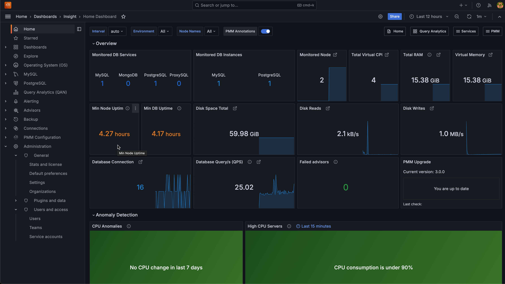

# Welcome

**Percona Monitoring and Management** (PMM) is a free, open-source monitoring tool for MySQL, PostgreSQL, MongoDB, and ProxySQL, and the servers they run on.

PMM helps you improve the performance of your databases, simplify their management, and strengthen their security. It's efficient, quick to [set up](setting-up/index.md), and easy to use.

- PMM **collects** thousands of out-of-the-box performance **metrics** from databases and their hosts.

- The PMM [web UI](using/interface.md) **visualizes data** in [dashboards](details/dashboards/).

- Additional features include checking databases for [security threats](using/security-threat-tool.md).

!!! alert alert-info ""
This is the documentation for the latest release, **PMM {{release}}** ([Release Notes](release-notes/{{release}}.md)).

Here's how the home page looks on our <a href='https://pmmdemo.percona.com/' target='_blank'>free, live demo system</a>.

PMM runs in the cloud, on-prem, or across hybrid platforms. It's supported by our [legendary expertise][percona_services] in open source databases, and by a vibrant developer and user [community].

A minimal PMM set-up comprises one [server](details/architecture.md#pmm-server) and a [client agent](details/architecture.md#pmm-client) on every system you want to monitor.

## Start here

- An [easy install] script, which you download, make executable and run. The script installs Docker and runs PMM Server as a container.

- The [Quickstart install guide] shows how to run PMM Server as a Docker container, and how to install PMM Client on Ubuntu or Red Hat Linux hosts.

- [Setting Up] explains in detail how to set up PMM Server, clients, and how to add services.

## Read more

??? note alert alert-info "Full section map v2 (click to show/hide)"
  

    
  

[percona_services]: https://www.percona.com/services
[community]: https://www.percona.com/forums/questions-discussions/percona-monitoring-and-management
[technical preview]: details/glossary.md#technical-preview
[easy install]: setting-up/server/easy-install.md
[setting up]: setting-up/index.md
[quickstart install guide]: https://www.percona.com/software/pmm/quickstart
