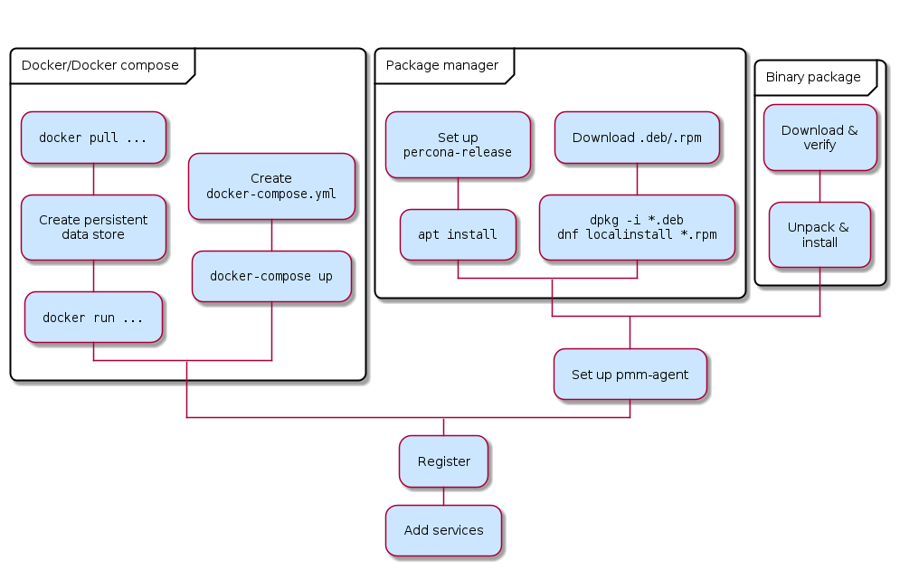

# About PMM client installation

There are different ways to install PMM Client on a node and register it with PMM Server. Choose from:

- [Docker](docker.md): Run PMM Client as a Docker container.

- [Package manager](package_manager.md):
    - On Debian or Red Hat Linux, install `percona-release` and use a Linux package manager (`apt`/`dnf`) to install PMM Client.
    - On Debian or Red Hat, download `.deb`/`.rpm` PMM Client packages and manually install them.

!!! hint alert "Binary is only way to install PMM client without root permissions"
    - [Binary package](binary_package.md): For other Linux distributions, download and unpack generic PMM Client Linux binaries.

When you have installed PMM Client, you must:

- [Register the node with PMM Server](../register-client-node/index.md).
- [Configure and add services according to type](..//add-services/index.md).

If you need to, you can [unregister](..//..//uninstall-pmm/unregister_client.md), [remove services](..//..//uninstall-pmm/remove_services.md) or [remove PMM Client](..//..//uninstall-pmm/uninstall_docker.md).

---

Here's an overview of the choices.

## Before you start

Before installing the PMM client, check [Prerequisites to install PMM client](./prerequisites.md).

## Add services

You must configure and adding services according to the service type.

- [MySQL](..//add-services/mysql.md) (and variants Percona Server for MySQL, Percona XtraDB Cluster, MariaDB)
- [MongoDB](..//add-services/mongodb.md)
- [PostgreSQL](..//add-services/postgresql.md)
- [ProxySQL](..//add-services/proxysql.md)
- [Amazon RDS](..//add-services/aws.md)
- [Microsoft Azure](..//add-services/azure.md)
- [Google Cloud Platform](..//add-services/google) (MySQL and PostgreSQL)
- [Linux](..//add-services/linux.md)
- [External services](..//add-services/external.md)
- [HAProxy](..//add-services/haproxy.md)
- [Remote instances](..//add-services/remote.md)

!!! hint alert alert-success "Tip"
    To change the parameters of a previously-added service, remove the service and re-add it with new parameters.

