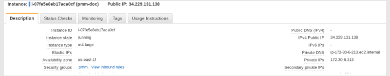

# Launch PMM Server on AWS

After [installing PMM Server from AWS Marketplace](../aws/aws.md): 
{.power-number}

1. Wait for initialization: after adding your new instance, it will take some time to initialize. Wait until the AWS console reports that the instance is running.

2. Access the PMM Server instance: select your instance and open its IP address in a web browser. You can find the IP address in the **IPv4 Public IP** column or at the top of the **Properties** panel under the **Public IP** field:

    

3. Initialize PMM Server: On the Percona Monitoring and Management Welcome page, enter the instance ID in the EC2 console.

4. Log in using the default credentials:
     - Username: `admin`
     - Password: <your instance ID> 

5. Change the default credentials then use the new ones on the PMM Server home page:

    

You are creating a username and password that will be used for two purposes:
{.power-number}

1. authentication as a user to PMM - the credentials to log in to PMM.

2. authentication between PMM Server and PMM Clients - you will re-use these credentials on another host when configuring PMM Client for the first time on a server, for example (DO NOT RUN ON THIS PMM SERVER YOU JUST CREATED):

    ```sh
    pmm-admin config --server-insecure-tls --server-url=https://admin:admin@<IP Address>:443
    ```

    !!! note alert alert-primary ""
        For instructions about how to access your instances by using an SSH client, see [Connecting to Your Linux Instance Using SSH](https://docs.aws.amazon.com/AWSEC2/latest/UserGuide/AccessingInstancesLinux.html)

    Make sure to replace the user name `ec2-user` used in this document with `admin`.

## Resize the EBS Volume

Your AWS instance comes with a predefined size which can become a limitation. To make more disk space available to your instance, you need to increase the size of the EBS volume as needed and then your instance will reconfigure itself to use the new size.

The procedure of resizing EBS volumes is described in the Amazon documentation: [Modifying the Size, IOPS, or Type of an EBS Volume on Linux](https://docs.aws.amazon.com/AWSEC2/latest/UserGuide/ebs-modify-volume.html).

After the EBS volume is updated, PMM Server instance will auto-detect changes in approximately 5 minutes or less and will reconfigure itself for the updated conditions.
