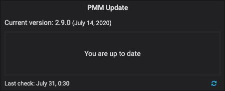
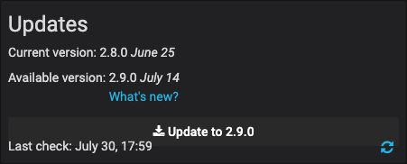

# Updating a Server

Client and server components are installed and updated separately.

PMM Server can run natively, as a Docker image, a virtual appliance, or an AWS cloud instance. Each has its own installation and update steps.

The simplest way to update a server is via the *PMM Update* panel on the Home page.

The panel shows:

- the current server version and release date;
- whether the server is up to date;
- the last time a check was made for updates.

If an update is available, click the button to install the update to the version indicated.This is the preferred way of updating PMM Server.

