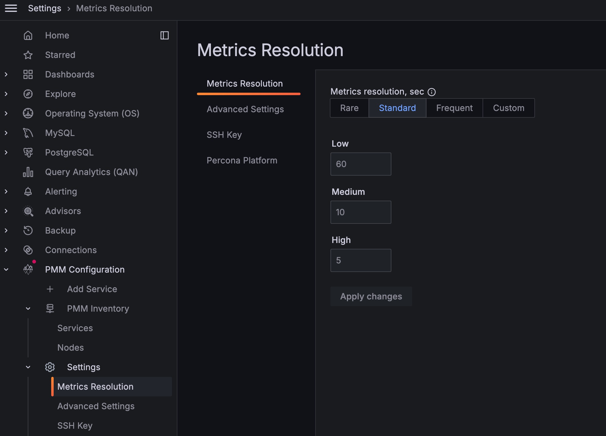

# PMM Settings Page

The *PMM Settings* page lets you configure a number of PMM options. It can be accessed from the main menu:

!!! note

    Press *Apply changes* to store any changes made in PMM Settings.

## Metrics resolution

Metrics are collected at three intervals representing low, medium and high resolutions. Short time intervals are regarded as high resolution metrics, while those at longer time intervals are low resolution.

The *Metrics Resolution* radio button lets you select one of four presets.

- *Rare*, *Standard* and *Frequent* are fixed presets.
- *Custom* is an editable preset.

Each preset is a group of Low, Medium and High metrics resolution values. Low resolution intervals *increases* the time between collection, resulting in low-resolution metrics and lower disk usage. High resolution intervals *decreases* the time between collection, resulting in high-resolution metrics and higher disk usage.

The default values for the fixed presets are:

**Rare**

- Low: 300 seconds
- Medium: 180 seconds
- High: 60 seconds

**Standard**

- Low: 60 seconds
- Medium: 10 seconds
- High: 5 seconds

**Frequent**

- Low: 30 seconds
- Medium: 5 seconds
- High: 1 second

Values for the *Custom* preset can be entered as values, or changed with the arrows.

!!! note

    If there is poor network connectivity between PMM Server and PMM Client, or between PMM Client and the database server it is monitoring, scraping every second may not be possible when the network latency is greater than 1 second.

## Advanced Settings

**Data Retention**

*Data retention* specifies how long data is stored by PMM Server.

**Telemetry**

The *Telemetry* switch enables gathering and sending basic **anonymous** data to Percona, which helps us to determine where to focus the development and what is the uptake of the various versions of PMM. Specifically, gathering this information helps determine if we need to release patches to legacy versions beyond support, determining when supporting a particular version is no longer necessary, and even understanding how the frequency of release encourages or deters adoption.

Currently, only the following information is gathered:

* PMM Version,
* Installation Method (Docker, AMI, OVF),
* the Server Uptime.

We do not gather anything that would make the system identifiable, but the following two things are to be mentioned:

1. The Country Code is evaluated from the submitting IP address before it is discarded.

2. We do create an "instance ID" - a random string generated using UUID v4.  This instance ID is generated to distinguish new instances from existing ones, for figuring out instance upgrades.

The first telemetry reporting of a new PMM Server instance is delayed by 24 hours to allow sufficient time to disable the service for those that do not wish to share any information.

There is a landing page for this service, available at [check.percona.com](https://check.percona.com), which clearly explains what this service is, what it’s collecting, and how you can turn it off.

Grafana’s [anonymous usage statistics](https://grafana.com/docs/grafana/latest/installation/configuration/#reporting-enabled) is not managed by PMM. To activate it, you must change the PMM Server container configuration after each update.

As well as via the *PMM Settings* page, you can also disable telemetry with the `-e DISABLE_TELEMETRY=1` option in your docker run statement for the PMM Server.

!!! note

    1. If the Security Threat Tool is enabled in PMM Settings, Telemetry is automatically enabled.
    2. Telemetry is sent immediately; the 24-hour grace period is not honored.

**Check for updates**

When active, PMM will automatically check for updates and put a notification in the *Updates* dashboard if any are available.

**Security Threat Tool**

The Security Threat Tool performs a range of security-related checks on a registered instance and reports the findings.

It is disabled by default.

It can be enabled in *PMM > PMM Settings > Settings > Advanced Settings > Security Threat Tool*.

The checks take 24 hours to complete.

The results can be viewed in *PMM > PMM Database Checks*.

## SSH Key Details

This section lets you upload your public SSH key to access the PMM Server via SSH (for example, when accessing PMM Server as a [virtual appliance](../install/virtual-appliance.md)).

Enter your **public key** in the *SSH Key* field and click *Apply SSH Key*.

## Alertmanager integration

The Prometheus Alertmanager manages alerts from Prometheus, deduplicating, grouping, and routing them to the appropriate receiver or display component.

This section lets you configure integration of Prometheus with an external Alertmanager.

* The **Alertmanager URL** field should contain the URL of the Alertmanager which would serve your PMM alerts.

* The **Prometheus Alerting rules** field is used to specify alerting rules in the YAML configuration format.

Fill both fields and click the *Apply Alertmanager settings* button to proceed.

## Diagnostics

PMM can generate a set of diagnostics data which can be examined and/or shared with Percona Support in case of some issue to solve it faster.  You can get collected logs from PMM Server
by clicking the **Download server diagnostics** button.

!!! seealso "See also"

    * [How do I troubleshoot communication issues between PMM Client and PMM Server?](../faq.md#how-do-i-troubleshoot-communication-issues-between-pmm-client-and-pmm-server)
    * [Security Threat Tool main page](../platform/stt.md)
    * [Prometheus Alertmanager documentation](https://prometheus.io/docs/alerting/alertmanager/)
    * [Prometheus Alertmanager alerting rules](https://prometheus.io/docs/prometheus/latest/configuration/alerting_rules/)
