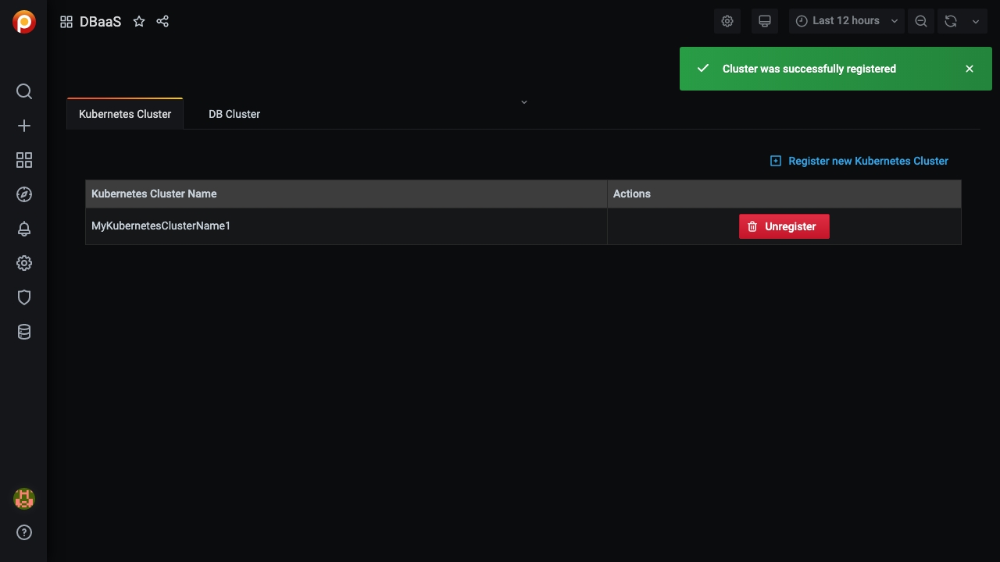
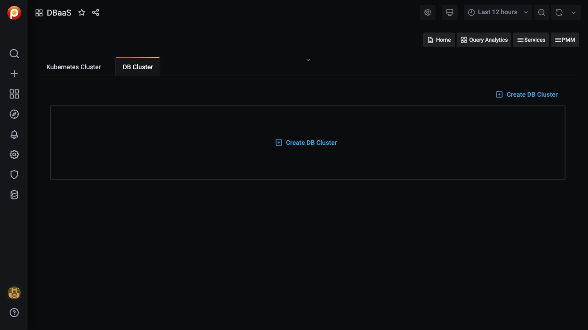
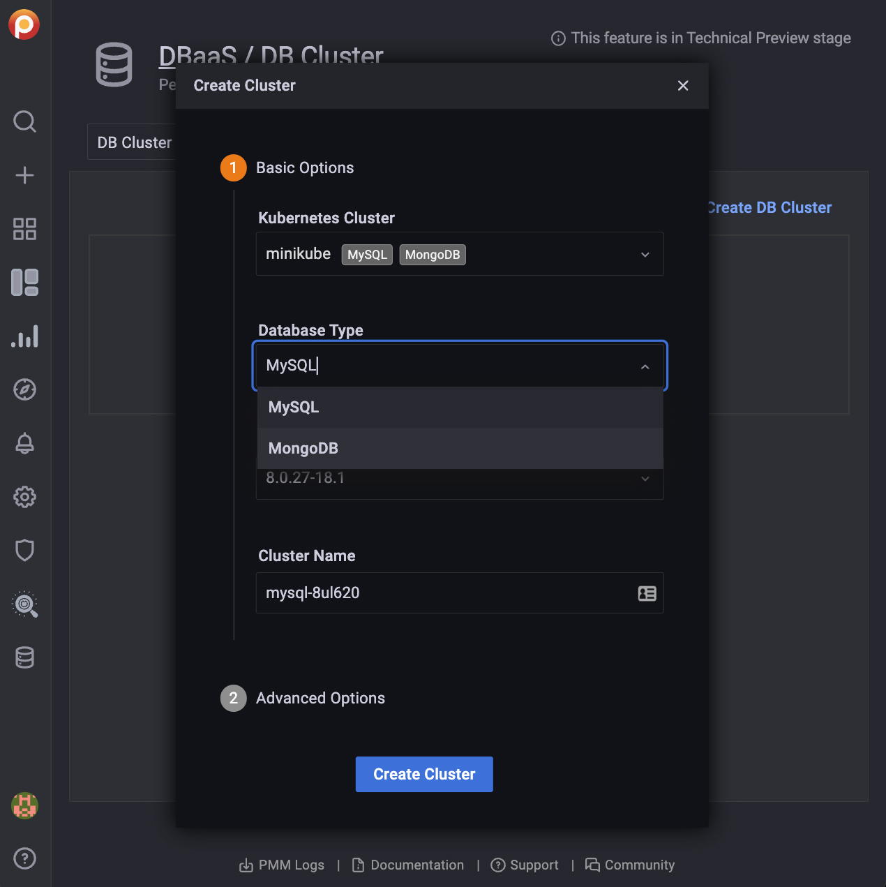
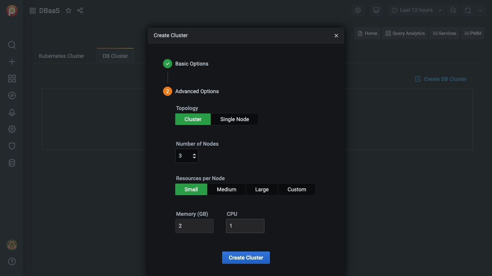
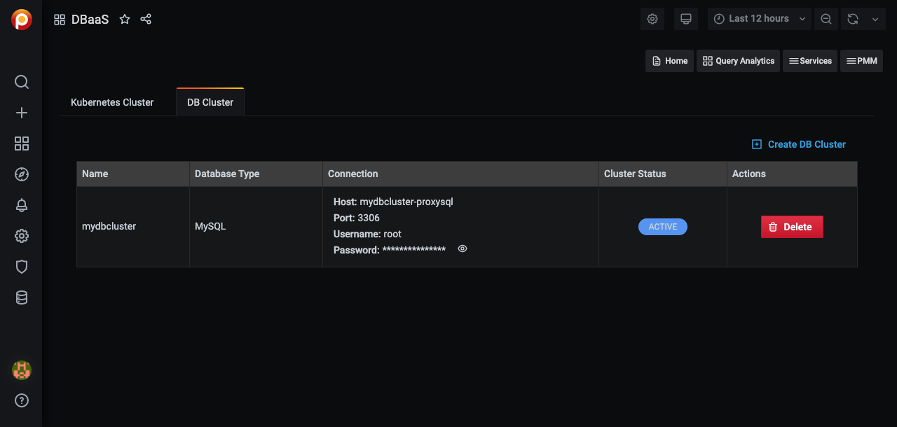
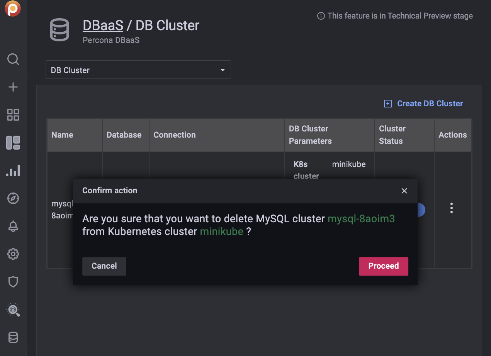

# DBaaS Dashboard

This dashboard is where you add and remove Kubernetes and database clusters.

To access it, select *PMM > PMM DBaaS*, or click the database icon (*DBaas*) in the left vertical menu bar.


## Add a Kubernetes cluster

1. Click *Register new Kubernetes Cluster*

2. Enter values for the *Kubernetes Cluster Name* and *Kubeconfig file* in the corresponding fields.

    

3. Click *Register*.

4. A message will momentarily display telling you whether the registration was successful or not.

    

## Unregister a Kubernetes cluster

!!! attention
    A kubernetes cluster can't be unregistered if there DB clusters associated with it.

1. Click *Unregister*.

2. Confirm the action by clicking *Proceed*, or abandon by clicking *Cancel*.

## Add a DB Cluster

!!! note
    You must create at least one Kubernetes cluster to create a DB cluster.

1. Select the *DB Cluster* tab.

    

2. Click *Create DB Cluster*.

3. In section 1, *Basic Options*:

    1. Enter a value for *Cluster name*.

        !!! note
            *Cluster Name* must comply with domain naming rules.

    2. Select a cluster from the *Kubernetes Cluster* menu.

    3. Select a database type from the *Database Type* menu.

        

4. Expand section 2, *Advanced Options*.

    1. Select *Topology*, either *Cluster* or *Single Node*.

    2. Select the number of nodes. (The lower limit is 3.)

    3. Select a preset for *Resources per Node*. *Small*, *Medium* and *Large* are fixed preset values for *Memory* and *CPU*. Values for the *Custom* preset can be edited.

         

5. When both *Basic Options* and *Advanced Options* section icons are green, the *Create Cluster* button becomes active. (If it is inactive, check the values for fields in sections whose icon is red.)

    Click *Create Cluster* to create your cluster.

    

6. The *Cluster Status* column will show the state of the cluster:

    - *PENDING*: The cluster is being created
    - *ACTIVE*: The cluster is active
    - *FAILED*: The cluster could not be created
    - *DELETING*: The cluster is being deleted

## Restart a DB Cluster

1. Select the *DB Cluster* tab.

2. Identify the DB cluster to restart.

3. In the *Actions* column, open the menu and click *Restart cluster*.

## Edit a DB Cluster

1. Select the *DB Cluster* tab.

2. Identify the database cluster to be changed.

3. In the *Actions* column, open the menu and click *Modify*.

## Delete a DB Cluster

1. Identify the database cluster to be deleted.

2. In the *Actions* column, open the menu and click *Delete*.

3. Confirm the action by clicking *Proceed*, or abandon by clicking *Cancel*.

    

## Add a Kubernetes Cluster on AWS EKS

1. Create your cluster via `eksctl` or the Amazon AWS interface.

2. To your kubeconfig file, add values for:

    - AWS access key ID and secret access key as environment variables in the `users.user.env` context:

        ```yml
        env:
          - name: AWS_ACCESS_KEY_ID
            value: <User AWS Access Key>
          - name: AWS_SECRET_ACCESS_KEY
            value: <User AWS Secret Access Key>
        ```

     - Authenticator command must be `aws-iam-authenticator`. For example, in the `users.user.exec` context:

        ```yml
        command: aws-iam-authenticator
        ```

3. Follow the instructions for [Add a Kubernetes cluster](#add-a-kubernetes-cluster).

!!! seealso "See also"
    - [Setting up a development environment for DBaaS](../install/dbaas.md)
    - [Amazon AWS EKS: Create a cluster](https://docs.aws.amazon.com/eks/latest/userguide/create-cluster.html)
    - [Amazon AWS EKS: Create a kubconfig file](https://docs.aws.amazon.com/eks/latest/userguide/create-kubeconfig.html)
    - [AWS IAM Authenticator](https://github.com/kubernetes-sigs/aws-iam-authenticator)
