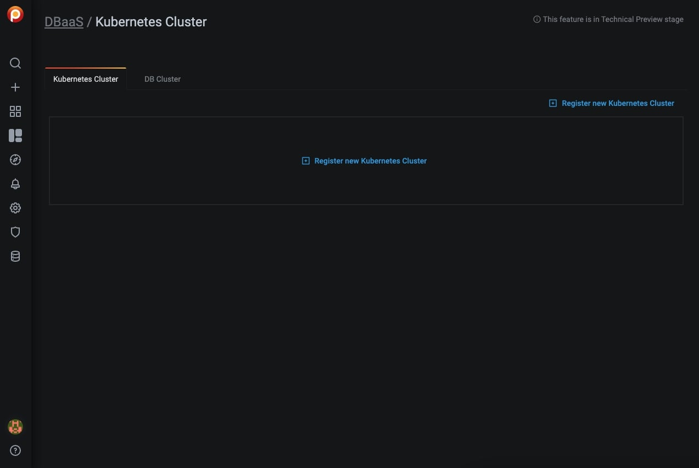

# PMM DBaaS

This dashboard is where you view, register (add), and unregister (remove) Kubernetes and database clusters.

To access it, select *PMM > PMM DBaaS*, or click the database icon (*DBaas*) in the left vertical menu bar.

## Add a Kubernetes cluster

1. Click *Register new Kubernetes Cluster*

2. Enter values for the *Kubernetes Cluster Name* and *Kubeconfig file* in the corresponding fields.

   

3. Click *Register*.

4. A message will momentarily display telling you whether the registration was successful or not.

    

## Unregister a Kubernetes cluster

1. Identify the kubernetes cluster to be deleted and click *Unregister*.

2. Confirm the action by clicking *Proceed*, or abandon by clicking *Cancel*.

## Add a DB Cluster

1. Select the *DB Cluster* tab. (You must first create at least one Kubernetes cluster.)

   

2. Click *Create DB Cluster*.

3. In section 1, *Basic Options*:

    1. Enter a value for *Cluster name*.
    2. Select a cluster from the *Kubernetes Cluster* menu.
    3. Select a database type from the *Database Type* menu.

4. Expand section 2, *Advanced Options*.

    1. Select *Topology*, either *Cluster* or *Single Node*.
    2. Select the number of nodes. (The lower limit is 3.)
    3. Select a preset for *Resources per Node*. *Small*, *Medium* and *Large* are fixed preset values for *Memory* and *CPU*. Values for the *Custom* preset can be edited.

5. When both section icons are green, the *Create Cluster* button becomes active. Click it to create your cluster.

6. If the button is inactive, check the values for fields in sections whose icon is red.

!!! note
    - *Cluster Name* must comply with domain naming rules.
    - MySQL is the only currently supported database type.

## Delete a DB Cluster

1. Identify the database cluster to be deleted and click *Delete*.

2. Confirm the action by clicking *Proceed*, or abandon by clicking *Cancel*.
