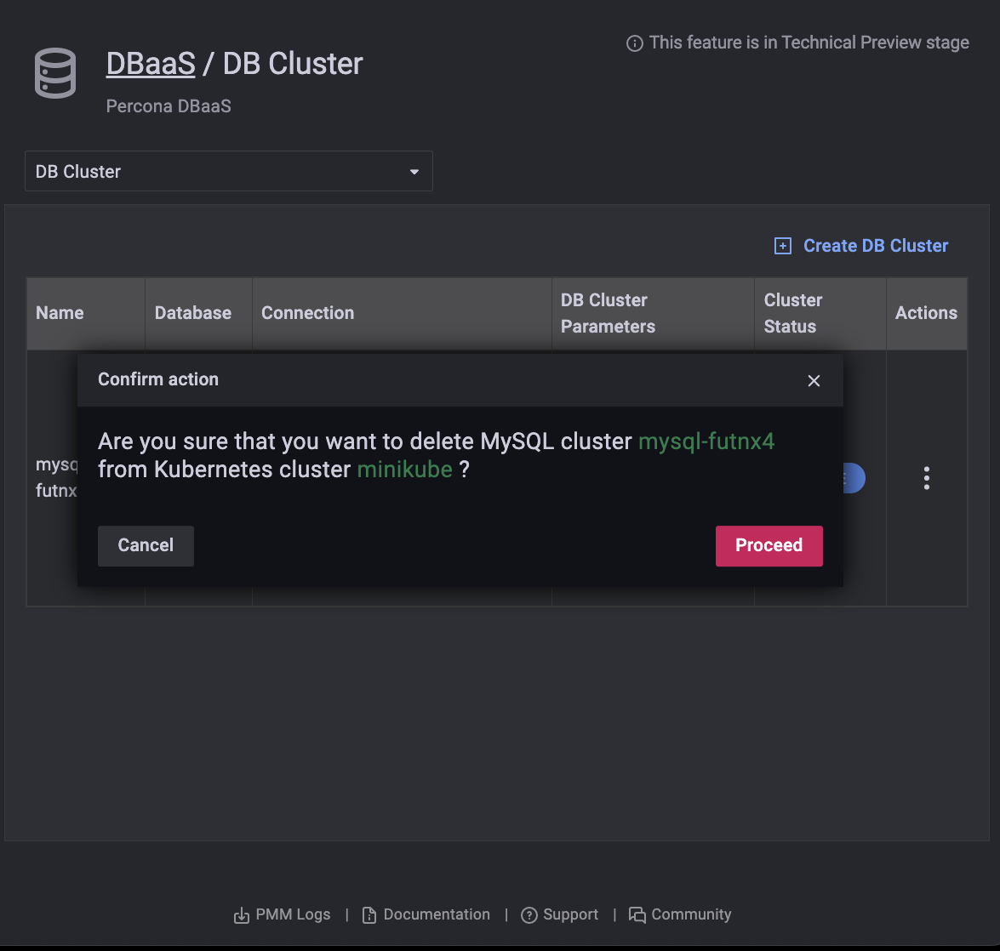

# PMM DBaaS

This dashboard is where you view, register (add), and unregister (remove) Kubernetes and database clusters.

To access it, select *PMM > PMM DBaaS*, or click the database icon (*DBaas*) in the left vertical menu bar.


## Add a Kubernetes cluster

1. Click *Register new Kubernetes Cluster*

2. Enter values for the *Kubernetes Cluster Name* and *Kubeconfig file* in the corresponding fields.

    

3. Click *Register*.

4. A message will momentarily display telling you whether the registration was successful or not.

    

## Unregister a Kubernetes cluster

!!! attention
    A kubernetes cluster can't be unregistered if there DB clusters associated with it.

1. Click *Unregister*.

2. Confirm the action by clicking *Proceed*, or abandon by clicking *Cancel*.

## Add a DB Cluster

1. Select the *DB Cluster* tab. (You must first create at least one Kubernetes cluster.)

    

2. Click *Create DB Cluster*.

3. In section 1, *Basic Options*:

    1. Enter a value for *Cluster name*.

        !!! note
            *Cluster Name* must comply with domain naming rules.

    2. Select a cluster from the *Kubernetes Cluster* menu.

    3. Select a database type from the *Database Type* menu.

        

4. Expand section 2, *Advanced Options*.

    1. Select *Topology*, either *Cluster* or *Single Node*.

    2. Select the number of nodes. (The lower limit is 3.)

    3. Select a preset for *Resources per Node*. *Small*, *Medium* and *Large* are fixed preset values for *Memory* and *CPU*. Values for the *Custom* preset can be edited.

         

5. When both *Basic Options* and *Advanced Options* section icons are green, the *Create Cluster* button becomes active. (If it is inactive, check the values for fields in sections whose icon is red.)

    Click *Create Cluster* to create your cluster.

    

6. The *Cluster Status* column will show the state of the cluster:

    - *PENDING*: The cluster is being created
    - *ACTIVE*: The cluster is active
    - *FAILED*: The cluster could not be created
    - *DELETING*: The cluster is being deleted

## Delete a DB Cluster

1. Identify the database cluster to be deleted and click *Delete*.

2. Confirm the action by clicking *Proceed*, or abandon by clicking *Cancel*.

    

## Add a Kubernetes Cluster on AWS EKS

1. Create your cluster via `eksctl` or the Amazon AWS interface.

2. To your kubeconfig file, add values for:

    - AWS access key ID and secret access key as environment variables in the `users.user.env` context:

        ```yml
        env:
          - name: AWS_ACCESS_KEY_ID
            value: <User AWS Access Key>
          - name: AWS_SECRET_ACCESS_KEY
            value: <User AWS Secret Access Key>
        ```

     - Authenticator command must be `aws-iam-authenticator`. For example, in the `users.user.exec` context:

        ```yml
        command: aws-iam-authenticator
        ```

3. Follow the instructions for [Add a Kubernetes cluster](#add-a-kubernetes-cluster).


## Start PMM server with DBaaS activated

1. You don't need pmm-client to use DBaaS. PMM Server only
2. To start the PMM server:
```
docker run --detach --publish 80:80 --name pmm-server --env PERCONA_TEST_DBAAS=1  perconalab/pmm-server-fb:TBD;
```
`PERCONA_TEST_DBAAS=1` - is to enable  DBaaS functionality

3. Change the default admin:admin credentials:
```
docker exec -t pmm-server bash -c 'ln -s /srv/grafana /usr/share/grafana/data; chown -R grafana:grafana /usr/share/grafana/data; grafana-cli --homepath /usr/share/grafana admin reset-admin-password db445p3rc0n4d3m0';
```


## Installing Percona operators in minikube

1. Install minikube if you don't have it already in your system
```
curl -Lo /usr/local/sbin/minikube https://storage.googleapis.com/minikube/releases/latest/minikube-linux-amd64 && chmod +x /usr/local/sbin/minikube;
ln -s /usr/local/sbin/minikube /usr/sbin/minikube;
```

2. Prepare minikube (if you don't have it setup in your system)

```
minikube config set cpus 4
minikube config set memory 4096
minikube config set kubernetes-version 1.16.8
minikube start
```

3. Deploy the Percona operators configuration in minikube:
```
curl -sSf -m 30 https://raw.githubusercontent.com/percona/percona-xtradb-cluster-operator/release-1.4.0/deploy/bundle.yaml  | minikube kubectl -- apply -f -
curl -sSf -m 30 https://raw.githubusercontent.com/percona/percona-xtradb-cluster-operator/release-1.4.0/deploy/secrets.yaml | minikube kubectl -- apply -f -
curl -sSf -m 30 https://raw.githubusercontent.com/percona/percona-server-mongodb-operator/release-1.4.0/deploy/bundle.yaml  | minikube kubectl -- apply -f -
curl -sSf -m 30 https://raw.githubusercontent.com/percona/percona-server-mongodb-operator/release-1.4.0/deploy/secrets.yaml | minikube kubectl -- apply -f -
```

4. Inspect and check if the operators are deployed:
```
minikube kubectl -- get nodes
minikube kubectl -- get pods
minikube kubectl -- wait --for=condition=Available deployment percona-xtradb-cluster-operator
minikube kubectl -- wait --for=condition=Available deployment percona-server-mongodb-operator
```

5. Get your kubeconfig details from minikube (so to register your k8s cluster in pmm-server):
```
minikube kubectl -- config view --flatten --minify
```

## Installing Percona operators in AWS EKS (k8s)
TBD

!!! seealso "See also"

    - [Amazon AWS EKS: Create a cluster](https://docs.aws.amazon.com/eks/latest/userguide/create-cluster.html)

    - [Amazon AWS EKS: Create a kubconfig file](https://docs.aws.amazon.com/eks/latest/userguide/create-kubeconfig.html)

    - [AWS IAM Authenticator](https://github.com/kubernetes-sigs/aws-iam-authenticator)
