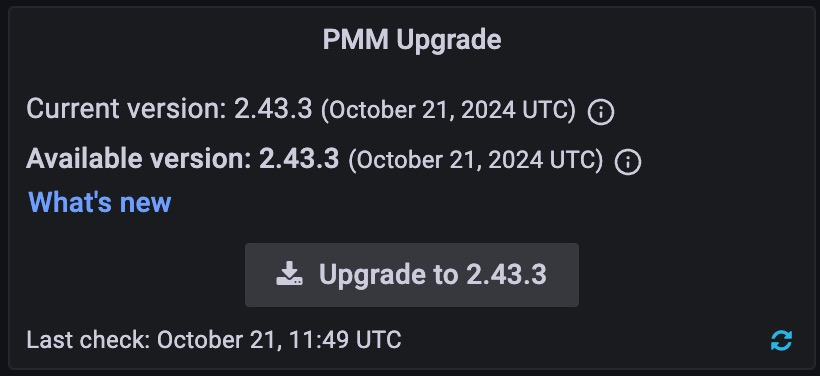

# Upgrade from PMM 2 to PMM 3

Due to significant architectural improvements in PMM 3, there is no direct upgrade path. Follow this gradual transition to make the switch from PMM version 2 to version 3:

## Step 1: Update PMM 2 Server to the latest version

!!! caution alert alert-warning "Caution"
    PMM versions prior to 2.33.0 may not show the latest versions available with instances created from the AWS marketplace in specific environments, including AWS. For a solution, see the [troubleshooting](../troubleshoot/upgrade_issues.md#pmm-server-not-showing-latest-versions-available-with-the-instances-created-from-aws) section.
{.power-number}

1. From the **Home** page, scroll to the **PMM Upgrade** panel and click the Refresh button to manually check for updates.

1. If an update is available, click the **Update** button to install the latest PMM 2 version.
2. Verify the update was successful by checking the version number after the update completes.

## Step 2: Upgrade PMM 2 Server to PMM 3

Follow these manual steps to upgrade your PMM 2 Server to PMM 3:
{.power-number}

1. Stop all services of the PMM 2 server container:

    ```sh
    docker exec -t pmm-server supervisorctl stop all
    ```

2. Transfer ownership of all directories and files in the `/srv` directory to the pmm user:

    ```sh 
    docker exec -t pmm-server chown -R pmm:pmm /srv
    ```

3. Stop and remove the PMM 2 server container:

    ```sh
    docker stop pmm-server && docker rm pmm-server
    ```

4. Pull the new PMM 3 server Docker image:

    ```sh
    docker pull percona/pmm-server:3
    ```

5. Run a new container based on the PMM 3 image, ensuring you pass the same pmm-data volume:

   ```sh
   docker run -d -p 80:8080 -p 443:8443 -v pmm-data:/srv --name pmm-server --restart always percona/pmm-server:3
   ```

6. Verify that the new PMM 3 Server container is running and accessible through the UI.

## Step 3: Upgrade PMM 2 Clients to PMM 3

!!! caution alert alert-warning "Important"
    Support of PMM 2 Clients by PMM 3 Server will be limited to metrics and Query Analytics (QAN) only. This limited support will be dropped in PMM 3.3.

Depending on your initial installation method, update PMM Clients using your operating system's package manager or by updating from a tarball.
For detailed instructions, see the [Upgrade PMM Client topic](../pmm-upgrade/upgrade_agent.md).

### Post-upgrade steps

After you finish migrating:
{.power-number}

1. Verify that all clients are up to date by checking **PMM Configuration > Updates**.
2. Confirm all previously monitored services are reporting correctly to the new PMM 3 Server by reviewing **Configuration > PMM Inventory > Services**.
3. Check the dashboards to make sure you're receiving the metrics information, QAN data.
