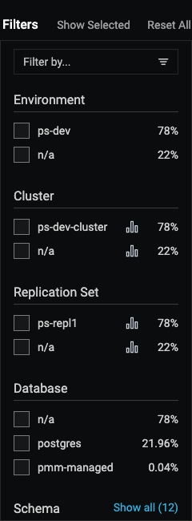
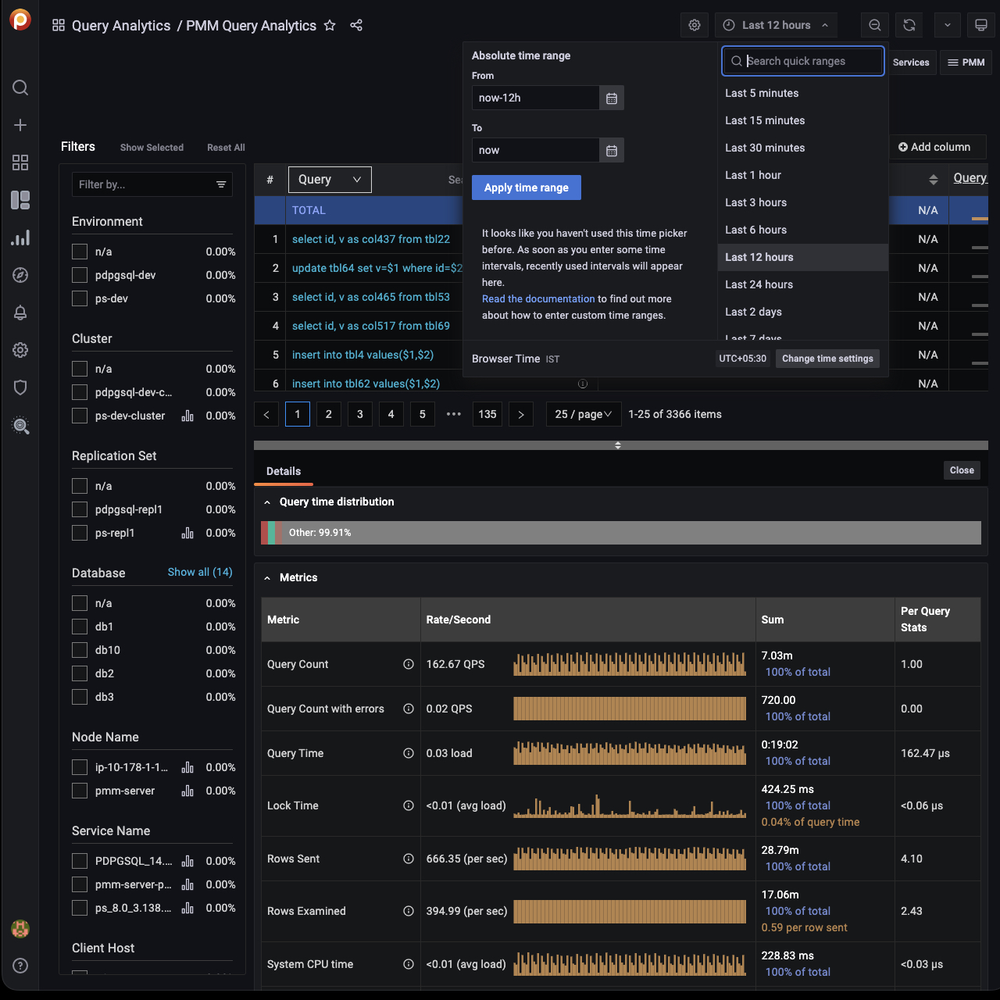

# Filters Panel

- The *Filter* panel on the left hand side of the dashboard lists the filters grouped by category. It also shows the percentage of the main metrics (explained below). If you select a different metric, the percentages on the left panel will change as per this metric. When you select a metric, it reduces the overview list as per the matching filter.
- The first five of each category are shown. If there are more, the list is expanded by clicking *Show all* beside the category name, and collapsed again with *Show top 5*.
- Applying a filter may make other filters inapplicable. These become grayed out and inactive.
- Click the chart symbol <i class="uil uil-graph-bar"></i> to navigate directly to an item's associated dashboard.
- Separately, the global *Time range* setting filters results by time, either your choice of *Absolute time range*, or one of the predefined *Relative time ranges*.

