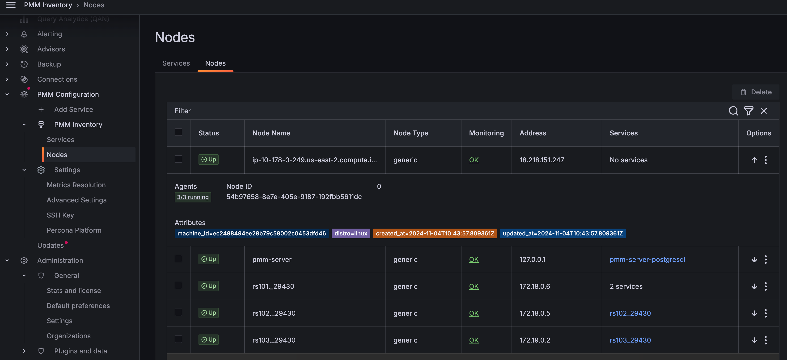

# Percona Monitoring and Management 2.38.0

| **Release date:** | JUn 02, 2023                                                                                    |
| ----------------- | ----------------------------------------------------------------------------------------------- |
| **Installation:** | [Installing Percona Monitoring and Management](https://www.percona.com/software/pmm/quickstart) |

Percona Monitoring and Management (PMM) is an open source database monitoring, management, and observability solution for MySQL, PostgreSQL, and MongoDB.

<!---
!!! caution alert alert-warning "Important/Caution"
    Crucial points that need emphasis:

    - Important: A significant point that deserves emphasis.
    - Caution: Used to mean 'Continue with care'.
 --->

## Release Highlights

### Important security updates

- As security is paramount to us, starting with PMM 2.38.0, we have laid a solid and modernized enterprise-grade foundation for PMM. We have migrated our base operating system on which we build our base image from Enterprise Linux 7 ( CentOS 7) to Enterprise Linux 9 (EL9). Thus starting with PMM 2.38.0, we have made PMM publicly available on EL9 (Oracle Linux 9) as an early preview.

    The benefits of this migration are manifold. The migration fixes a large number of CVEs and improves upstream's response time to security-related issues. You can access more modern libraries to build on long with better compatibility with new technologies. 

    We will be rolling this out in phases. 

    The following users will be able to take advantage of this immediately:

    - Brand new installations of PMM, regardless of how you choose to run it
        * Docker: substitute perconalab/pmm-server:2.37.0-el9 in the docker run commands
        * OVF: [Download](https://downloads.percona.com/downloads/pmm2/2.37.0/ova/pmm-server-2.37.0-el9.ova) it directly from percona.com.
    - Docker/Podman users that do full container replacement upgrades to newer versions of PMM*
        * substitute perconalab/pmm-server:2.37.0-el9 in the docker run commands

    Users who will need to wait a bit longer:

    - AMI users
    - Users that exclusively upgrade through the UI’s “Upgrade Now” button
    - OVF users

- Components upgrade - Grafana has been upgraded to 9.2.18 due to [CVE-2023-28119](https://github.com/advisories/GHSA-5mqj-xc49-246p) and [CVE-2023-1387](https://github.com/advisories/GHSA-c3h9-vpfv-3x4m).

- Exporters - Updated the mysqld_exporter, node_exporter, postgres_exporter, mongo_exporter to fix the CVE's.

- ClickHouse plugin - Updated this plugin to fix the CVE's.

### Improved nodes view on the Inventory page

In our continuing endeavor to enhance user experience, we further improved the **Inventory** page by improving the **Nodes** tab. With this change, you can get more context on your inventory objects, such as node, and more actionable information for exploring and resolving possible issues.

Here is the change as part of PMM 2.38.0:

- You can see the number of agents running on any particular node. When you click on any node, the UI navigates to the view of agents, which is filtered to display only agents related to that specific node. 

To see the details of the agents running, do the following:

On the **Nodes** tab, under the **Monitoring** column, click **OK** or **Failed** depending on the status of the node that you have selected. A page that provides the user with crucial information regarding the total number of agents deployed on that node is displayed.
    

- You can also view comprehensive information about each agent, including key attributes such as node type, IP address, and associated services. This gives you a complete overview of the nodes at a glance.

    

- You can check the health status of the agents to see if they are running or have failed.

### MongoDB backup enhancements

#### Sharded cluster backup support
This release introduces support for working with backups for sharded clusters. PMM handles the backup process end-to-end, but restoring such artifacts is currently possible only via the CLI, using Percona Backup for MongoDB.

For information on restoring sharded backups, check the [PBM documentation](https://docs.percona.com/percona-backup-mongodb/usage/restore.html)

#### Better folder management for enhanced PMB compatibility 
We’ve added a new **Folder** field to the Create Backup pages. Use this to specify a specific target directory within the selected local or S3-compatible location for the backup.  

Organizing backups in folders makes grouping PBM backups for clusters easier, and it improves PMM-PBM integration workflows. For example, it enables you to switch between the PBM CLI and PMM UI when creating backups, or add snapshots to running PITR backups.

The **Folder** field is automatically populated with the value of the cluster label. You can change this default folder from PMM’s Advanced Settings. However,  this is not recommended since it can…

## New Features

- [PMM-2852](https://jira.percona.com/browse/PMM-2852) - [MySQL, PostgreSQL] QAN support for parsing query comments
- [PMM-11961](https://jira.percona.com/browse/PMM-11961) - Starting with PMM 2.38.0, we have enhanced the **Inventory** page by improving the **Nodes** tab. With this change, you can get more context on your inventory objects, such as node, and more actionable information for exploring and resolving possible issues.
- [PMM-11962](https://jira.percona.com/browse/PMM-11962) - Starting with PMM 2.38.0, you can filter the nodes and services on the **Inventory** page using the parameters such as ID, names, status, etc., instead of scrolling through an exhaustive list of nodes or services.
- [PMM-12077](https://jira.percona.com/browse/PMM-12077) - Telemetry data about the base image
- [PMM-12087](https://jira.percona.com/browse/PMM-12087) - Inventory - add tooltip to status columns

## Improvements

- [PMM-4466](https://jira.percona.com/browse/PMM-4466) - Migrate Grafana from using SQLite to PostgreSQLStarting with PMM 2.38.0, we have migrated Grafana from SQLite to PostgreSQL datasource for better performance of Auth sessions.
- [PMM-6279](https://jira.percona.com/browse/PMM-6279) - Starting with PMM 2.38.0, you now have an additional tab in QAN that displays query metadata like cluster, schema, node, user, etc.
- [PMM-9367](https://jira.percona.com/browse/PMM-9367) - MongoDB Backup: Sharded Cluster Backup
- [PMM-11250](https://jira.percona.com/browse/PMM-11250) - Allow user to specify target directory for backup artifact
- [PMM-12038](https://jira.percona.com/browse/PMM-12038) - MongoDB backups don't work if authentication mechanism other than SCRAM is used
- [PMM-12114](https://jira.percona.com/browse/PMM-12114) - Grafana has been upgraded to 9.2.18 due to CVE.
- [PMM-12136](https://jira.percona.com/browse/PMM-12136) - We have migrated our base operating system on which we build our base image from Enterprise Linux 7 (CentOS 7) to Enterprise Linux 9 (EL9) to fix the CVE's.

## Bugs Fixed

- [PMM-9541](https://jira.percona.com/browse/PMM-9541) - PostgreSQL exporter not working with --socket
- [PMM-9544](https://jira.percona.com/browse/PMM-9544) - Alerting doesn't seem to be able to monitor for "Host Down"
- [PMM-9844](https://jira.percona.com/browse/PMM-9844) - Data for a large number of partitions or possible indexes was shown in the QAN Details tab in one scrolling column making it practically impossible to read. The issue has been resolved now.
- [PMM-10799](https://jira.percona.com/browse/PMM-10799) - Now in **EXPLAIN/TABLE** tab you can get results even for queries with table alias.
- [PMM-11386](https://jira.percona.com/browse/PMM-11386) - MongoDB QAN query time metrics was showing the wrong unit. It should be ms. The issue has been resolved now.
- [PMM-11692](https://jira.percona.com/browse/PMM-11692) - `Top MySQL Active Client Threads` panel color was misleading. The isuue has been resolved now.
- [PMM-11715](https://jira.percona.com/browse/PMM-11715) - CPU Utilization Graph for RDS instances was not matching what Cloudwatch reported. The issue has been resolved now.
- [PMM-11938](https://jira.percona.com/browse/PMM-11938) - Fixed the problem when PMM tried to create pg_stat_monitor_settings view all over again.
- [PMM-11950](https://jira.percona.com/browse/PMM-11950) - Non-admin roles are calling restricted endpoints after login or page refresh.
- [PMM-12024](https://jira.percona.com/browse/PMM-12024) - Fixed an issue where a QAN agent couldn't start due to an expected return value type.
- [PMM-12031](https://jira.percona.com/browse/PMM-12031) - Inventory: The `enhanced_metrics_disabled` and `basic_metrics_disabled` were not displayed on the **Inventory** page for an external service. The issue has been resolved now.
- [PMM-12067](https://jira.percona.com/browse/PMM-12067) - QAN: Fixed vulnerability in Vitess package.
- [PMM-12085](https://jira.percona.com/browse/PMM-12085) - Fixed an issue where SSH access to AMI and OVF images for el9 based images did not work. The issue has been resolved now.
- [PMM-12091](https://jira.percona.com/browse/PMM-12091) - The tooltip for QAN > MongoDB > Query Details was displayed in seconds instead of decimals. The issue has been fixed now.
- [PMM-12105](https://jira.percona.com/browse/PMM-12105) - QAN: Fixed an issue where QAN was broken due to wrong pgsm_query_ids.
- [PMM-12118](https://jira.percona.com/browse/PMM-12118) - Addressed the Grafana ClickHouse DS plugin CVEs.
- [PMM-12119](https://jira.percona.com/browse/PMM-12119) - Fixed an issue where the RDS exporter status was always `UNKNOWN`.

<!---

## Known issues

- ​List of known issues with a  comprehensive description and link to the JIRA ticket.

    Example:

    [PMM-XXXX](https://jira.percona.com/browse/PMM-XXXX) - Comprehensive description.

    **Solution**

    Description of the solution.

## Coming Soon

  Share what are the upcoming features on your roadmap to keep users excited:

- Planned item 1
- Planned item 2

--->